#  LabVIEW—数据采集快速入门与提高

## 1. 数据采集系统概述

* 数据采集系统包含：

  * 原始信号

  * 信号调理设备（放大、滤波）
  * 数据采集设备
  * 上位机

* 数据采集平台：

  * PXI平台 - 模块化、可拓展、利用最新商业技术
  * C系列数据采集产品CDAQ - 使用USB连接，体积小、功耗小
  * C系列数据采集产品cRIO - 配置了实时处理器和可重配置的FPGA资源（可以脱离PC机），体积小、功耗小
  * PCI，USB产品

## 2. 安装NI-DAQmx驱动

* 安装NI-DAQmx驱动的方法：
  * NI Device Drivers DVD
  * NI-DAQmx DVD
  * ni.com/downloads/products

## 3. 配置管理软件NI-MAX

* NI-max实现的三个功能：
  * 识别和检测NI硬件
  * 无需编程完成数据采集任务
  * 创建数据采集任务，导入LabVIEW自动生成代码
* NI-MAX面板信息
  * 所有安装的软件：我的系统 ---> 软件
  * 已经创建的任务：我的系统 ---> 数据邻居
  *  外界的设备：我的系统 ---> 设备和接口
  * 外接设备的信息：右键某个设备
  * 设备仿真：右键“设备和接口” ---> 仿真NI-DAQmx设备或模块化仪器
* 无需编程完成数据采集任务
  * 选择设备 ---> 工具栏选择“测试面板”
  * 右键设备 ---> 创建任务 ---> 选择数据采集模式 ---> 各种设置

## 4. 硬件选型关注的参数

* 通道数是多少？
  * 选择有足够通道数的DAQ设备
* 测量的最大最小值
  * 选择正确输入范围的DAQ设备
* 采样或生成信号的分辨率是多少
  * 有足够高采样率的DAQ设备
  * 采样需要考虑的几个问题：
    * 实际模拟输入信号是随时间连续的，采样信号是用指定采样速率量化模拟信号得到的一系列离散的点
    * Nyquist定理：**为了准去获取信号的频率信息，采样频率必须大于信号的最大频率的两倍**，**为了准去获取信号的波形信息，采样频率必须大于信号的最大频率的5-10倍**
* 需要检测的最小信号变化是多少
  * 选择有正确编码宽度的DAQ设备
  * 计算编码宽度需要：
    * 分辨率
      * 表示信号ADC位数
      * 分辨率决定了可测量的电压的变化值
      * 更高的分辨率 = 更精确的表达信号
      * 3位分辨率可以表示2^3^ = 8个电压阶数
      * 16位分辨率可以表示2^16^ = 65536个电压阶数
      * 电压的变化曲线更加平滑
    * 设备输入范围
    * 编码宽度 = 设备输入范围 / 2^分辨率^
    * 更小的编码宽度 = 更精确的表达信号
* 测量的误差要求是多少
  * 确保DAQ设备有合适的绝对精度
  * 编码宽度 ！= 精度
  * 影响精度的误差源
    * 来自放大器和ADC的增益误差和偏置误差
    * 系统噪声
  * 查看DAQ设备的产品规范手册

## 5. 信号的连接方式

* 接地注意事项
  * 为了正确的测量结果，必须对系统正确姐弟
  * 信号的接地方式将影响DAQ设备上的仪用放大器的接地方式
  * 正确的系统接地步骤：
    * 确定信号如何接地
    * 为测量系统选择接地模式
  * 信号的接地方式：
  * 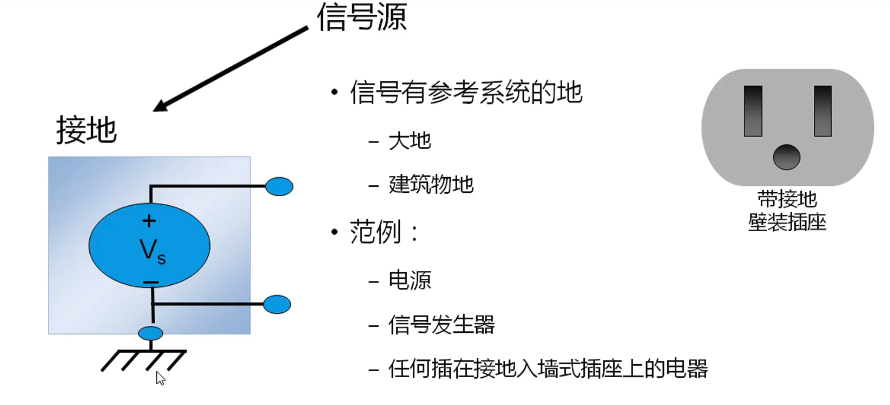
  * 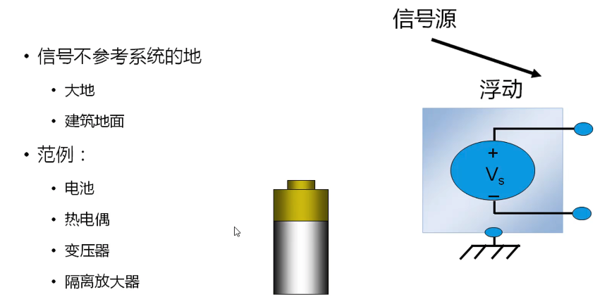
  * 系统的接地方式：
  * 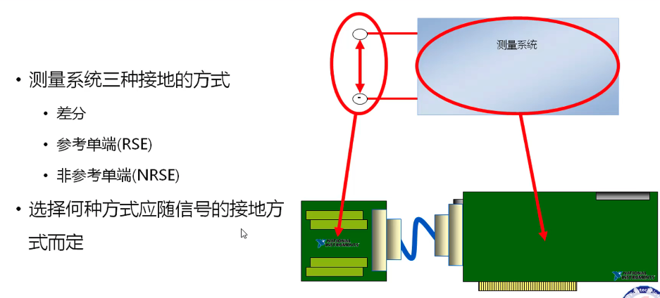
  * 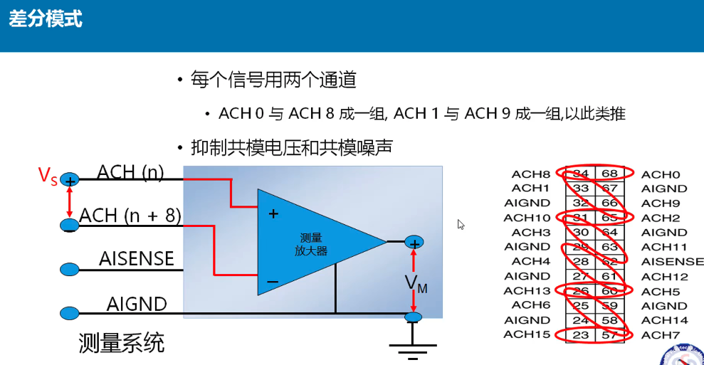
  * 👆会导致可用通道减半，但是可以有效抑制共模电压和噪声
  * 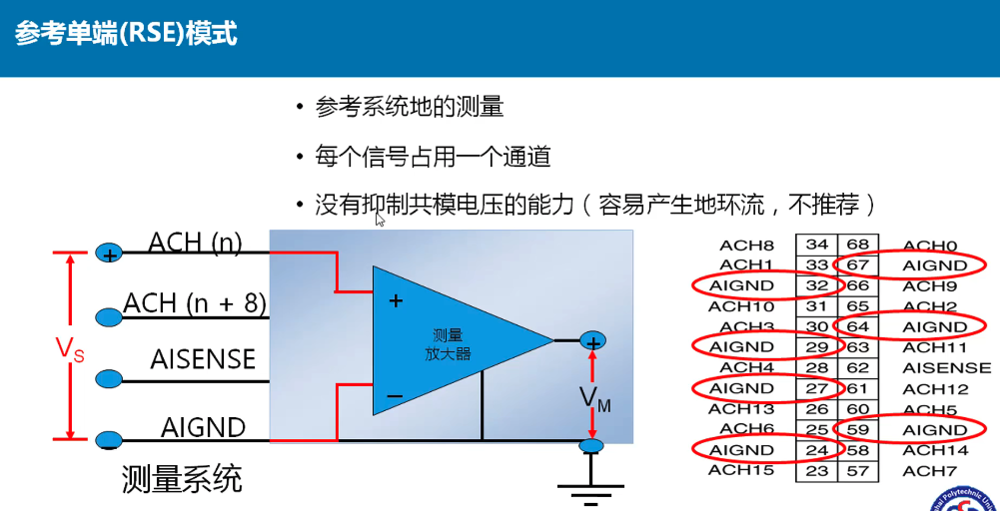
  * 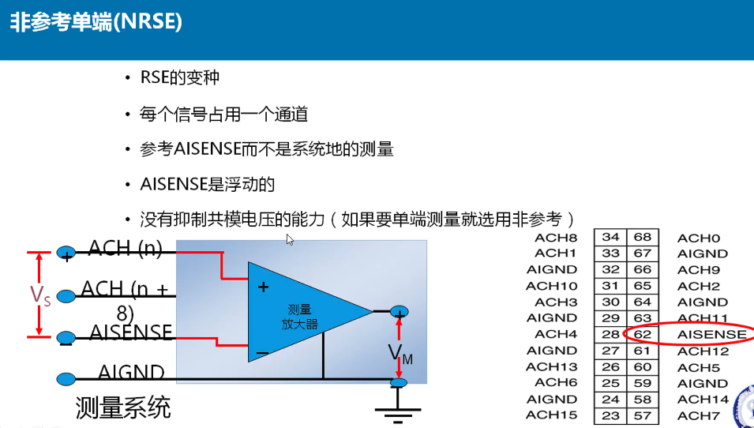
  * 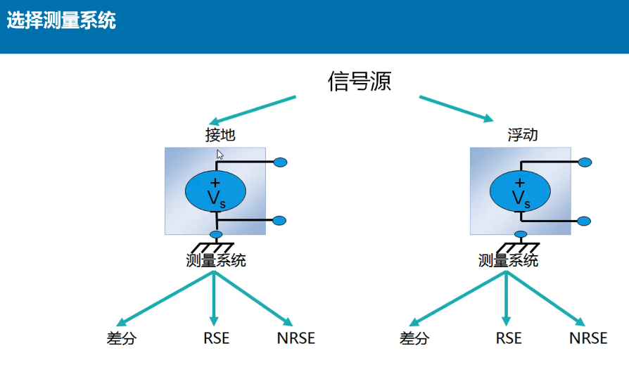
  * 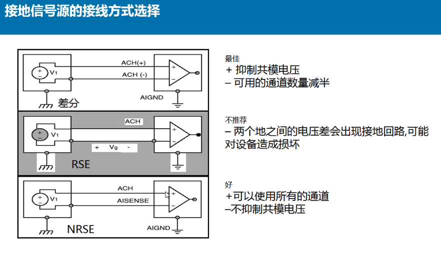
  * 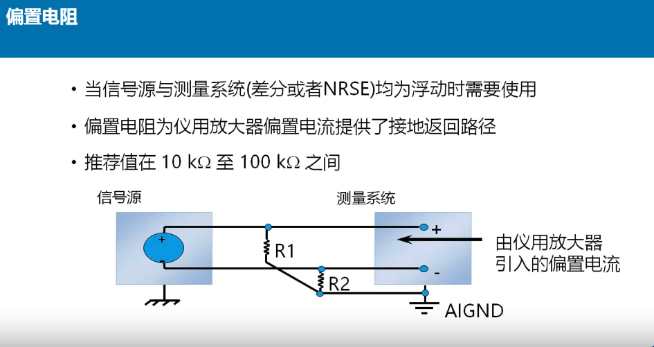
  * 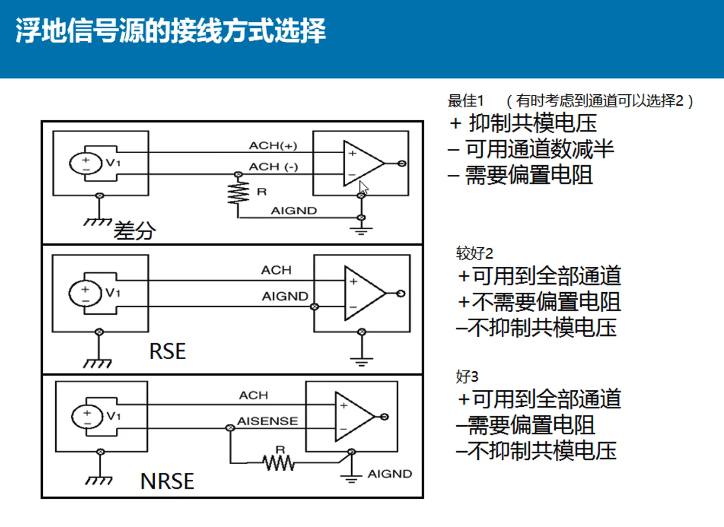

## 6. NI数据采集篇

* 根据手上不同的采集卡，可以去官网查看用户手册

## 7. USB-6001功能测试

* 

## 8. DAQ助手 ExpressVI（一）

* 根据传感器的图标和NI-MAX的引脚指引连接
* 创建vi ---> 函数面板 ---> 测量I/O ---> DAQ-mx ---> DAQ助手 ---> 选择任务类型
* 1采样（按要求）：软件定时，速度要求不高
* 将动态数据转换为标量（可进行运算）：
  * 函数面板 ---> Express ---> 信号操作 --->  从动态数据.....

## 9. DAQ助手 ExpressVI（二）

* 差分的连接方式是将两个接线端都接在AI端口，在DAQ助手设置的时候只需要选中一个接线端
* 使用DAQ助手可以单次选择设置多个物理通道
* 使用8中提到的“将动态数据转换为标量”是输出一个数组，如果有多组的采样则是多维数组，需要用索引切开

## 10. DAQ助手 ExpressVI（三）

* 高速采集：
  * 连续输入
* 自产自测流程：
  * 使用仿真信号搞一个波形 ---> 使用DAQ助手创建一个输出 ---> 使用DAQ助手创建一个采集（注意端口要一致，**为了保证先运行输出再运行采样，可以将两个控件的错误簇连接在一起** ---> 输出控件 ---> 套个while循环

## 11. NI-DAQmx底层VI

* Express VI：简单、方便、易用，功能有限、执行效率低
* 使用底层VI编写读取程序
  * 函数选板 ---> 测量I/O ---> DAQmx-数据采集
  * 创建虚拟通道VI：可以创建虚拟通道并将其添加到任务
  * DAQ-mx定时：配置采样率，模式等等
  * DAQ-mx触发：
    * 开始触发：启动采集或生成
    * 参考触发：在一组样本中创建预触发数据
    * 多个设备之间的同步时用到
  * DAQ-mx开始任务：将任务转换为开始状态
  * DAQ-mx读取：从制定的任务中读取样本
  * DAQ-mx结束
  * DAQ-mx清除

## 12. 单点数据采样

* 单点采样：

  * 1采样（按要求）、1采样（硬件定时）

* 单点定时（硬件定时）

  * 
  * 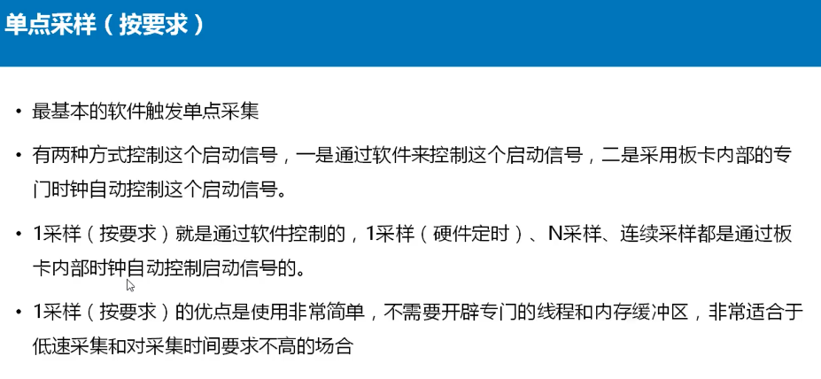
  * 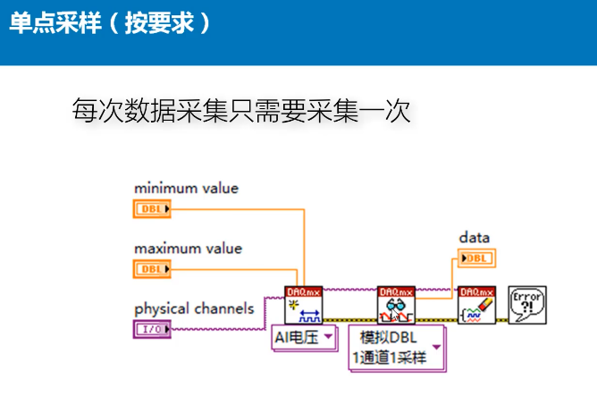
  * 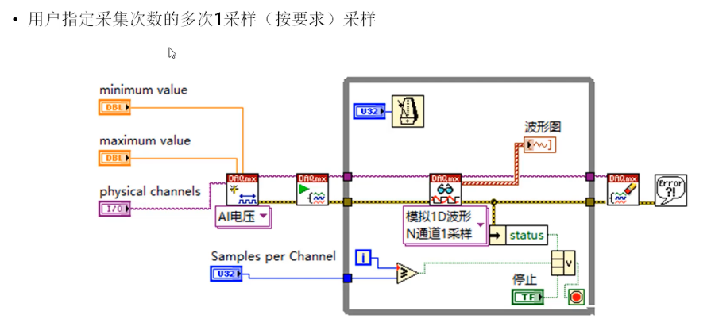
  * 👆如果时间间隔过长，可能会导致程序无法正确退出（记得设置采样控件中的采样什么的）
  * 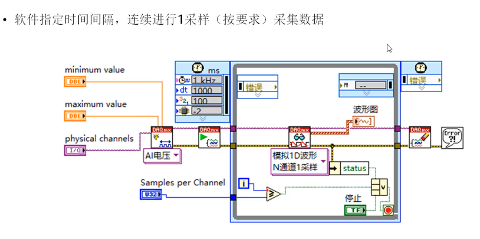

## 13. 温度数据采集

* 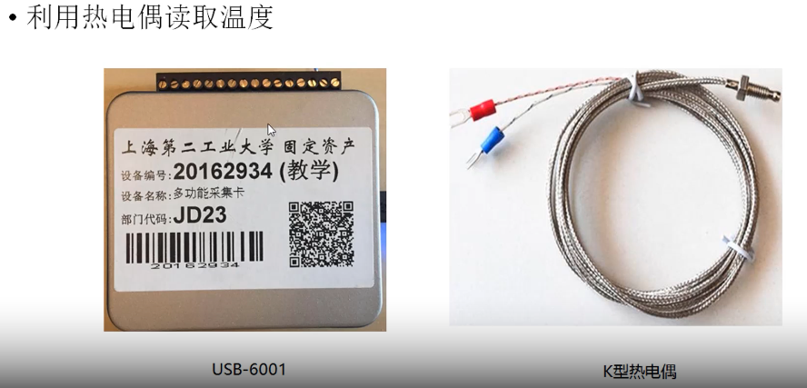
* 工作原理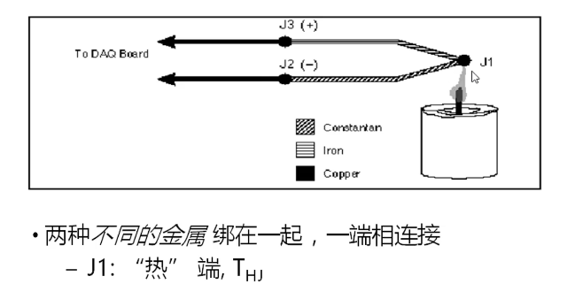
* 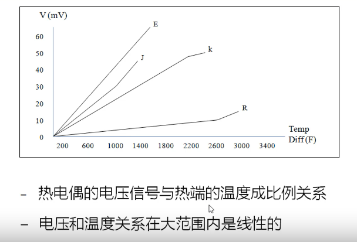

* 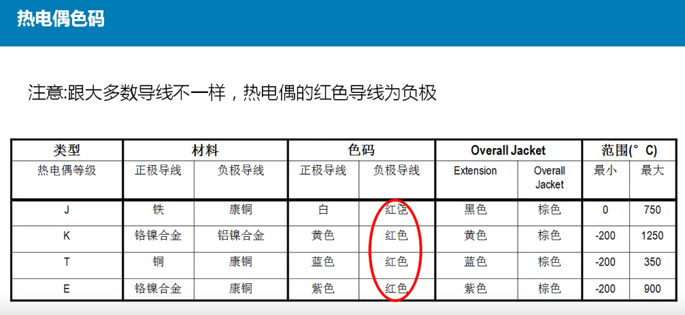

* 

* 编写程序，顺序为：创建（设置各种参数：最大最小值，通道，单位...）---> 开始 ---> while循环 ---> 读取 ---> 清除（因为有while所以不需要停止）

  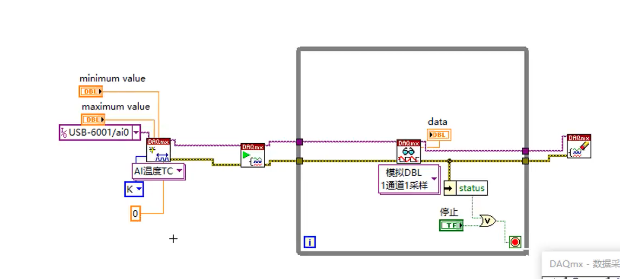

## 14. 有限点数据采集

* N采样，也叫有限点采样。用于在已知需要的总采样点数情况下的采集任务

* 尤其是用在带触发的采样任务中

* 需要缓存区

  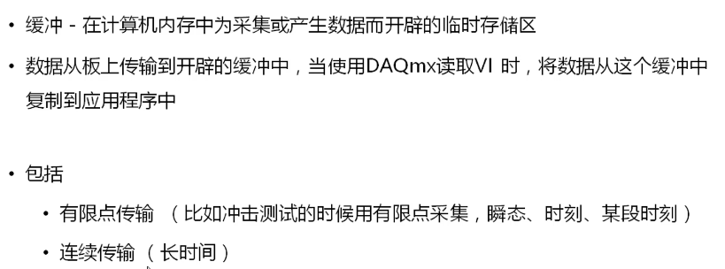

* 设置采样大小

  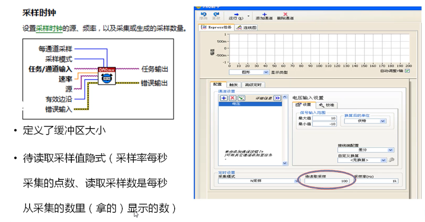

* 基本流程：

  * 不需要while
  * 创建任务 ---> 配置任务（采样时钟） ---> 开始任务 ---> 采样任务（记得设置采样控件中的采样什么的） ---> 清楚任务

  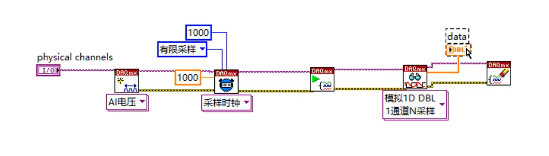

## 15. 连续数据采集（一）

* 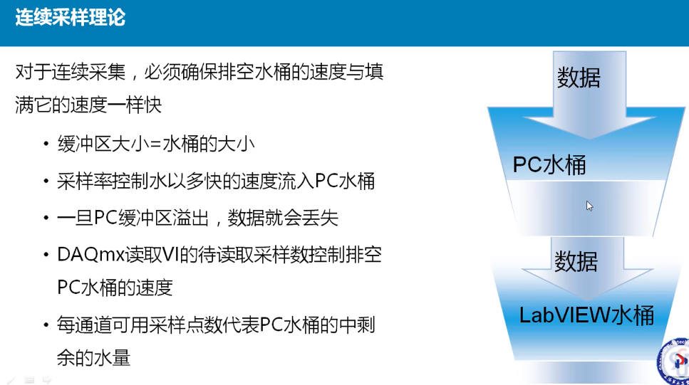
* 缓冲区的大小一般为采样率的10倍
* 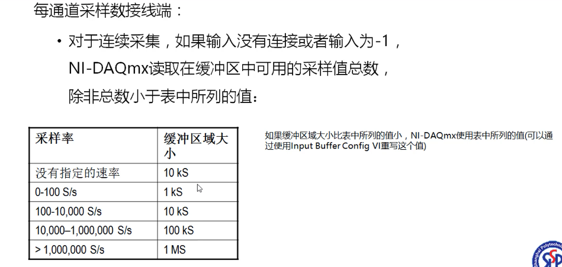
* 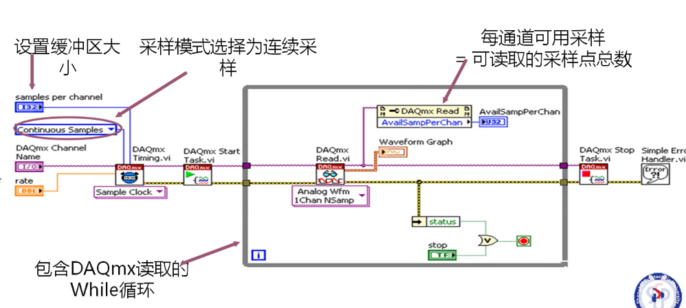
* 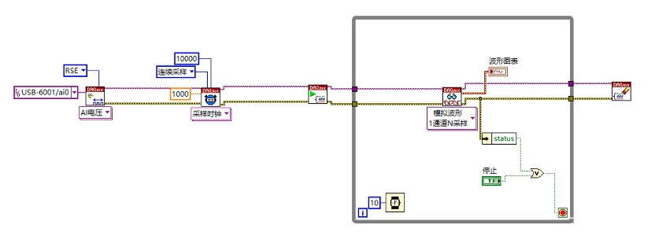

## 16. 连续数据采集（二）

* 

## 17. 信号调理

*  信号调理的通用功能
  * 放大：微弱的信号都要进行放大以提高分辨率和降低噪声，尽量靠近数据采集模块，以保证数据在受到噪声之前就被放大，减小信噪比
  * 隔离：隔离是指使用变压器、光或者电容耦合等方法在被测系统和测试系统之间传递信号，避免直接的店连接。使用隔离的原因有两个：1. 安全 2. 隔离可以使得从数据采集卡读出来的数据不受地电位和输入模式的影响
  * 滤波：除去信号中不需要的成分
  * 激励：信号调理也能为某些传感器提供所需要的激励信号，比如应变传感器、热敏电阻等需要外界电源或电流激励信号
  * 线性化：许多传感器对被测量的响应是非线性的，因而需要对其输出信号进行线性化，以补偿传感器带来的误差
  * 数字信号调理即使传感器直接输出数字信号，有时候也有进行调理的必要性。其作用是将传感器输出的数字信号进行必要的整形或电平调整

## 18. 模拟输出——单点生成

* 大部分多功能DAQ设备的每个模拟输出通道都有一个数模转换器（DAC）

* 所有DAC同时更新

* 类似于对模拟输入同时采样

* 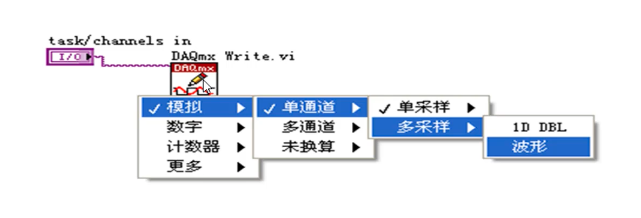

* 自动开始

  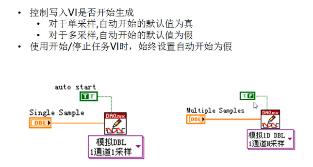

* 单点生成

  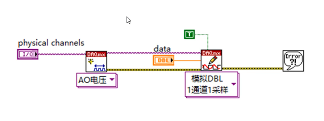

* 软件定时模拟输出

  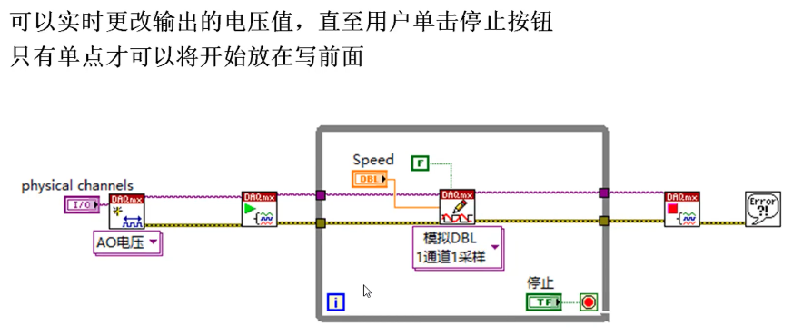

## 19. 单点生成程序设计

* 单次生成

  * 函数面板 ---> 创建任务（修改控件下方的设置，改为模拟输出，添加通道选择控件） ---> **单值的模拟输出不需要开始控件** ---> “写入”控件（设置输入的值） ---> 清除控件

  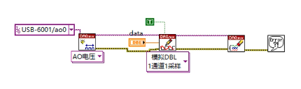

* 多次生成（软件控制）

  * **多值模拟输出需要“开始”控件**，用while把“写入”控件框起来，更改掉自动开始

    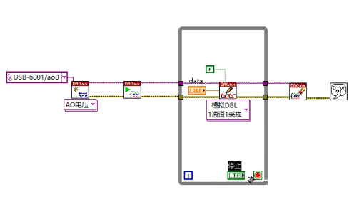

* 通过NI-MAX的面板监控输入

## 20. 模拟输出——连续生成

* 输出波形的频率由三个因素决定：
  * 更新速率
  * 缓冲区的点数
  * 缓冲中的循环数
  * 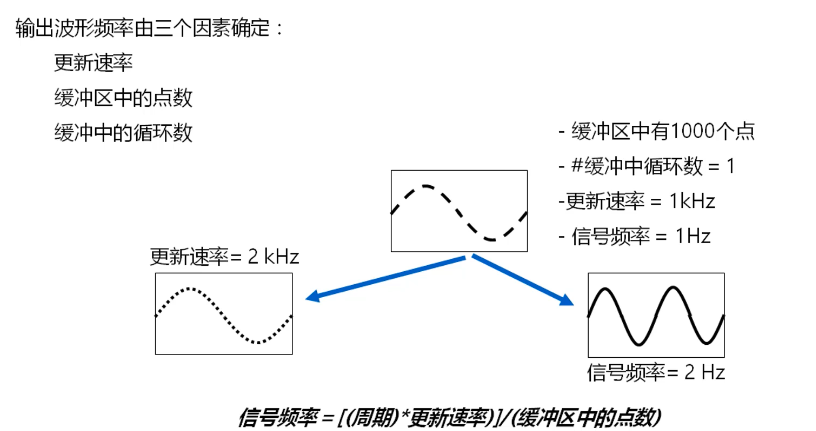
* 连续缓冲区生成的流程图：
  * 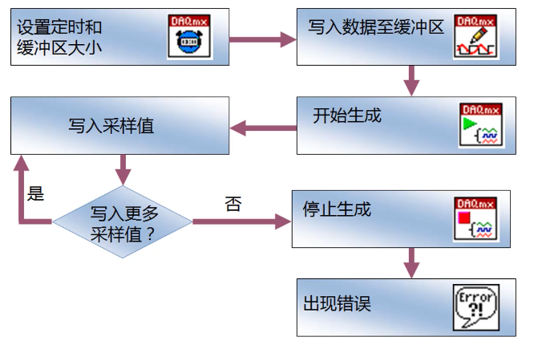
  *  注意：先写入缓冲区，再开始
  * 可以通过“范例”中生成vi
  * 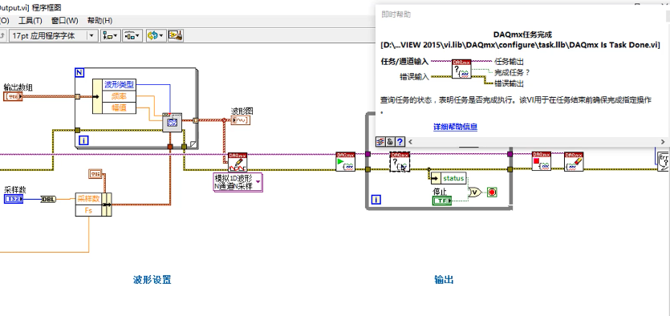

## 21. 信号发生器（重生成方式）

* vi流程：
  * 创建任务 ---> 采样时钟 ---> 写入 ---> 开始 ---> 任务完成（在DAQmx高级任务选项中） ---> 清除
* 对于“写入”控件中的“数据”端口：
  * 使用函数面板 ---> 信号处理  ---> 波形生成  --->基本函数发生器
* 对于“基本函数发生器”中的”采样信息“端：
  * 右键接口创建常量 ---> 使用”作为簇捆绑“  ---> 把创建的常量作为“簇的类型” ---> 下拉扩展“作为簇捆绑”控件  ---> 左侧两个输入接口分别是采样率、采样点数（跟采样时钟中的数据一致） ---> 将“作为簇捆绑”空间的输出连接回 “基本函数发生器”中的采样信息接口。
* 使用循环把“任务完成”框起来（记得把接口改为隧道） 
* 设置“任务完成”控件报错时退出循环：
  * 函数面板 ---> 编程 ---> 簇、类与变体 --->  按名称解绑 ---> 输入为任务完成vi的错误输出，输出连接到退出循环控件  
* 设置输出控件对“基本函数发生器”vi进行显示
* 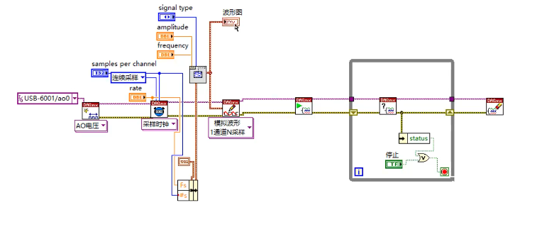

## 22. 信号发生器（非重生成连续输出）（可以实时改变波形参数）

* 把“写入”同埋“开始”放入循环内，删除“任务完成”vi

* 注意：**每次运行只需要一次开始**

  * 函数选板 ---> 同步 ---> 首次调用
  * 使用条件结构将“开始”控件框起来
  * 将“首次调用”当作条件控件的参数
  * 将“假“情况下的条件控件中两个连线连起来，确保没有断线
  * 原理：如果是首次调用，“首次调用”函数为真，运行条件函数中“真”情况下的 内容
  * 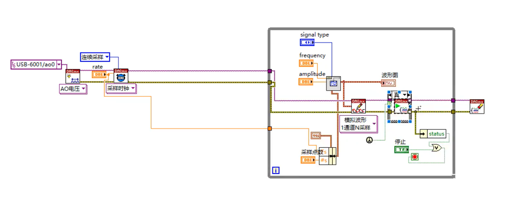

* 可以将之前写过的模拟输入函数放在同一个vi中

  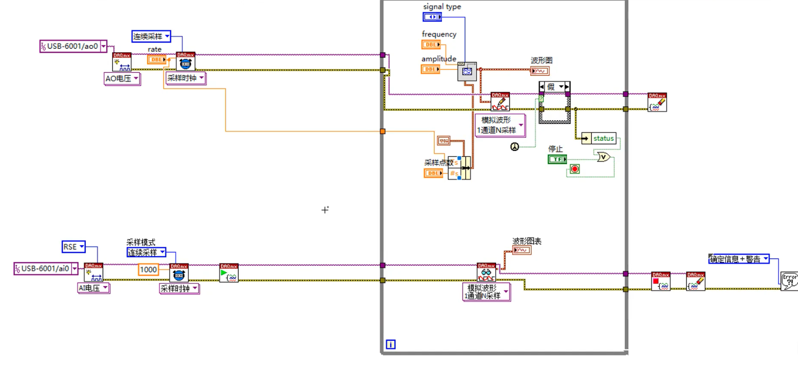

## 23. 数字IO

* 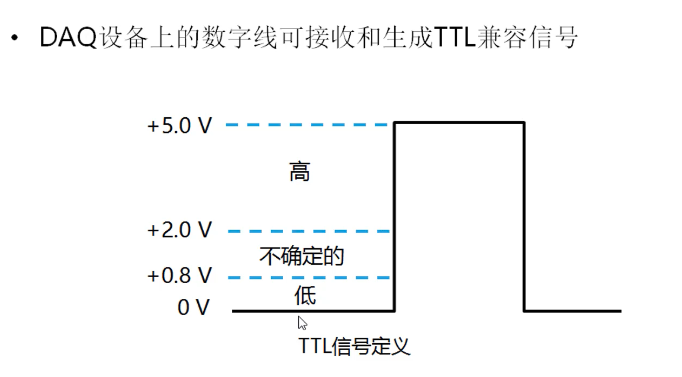
* 根据产品手册check哪个端口可以数字输入/输出
* 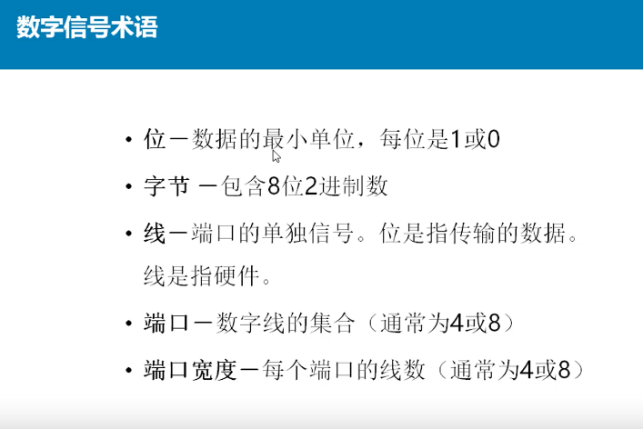
* 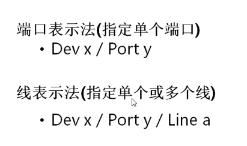
* 可以使用NI-MAX中的“测试面板”来控制数字输入输出

## 24. 数字——软件定时输入

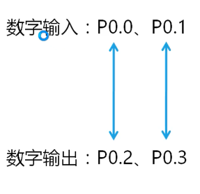

* 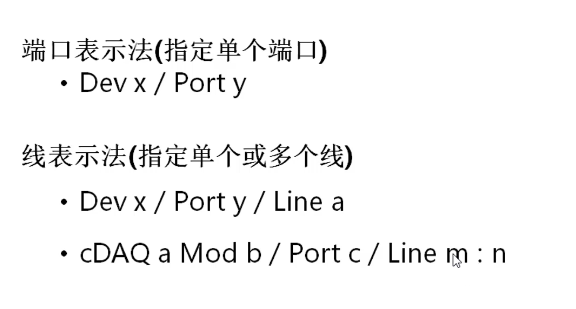
* 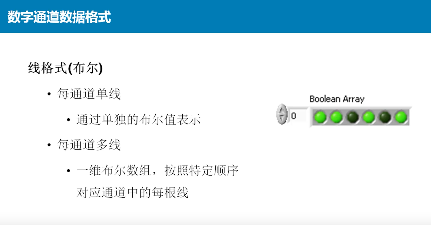
* 使用底层VI实现数字数据的输入：
  * 创建虚拟通道vi（注意更改参数） ---> 开始vi ---> 循环（里面放读取vi + 输出控件） ---> 清除任务
  * 在创建vi控件需要添加一个输入端口，右键设置的输入端口控件（在前面板）可以进行筛选的设置
  * 多通道需要在输入通道的控件中手动加冒号
* 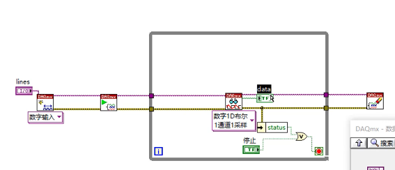

## 25. 数字——软件定时输出

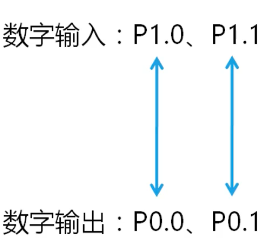

* 数字输出程序：
  * 创建虚拟通道vi（参数更改） ---> 开始任务vi ---> 写入vi（更改参数，在此添加要输出的数字类型） ---> 清除
  * 软件定时需要加等待时间
* 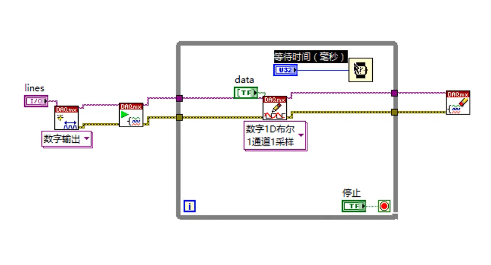

## 26. 计数器

* 计数器的定义：
  * 两个基本功能：
    * 基于输入信号（门，源....）的比较进行计数
    * 基于输入和寄存器值生成脉冲
  * 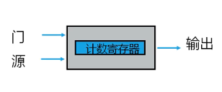
  * 计数器的许多应用都是基本计数
    * 边沿计数（例如，简单边沿计数和时间测量）
    * 输入信号的脉冲、半周期和周期测量
    * 频率测量
    * 单脉冲和脉冲序列的产生
    * 位置和速度测量
    * 转动角度和速度的测量 
* 计数器的组成：
  * 计数寄存器
    * 存储当前的计数值
  * 源
    * 更改当前计数值的输入信号
    * 输入信号的有效边沿（上升或下降）可以更改计数值
  * 门（侧频率时需要对他进行设置）
    * 控制计数生成的输入信号
    * 门信号为高、低或处于各种上升沿和下降沿的组合时，可生成计数
  * 输出
    * 输出信号，通常用于生成脉冲
* 通过计数手册测量是否具有计数器功能

## 27. 计数器——边沿计算

* 流程：
  * 创建任务vi ---> 开始任务vi ---> 读取数据vi（放在循环中） ---> 清除任务vi
  * 创建任务vi：设置为计数器输入 ---> 边沿计数，创建物理通道
  * 开始任务vi：
  * 读取数据vi：设置为计数器 ---> 单通道 ---> 单采样 ---> U32（int）
  *  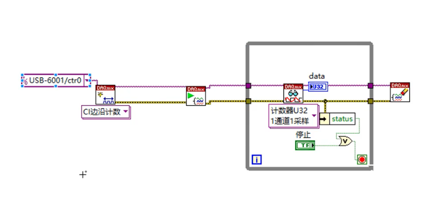

## 28. 计数器（其他功能）

* 脉冲产生：

  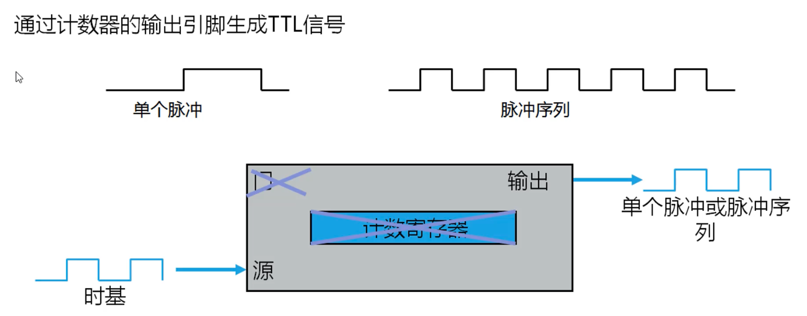

* 周期测量：

  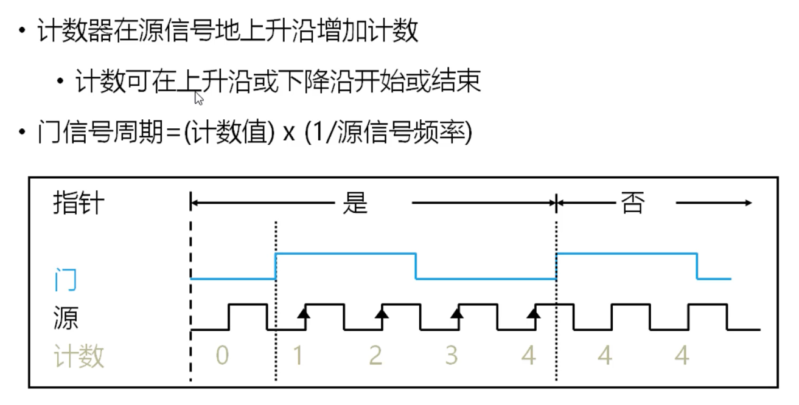

* 频率测量：

  

  * 周期倒数：

    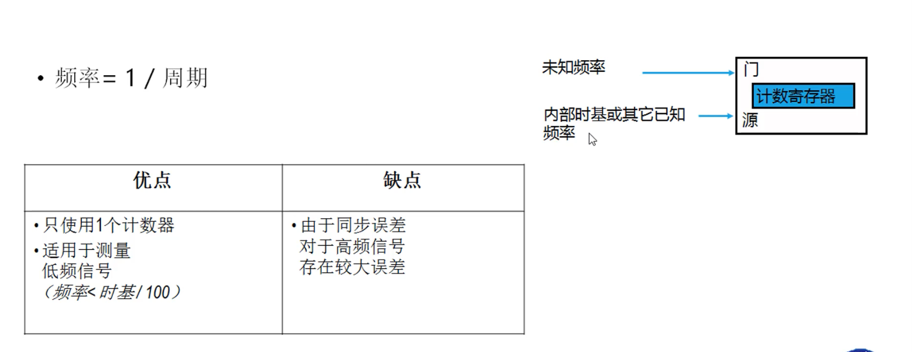

  * 平均：

    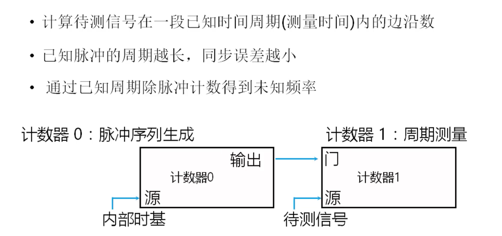

  * 分频：

    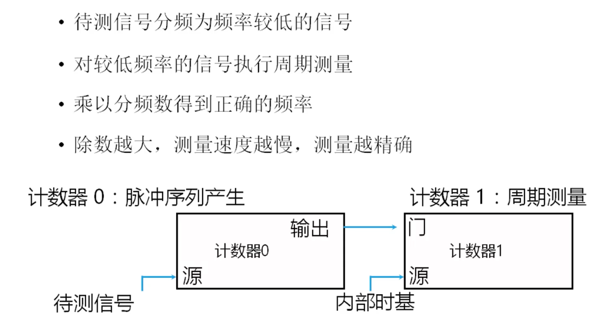

## 29. 报表生成

* Excel报表模版：

  * 往哪写？写入Name box后相当于给选中的地方打了一个mark，往表格里写数据的时候会读取这个mark的位置

     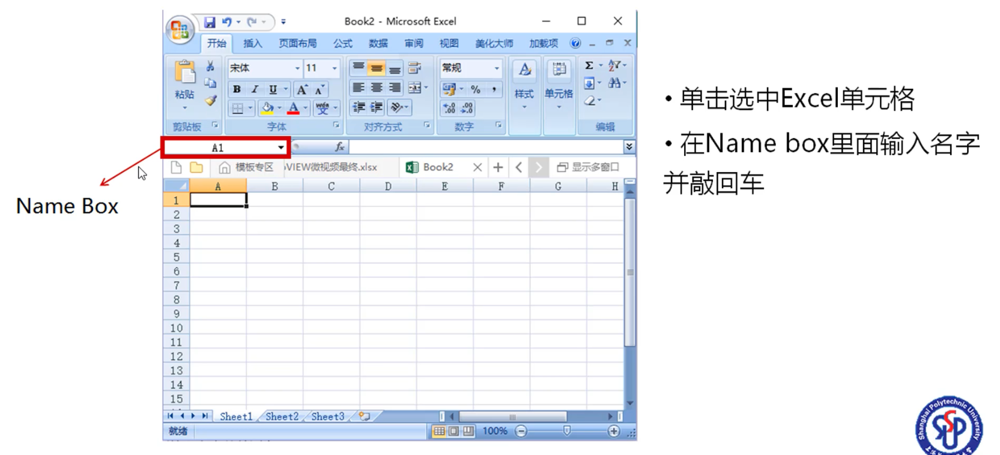

  * 报表保存：

    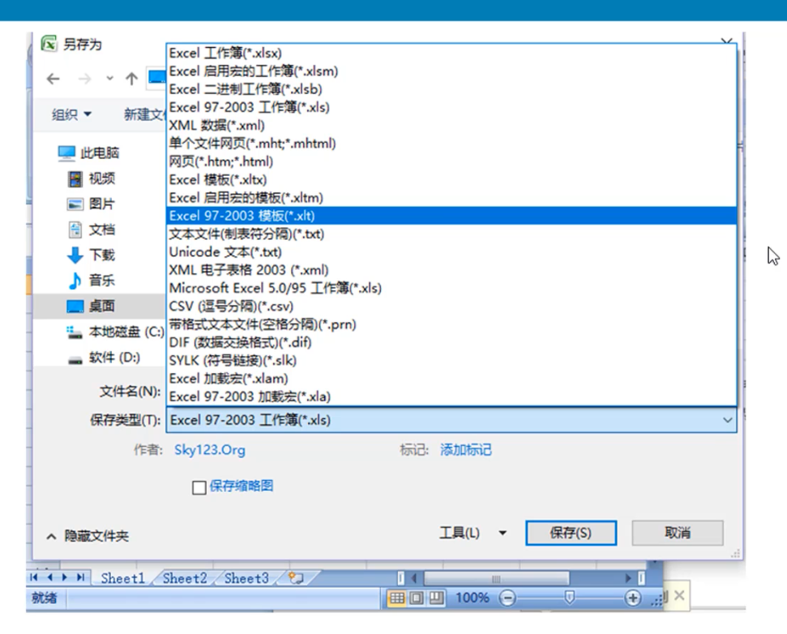

  * 函数选板 ---> 报表生成 ---> MS Office Report ---> Template: Custom Report for Excel ---> Path:选中设置好的excel文件的路径 ---> ok

## 30. 文件IO——文本文件应用

* 文件类型：

  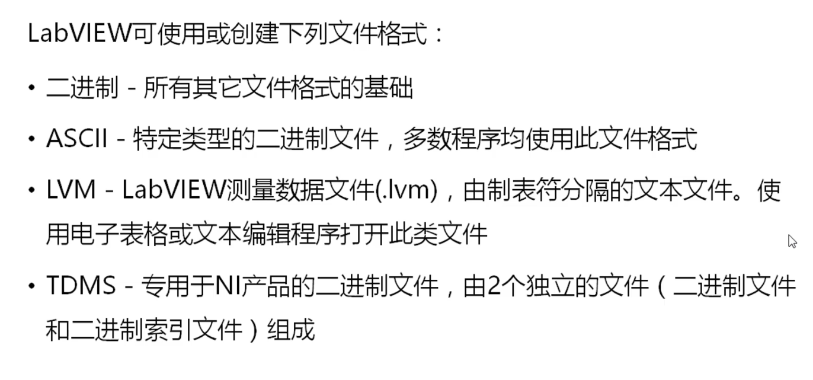

* 文件I/O

  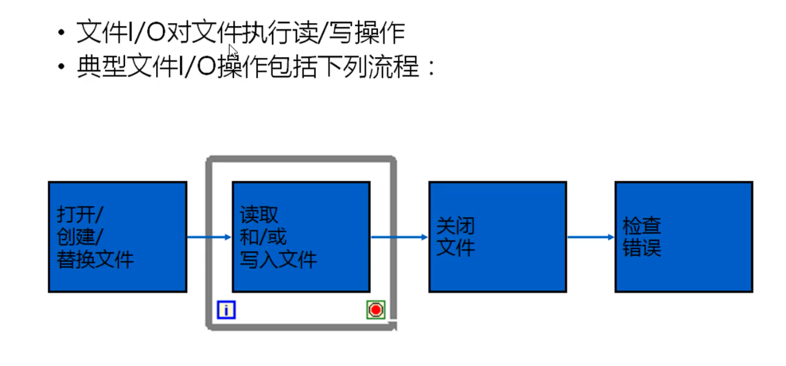

* 用于文件操作的vi位于：函数 ---> 编程 ---> 文件IO

  * 高层vi：
    * 执行文件I/O操作的三个步骤（打开、读取、写入和关闭）
    * 操作效率可能低于执行单步操作的函数
  * 底层vi：
    * 每一步一个独立的vi
    * 如果要写入数据到循环中的文件，可食用底层文件I/O函数

* 文本文件：

  * 何时使用文本文件：
    * 需通过其他应用程序访问该文件
    * 磁盘空间以及文件I/O传输速度不是主要考虑因素
    * 无需执行随机读写操作
    * 数字精度要求可以忽略

  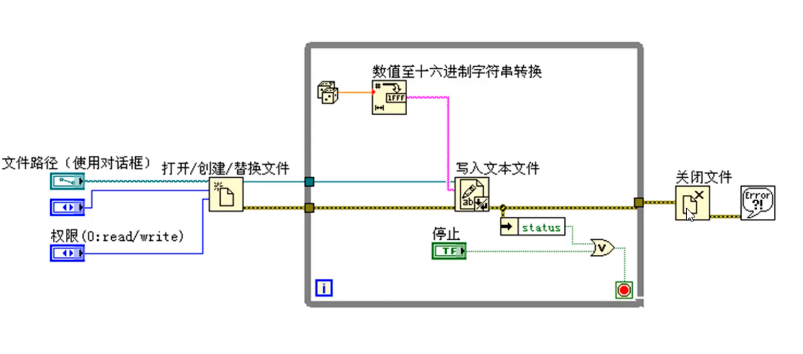

* 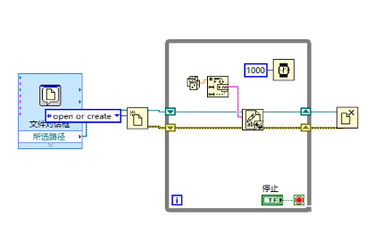

  * 👆左侧的控件是文件I/O面板中“高级文件函数” ---> 文件对话框。这样设置完成后，每次run都会弹出一个对话框让我们选择路径

## 31. 文件IO——二进制文件的应用

* 二进制文件特点：

  * 存取速度最快
  * 格式最紧凑
  * 冗余数据最少
  * 适用于高速数据采集

* 整体思路跟30的差不多，需要更换一个“写入二进制文件”vi和“读二进制文件“vi

  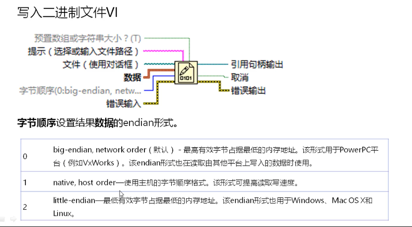

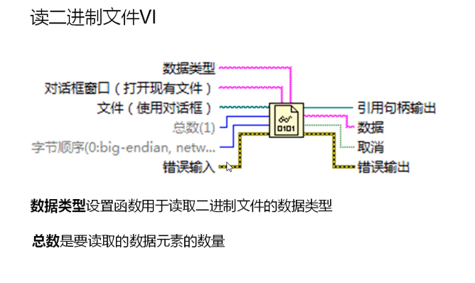

* 可以通过ctrl + h寻找范例

* 读取文件范例：

  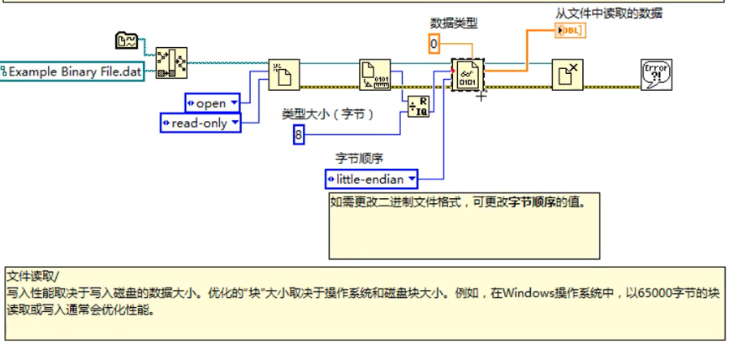

  * 第三个vi是读取文件大小，因为存储的类型是ddl，所以/8就可以得到文件内元素的数量

## 32. 文件 IO——配置文件的应用

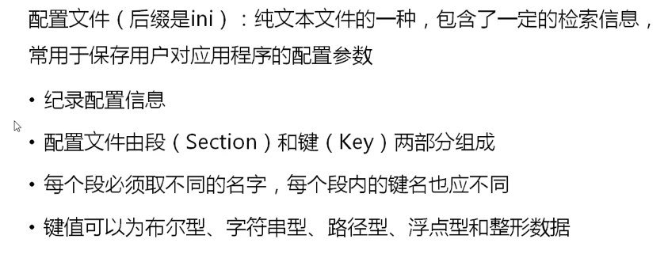

​		👆段相当于一个大的title，比如“温度”，键是subtitle，比如“上限”，再存才是我们要存的数据

* 函数面板 ---> 文件IO ---> 配置文件vi

* 打开 ---> 写入/读取 ---> 关闭

* 写入：  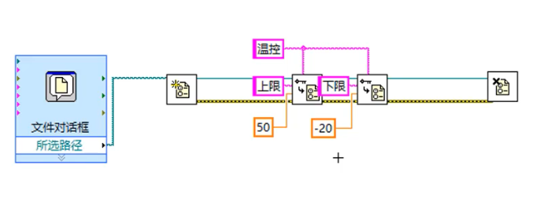

  * 👆“温控”是段，“上、下限”是键

* 读取：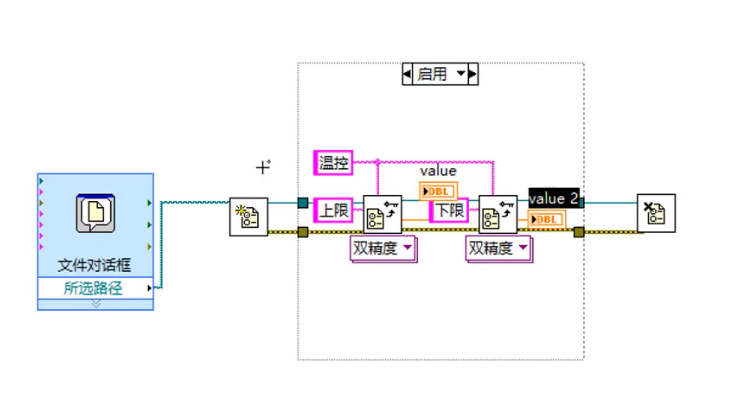

  * 👆注意读取vi需要设置下面的数据类型

* 使用文本文件打开保存的配置文件：

  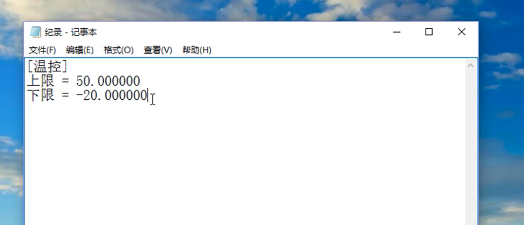

## 33. 文件——TDMS文件的应用

* 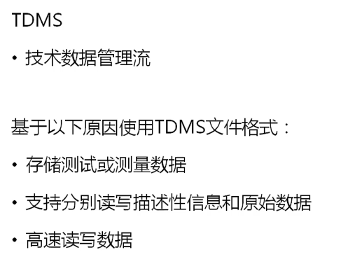

* 写完TDMS文件，硬盘会出现两个文件：

  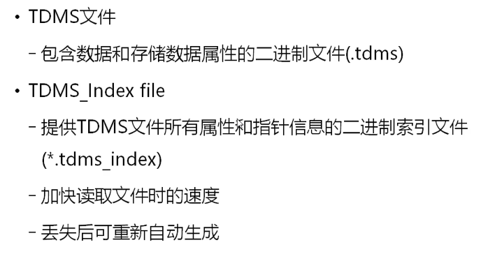

* 访问方法：

  * 使用快速测量文件和读取测量文件 Express VI
    * 快速保存和检索TDMS格式数据
    * 不易控制数据分组和数据属性
  * 使用TDMS API
    * 打开、写入、读取和关闭TDMS文件的一组函数
    * 允许以通道组或通道的形式组织数据
  * 使用TDM Excel嵌入工具
  * 通过Microsoft Excel读取TDMS文件

* 使用TDMS API访问TDMS文件：（编程 ---> 文件IO ---> TDMS ） 

  * API包含：打开vi，写入vi，读取vi，关闭vi，设置属性vi，获取属性vi

  * 写入流程：

    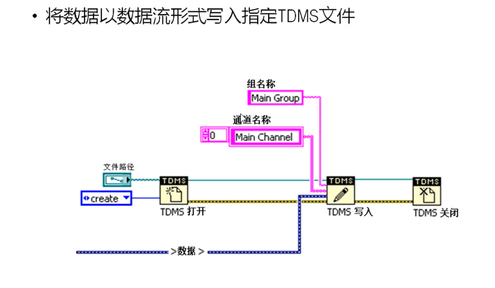

  * 读取流程：

    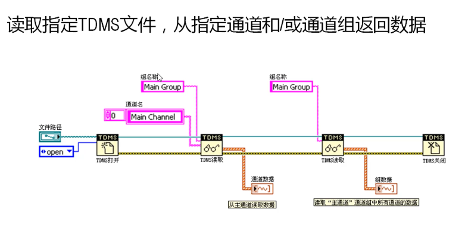

  * TDMS文件查看器：

    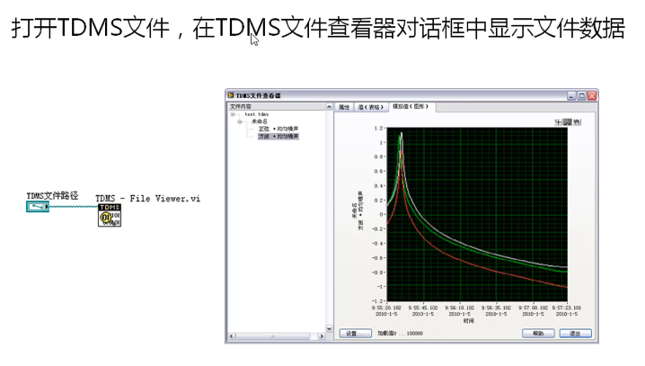

  * 

## 34. 数据记录仪

* 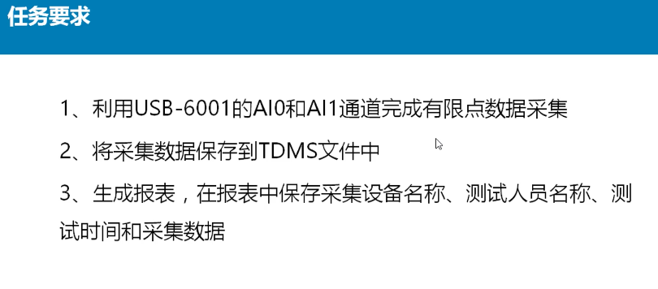

* 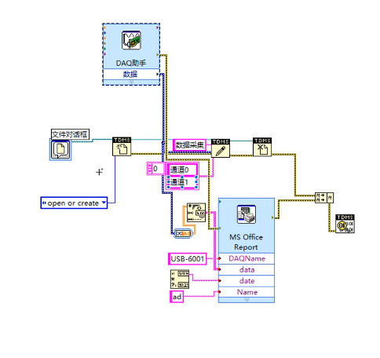

  **注意：**读取到的数据是动态数据，需要先转变成数组；再把数组转换为字符串才能输出报表
