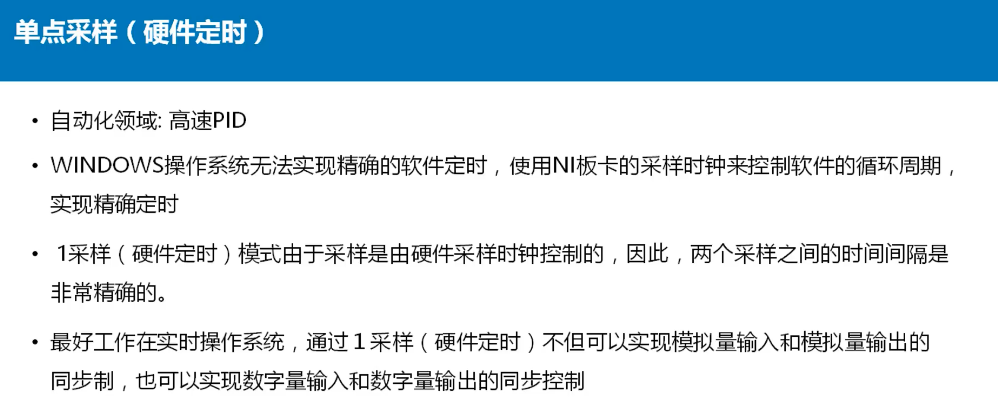

#  LabVIEW—数据采集快速入门与提高

## 1. 数据采集系统概述

* 数据采集系统包含：

  * 原始信号

  * 信号调理设备（放大、滤波）
  * 数据采集设备
  * 上位机

* 数据采集平台：

  * PXI平台 - 模块化、可拓展、利用最新商业技术
  * C系列数据采集产品CDAQ - 使用USB连接，体积小、功耗小
  * C系列数据采集产品cRIO - 配置了实时处理器和可重配置的FPGA资源（可以脱离PC机），体积小、功耗小
  * PCI，USB产品

## 2. 安装NI-DAQmx驱动

* 安装NI-DAQmx驱动的方法：
  * NI Device Drivers DVD
  * NI-DAQmx DVD
  * ni.com/downloads/products

## 3. 配置管理软件NI-MAX

* NI-max实现的三个功能：
  * 识别和检测NI硬件
  * 无需编程完成数据采集任务
  * 创建数据采集任务，导入LabVIEW自动生成代码
* NI-MAX面板信息
  * 所有安装的软件：我的系统 ---> 软件
  * 已经创建的任务：我的系统 ---> 数据邻居
  *  外界的设备：我的系统 ---> 设备和接口
  * 外接设备的信息：右键某个设备
  * 设备仿真：右键“设备和接口” ---> 仿真NI-DAQmx设备或模块化仪器
* 无需编程完成数据采集任务
  * 选择设备 ---> 工具栏选择“测试面板”
  * 右键设备 ---> 创建任务 ---> 选择数据采集模式 ---> 各种设置

## 4. 硬件选型关注的参数

* 通道数是多少？
  * 选择有足够通道数的DAQ设备
* 测量的最大最小值
  * 选择正确输入范围的DAQ设备
* 采样或生成信号的分辨率是多少
  * 有足够高采样率的DAQ设备
  * 采样需要考虑的几个问题：
    * 实际模拟输入信号是随时间连续的，采样信号是用指定采样速率量化模拟信号得到的一系列离散的点
    * Nyquist定理：**为了准去获取信号的频率信息，采样频率必须大于信号的最大频率的两倍**，**为了准去获取信号的波形信息，采样频率必须大于信号的最大频率的5-10倍**
* 需要检测的最小信号变化是多少
  * 选择有正确编码宽度的DAQ设备
  * 计算编码宽度需要：
    * 分辨率
      * 表示信号ADC位数
      * 分辨率决定了可测量的电压的变化值
      * 更高的分辨率 = 更精确的表达信号
      * 3位分辨率可以表示2^3^ = 8个电压阶数
      * 16位分辨率可以表示2^16^ = 65536个电压阶数
      * 电压的变化曲线更加平滑
    * 设备输入范围
    * 编码宽度 = 设备输入范围 / 2^分辨率^
    * 更小的编码宽度 = 更精确的表达信号
* 测量的误差要求是多少
  * 确保DAQ设备有合适的绝对精度
  * 编码宽度 ！= 精度
  * 影响精度的误差源
    * 来自放大器和ADC的增益误差和偏置误差
    * 系统噪声
  * 查看DAQ设备的产品规范手册

## 5. 信号的连接方式

* 接地注意事项
  * 为了正确的测量结果，必须对系统正确姐弟
  * 信号的接地方式将影响DAQ设备上的仪用放大器的接地方式
  * 正确的系统接地步骤：
    * 确定信号如何接地
    * 为测量系统选择接地模式
  * 信号的接地方式：
  * 
  * 
  * 系统的接地方式：
  * 
  * 
  * 👆会导致可用通道减半，但是可以有效抑制共模电压和噪声
  * 
  * 
  * 
  * 
  * 
  * 

## 6. NI数据采集篇

* 根据手上不同的采集卡，可以去官网查看用户手册

## 7. USB-6001功能测试

* 

## 8. DAQ助手 ExpressVI（一）

* 根据传感器的图标和NI-MAX的引脚指引连接
* 创建vi ---> 函数面板 ---> 测量I/O ---> DAQ-mx ---> DAQ助手 ---> 选择任务类型
* 1采样（按要求）：软件定时，速度要求不高
* 将动态数据转换为标量（可进行运算）：
  * 函数面板 ---> Express ---> 信号操作 --->  从动态数据.....

## 9. DAQ助手 ExpressVI（二）

* 差分的连接方式是将两个接线端都接在AI端口，在DAQ助手设置的时候只需要选中一个接线端
* 使用DAQ助手可以单次选择设置多个物理通道
* 使用8中提到的“将动态数据转换为标量”是输出一个数组，如果有多组的采样则是多维数组，需要用索引切开

## 10. DAQ助手 ExpressVI（三）

* 高速采集：
  * 连续输入
* 自产自测流程：
  * 使用仿真信号搞一个波形 ---> 使用DAQ助手创建一个输出 ---> 使用DAQ助手创建一个采集（注意端口要一致，**为了保证先运行输出再运行采样，可以将两个控件的错误簇连接在一起** ---> 输出控件 ---> 套个while循环

## 11. NI-DAQmx底层VI

* Express VI：简单、方便、易用，功能有限、执行效率低
* 使用底层VI编写读取程序
  * 函数选板 ---> 测量I/O ---> DAQmx-数据采集
  * 创建虚拟通道VI：可以创建虚拟通道并将其添加到任务
  * DAQ-mx定时：配置采样率，模式等等
  * DAQ-mx触发：
    * 开始触发：启动采集或生成
    * 参考触发：在一组样本中创建预触发数据
    * 多个设备之间的同步时用到
  * DAQ-mx开始任务：将任务转换为开始状态
  * DAQ-mx读取：从制定的任务中读取样本
  * DAQ-mx结束
  * DAQ-mx清除

## 12. 单点数据采样

* 单点采样：

  * 1采样（按要求）、1采样（硬件定时）

* 单点定时（硬件定时）

  * 
  * 
  * 
  * 
  * 👆如果时间间隔过长，可能会导致程序无法正确退出（记得设置采样控件中的采样什么的）
  * 

## 13. 温度数据采集

* 
* 工作原理
* 

* 

* 

* 编写程序，顺序为：创建（设置各种参数：最大最小值，通道，单位...）---> 开始 ---> while循环 ---> 读取 ---> 清除（因为有while所以不需要停止）

  

## 14. 有限点数据采集

* N采样，也叫有限点采样。用于在已知需要的总采样点数情况下的采集任务

* 尤其是用在带触发的采样任务中

* 需要缓存区

  

* 设置采样大小

  

* 基本流程：

  * 不需要while
  * 创建任务 ---> 配置任务（采样时钟） ---> 开始任务 ---> 采样任务（记得设置采样控件中的采样什么的） ---> 清楚任务

  

## 15. 连续数据采集（一）

* 
* 缓冲区的大小一般为采样率的10倍
* 
* 
* 

## 16. 连续数据采集（二）

* 

## 17. 信号调理

*  信号调理的通用功能
  * 放大：微弱的信号都要进行放大以提高分辨率和降低噪声，尽量靠近数据采集模块，以保证数据在受到噪声之前就被放大，减小信噪比
  * 隔离：隔离是指使用变压器、光或者电容耦合等方法在被测系统和测试系统之间传递信号，避免直接的店连接。使用隔离的原因有两个：1. 安全 2. 隔离可以使得从数据采集卡读出来的数据不受地电位和输入模式的影响
  * 滤波：除去信号中不需要的成分
  * 激励：信号调理也能为某些传感器提供所需要的激励信号，比如应变传感器、热敏电阻等需要外界电源或电流激励信号
  * 线性化：许多传感器对被测量的响应是非线性的，因而需要对其输出信号进行线性化，以补偿传感器带来的误差
  * 数字信号调理即使传感器直接输出数字信号，有时候也有进行调理的必要性。其作用是将传感器输出的数字信号进行必要的整形或电平调整

## 18. 模拟输出——单点生成

* 大部分多功能DAQ设备的每个模拟输出通道都有一个数模转换器（DAC）

* 所有DAC同时更新

* 类似于对模拟输入同时采样

* 

* 自动开始

  

* 单点生成

  

* 软件定时模拟输出

  

## 19. 单点生成程序设计

* 单次生成

  * 函数面板 ---> 创建任务（修改控件下方的设置，改为模拟输出，添加通道选择控件） ---> **单值的模拟输出不需要开始控件** ---> “写入”控件（设置输入的值） ---> 清除控件

  

* 多次生成（软件控制）

  * **多值模拟输出需要“开始”控件**，用while把“写入”控件框起来，更改掉自动开始

    

* 通过NI-MAX的面板监控输入

## 20. 模拟输出——连续生成

