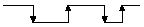
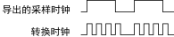

# NI-DAQMX 20.7手册

## 0. 入门

### 0.1 NI-DAQmx概述

NI-DAQmx是用于与NI数据采集(DAQ)设备通信并控制设备的驱动程序软件。它包含一个用途广泛的函数和VI库，可从LabVIEW或LabWindows/CVI中调用库函数，对NI设备进行编程。

Measurement＆Automation Explorer (MAX)和DAQ助手是随NI-DAQmx自动安装的应用程序。

可在在MAX或LabVIEW、SignalExpress、LabWindows/CVI、Measurement Studio等NI应用软件中打开DAQ助手。通过DAQ助手，可︰

- 创建和编辑任务及虚拟通道
- 向任务添加虚拟通道
- 创建和编辑换算
- 测试自定义配置
- 保存自定义配置
- 在NI应用软件中生成代码以用于自定义应用程序。
- 查看传感器的连线图。

### 0.2 查找范例

每个API均提供一组编程范例，以方便用户开发应用程序。用户可修改范例代码，然后将代码保存在应用程序中。用户可使用范例开发新的应用程序，或将范例添加至现有应用程序中。

使用NI-DAQmx仿真设备，无需安装硬件就可以运行范例。在MAX中，选择帮助 -> 帮助主题 -> NI-DAQmx，查看*NI-DAQmx的MAX帮助*，获取更多关于NI-DAQmx仿真设备的信息。

### 0.3 疑难解答

* https://www.ni.com/documentation/zhs/ni-daqmx/20.1/gettingstarted/troubleshooting/

## 1. 测量基础

### 1.1 测量系统概述－硬件和NI-DAQmx

NI-DAQmx驱动软件中包含的应用软件可用于对NI测量设备编程（例如，配置、采集、生成和发送数据至NI测量设备）。使用NI-DAQmx可节省编程时间。应用程序（例如，LabVIEW、LabWindows™/CVI™和Measurement Studio）发送命令至驱动软件。例如，获取和返回热偶的读取值并显示和分析得到的数据。

通过NI应用软件或支持使用ANSI C接口调用动态链接库(DLL)的编程环境，可调用NI-DAQmx驱动程序。在任意编程环境中，DAQ应用均使用NI-DAQmx。

### 1.2 信号类型

#### 1.2.1 模拟信号连接注意事项

**测量模拟信号前，必须确定信号源为接地或浮接，还必须考虑测量系统为差分、参考单端或非参考单端。**

* [接地信号源](https://www.ni.com/documentation/zhs/ni-daqmx/20.1/measfunds/groundsig/#GUID-A41EE540-F1EF-46F8-9D86-B72704F24216)
* [浮接信号源](https://www.ni.com/documentation/zhs/ni-daqmx/20.1/measfunds/floatsig/#GUID-EAC91D96-DE8A-47B7-BBEF-B53B37B190C2)
* [差分测量系统](https://www.ni.com/documentation/zhs/ni-daqmx/20.1/measfunds/diffmeassys/)
* [参考和非参考单端测量系统](https://www.ni.com/documentation/zhs/ni-daqmx/20.1/measfunds/refsingleended/)

#### 1.2.2 连接模拟输入信号

### 1.3 信号调理

传感器可生成用于测量物理现象（例如，温度、力、声音和光）的电信号。如需测量传感器的信号，必须将其转换为DAQ设备可读取的格式。例如，热电偶的输出电压很小且易被噪声干扰。因此，在转换为数字信号前，必须进行放大和滤波处理。

使信号适合数字化的过程称为*信号调理*。信号调理通常包括：放大, 线性化, 传感器激励, 隔离

#### 1.3.1 放大

通过增大信号相对于噪声的幅度，提高数字化信号的精度。使最大电压变化等于ADC或数字化仪的最大输入范围，可获得尽可能高的准确性。系统应通过最接近信号源的测量设备放大低电平信号。

如通过测量设备放大信号，则测量和数字化的信号中可能包含由导线引入的噪声。在接近信号源的位置通过SCXI模块放大信号，可减少噪声对被测信号的影响。

**Note: 应使用屏蔽式电缆或双绞线电缆。通过减小电缆长度可降低导线引入的噪声。使信号连线远离AC电源电缆和显示器可减少频率为50至60 Hz的噪声。**

#### 1.3.2 线性化

通过软件使传感器产生的信号线性化，换算后的电压可用于物理现象。例如，通常，热电偶10 mV的电压变化并意味着温度的变化为10。但是，通过软件或硬件的线性化处理，应用中的热电偶值可换算为相应的温度变化。绝大多数传感器具有用于说明传感器换算关系的线性化表格。

#### 1.3.3 传感器激励 

信号调理系统可为某些传感器生成激励。应变计和RTD需要外部电压和电流激励电路，然后开始测量物理现象。激励类似于收音机用于接收和解码音频信号所需的电源。许多测量设备可为传感器提供激励。关于设备是否可生成激励，见设备文档

#### 1.3.4 隔离

信号通常会超出测量设备可处理的范围。尝试测量过大的信号可导致测量设备损坏或人身伤害。通过*隔离*信号调理技术可防止人体和测量设备接触过大的电压。信号调理硬件可降低较高的共模电压，获取测量设备可处理的电压信号。通过隔离可避免接地电势差对设备的影响。

### 1.4 常见传感器

不同的应用使用不同的传感器。常见的传感器包括：应变计、热电偶、热电阻、角度编码器、线性编码器、基于电桥的传感器以及电阻式温度检测器(RTD)。

* https://www.ni.com/documentation/zhs/ni-daqmx/20.1/measfunds/cmmnsensor/

### 1.5 控制概述

通常，控制应用中包含一个或多个需控制的过程变量（例如，温度）。传感器可测量动态系统中的过程变量并为应控制应用提供数据。设定点为过程变量要达到的值。比较器可判断过程变量和设定点之间的差。如差不为零且系统判断该值足够大， 补偿器可处理该值并通过执行器的输出驱动系统接近设定点。

#### 1.5.1 比例积分微分(PID)

比例积分微分(PID)算法是工业中最常使用的控制算法。通常，PID用于加热和冷却系统、液面监控、流控制和压力控制应用。在PID控制中，必须指定过程变量和设定点。过程变量是要控制的系统参数（例如，温度、压力和流量），设定点是要控制的参数值。PID控制器可确定控制器的输出值（例如，加热器的功率或值位置）。控制器使用控制器输出值控制系统，使过程变量接近设定点的值。

#### 1.5.2 实时

实时是指及时响应。对于非实时系统，无法确定响应发生的时间，操作完成的时间可能早于或晚于预期时间。换句话说，实时系统具有确定性，可保证操作在指定时间内发生。实时系统是可预期的。

对于实时系统，所有部分都必须是实时的。例如，即使程序运行在实时操作系统上，也不意味着程序具有实时特性。程序可能依赖某些非实时动作（例如，文件I/O），导致程序无法实时运行。

#### 1.5.3 循环周期时间

许多应用（例如，控制应用）需使用周期性实时操作系统。周期的开始和结束之间的时间*T*称为*循环周期时间*或采样周期。1/T为循环速率或采样率。即使在实时操作系统中，循环周期也可能变化，但始终小于最大抖动。

#### 1.5.4 控制应用中的抖动

对于控制应用，循环时间与期望时间的差称为抖动。循环时间与期望时间差的最大值称为最大抖动。

实时系统中的抖动是固定的。例如，安全气囊必须在碰撞发生后的1秒内打开，因此最大抖动为固定值。非实时系统中的抖动不是固定的，变化范围较大。例如，等待公交车。按照计划，公交车应在上午11:00到达，但实际到达时间第一天为上午11:05，第二天为上午11:30，第三天无法到达。对公交车的延误时间没有限制。

#### 1.5.5 事件响应

事件响应应用需要在确定的时间内对发生的事件进行响应。例如，监视引擎的温度。在引擎温度过高时，降低引擎运行的速度。事件是指引擎温度超出预设上限，响应是指降低引擎运行速度。另一个实例来自生产制造过程。在生产线上，系统在检测到零件将要进行一道工序（事件）时，将获取读数或对零件执行操作（响应）。如系统在一段时间内没有检测到零件或没有对零件的出现产生响应，生产线将产生次品零件。

## 2. NI-DAQmx重要概念

### 2.1 NI-DAQmx通道和任务

* **虚拟通道（通道）**，是将实体通道和通道相关信息（范围、接线端配置、自定义换算等格式化数据信息）组合在一起的软件实体。任务是具有定时、触发等属性的一个或多个虚拟通道。
  * 通过“DAQmx创建虚拟通道”函数/VI创建的虚拟通道是局部虚拟通道，只能在任务中使用。使用该函数，可选择虚拟通道的名称。该名称将用于NI-DAQmx的其他位置，用于指代该虚拟通道。
  * 如使用DAQ助手创建虚拟通道，可在其他任务中使用这些虚拟通道，并在任务之外引用虚拟通道。因为这些虚拟通道是全局虚拟通道，可用于多个任务。可使用NI-DAQmx API或DAQ助手选择全局虚拟通道，并将其加入至任务。如将一条全局虚拟通道添加至若干个任务，然后使用DAQ助手修改这个全局虚拟通道，改动将应用于所有使用该全局虚拟通道的任务。全局虚拟通道的改动生效前必须先保存改动。
* **实体通道**是测量和发生模拟信号或数字信号的接线端或管脚。信号物理通道可包括一个以上接线端，例如，差分模拟输入通道，或8线数字端口。设备上的每个实体通道都有唯一的符合NI-DAQmx实体通道命名规范的名称（例如，SC1Mod4/ai0, Dev2/ao5, Dev6/ctr3）。

#### 2.1.1 通道：物理、虚拟、局部虚拟和全局虚拟

##### 2.1.1.1 使用API创建虚拟通道

**问题：**

创建一个NI-DAQmx虚拟通道，测量50° C - 200° C之间的温度。将M系列设备配置为Dev1，将J型热电偶连接至设备上的通道0。使用LabVIEW或LabWindows™/CVI™写一个应用程序。

**解答：**

1. 调用LabVIEW中的“DAQmx创建虚拟通道”VI的AI温度TC实例在LabWindows/CVI中是``DAQmxCreateAIThrmcplChan``函数）。
2. 使用设备上的``Dev1/ai0``作为连接热电偶信号的实体通道。
3. 指定虚拟通道的名称为``myThermocoupleChannel``。
4. 选择相应的热电偶类型和范围输入值。NI-DAQmx将把这些属性应用至虚拟通道。

##### 2.1.1.2 虚拟通道的类型

根据信号的类型（模拟、数字、计数器）和方向（输入、输出），可创建不同类型的虚拟通道。虚拟通道可以是全局虚拟通道或局部虚拟通道。关于函数/VI的详细信息，请参考ADE的相关帮助。

- **模拟输入通道**—模拟输入通道使用各种传感器测量不同的物理现象。创建的通道类型取决于传感器以及测量现象的类型。例如，可创建热电偶测量温度的通道、测量电流电压的通道、测量带激励电压的通道，等等。

- **模拟输出通道**—NI-DAQmx支持两种类型的信号，电流信号和电压信号。如设备测量的是其他信号，可将测得的信号进行转换得到电压或电流信号。

- **数字输入/输出通道**—对于数字通道，可创建基于线和基于端口的数字通道。基于线的通道可包含设备一个或多个端口的一条或多条数字线。读取护哦些如基于数字线的通道不会影响硬件上的其他数字线。可将一个端口中的数字线在多条通道中使用，并在一个或多个任务中同时使用这些通道，但是某条通道中的线必须全是输入线或输出线。另外，任务中的所有通道必须是输入通道或输出通道。有些设备还规定端口中的线必须都是输入线或输出线。关于设备的详细信息，请查阅设备文档。

  基于端口的通道表示设备上的一组数字线。读取或写入端口将影响端口中的所有数字线。端口中所有线的数量（端口宽度）是一个硬件参数，通常从8线（MIO设备）到32线（SCXI数字模块）不等。

- **计数器输入/输出通道**—NI-DAQmx支持不同计数器测量和生成类型的输入和输出。关于计数器测量的常见应用，见NI-DAQmx中计数器的组成。

##### 2.1.1.3 物理通道语法

###### 物理通道名称

物理通道的名称有**设备标识符、斜杠(/)和通道标识符**组成。例如，如物理通道是``Dev1/ai1``，设备标识符是``Dev1``，通道标识符是``ai1``。MAX根据设备在系统中安装顺序的前后为设备分配标识符，例如，``Dev0、Dev1``等等。也可在MAX中为设备分配设备标识符。

对于模拟I/O和计数器I/O，通道标识符由通道类型（**模拟输入ai，模拟输出ao，计数器ctr**）和通道编号组成，如下所示：``ai1 ctr0``

对于数字I/O，通道标识符指定了一个端口，包括了端口中的所有线：``端口0``

通道标识符可指定端口中的线：``port0/line1``

所有线都具有唯一的标识符。所以，不用说明线归属的端口即可指定一条数字线。例如，在有4个8位端口的设备上，``line31``等同于``port3/line7``。

###### 物理通道范围

如要指定一个物理通道的范围，在两个通道编号或物理通道名称的编号之间使用冒号分隔：

``Dev1/ai0:4``or ``Dev1/ai0:Dev1/ai4``

对于数字I/O，在两个端口编号之间用冒号分隔，指定一个端口范围。

``Dev1/port0:1``

可指定一个数字线的范围：

``Dev1/port0/line0:4``

``Dev1/line0:31``

可反向指定通道范围：

``Dev1/ai4:0``

``Dev1/ai4:Dev1/ai0``

``Dev1/port1/line3:0``

###### 物理通道列表

使用逗号在列表中分隔物理通道名称和范围，如下所示：

``Dev1/ai0, Dev1/ai3:6``

``Dev1/port0, Dev1/port1/line0:2``

##### 2.1.1.4 数字线、端口和端口宽度

数字线和端口是数字输入/输出系统的重要部分。

- **线**—一条线就是一个独立的信号。线表示一个实体的接线端。线上的数据叫做“位”，是二进制的0或1。线和位基本上是可以互换的术语。例如，8比特端口与8线端口含义相同。
- **端口**—端口是数字线的集合。通常情况下，数据线都被组合为8位或32位端口。
- **端口宽度**—端口宽度指端口中线的数量。例如，一个8线端口的端口宽度为8。

##### 2.1.1.5 生成通道名称

通过NI-DAQmx API创建局部虚拟通道时，如用户不提供局部虚拟通道的名称，NI-DAQmx将会为通道自动分配名称

| 物理通道名称 | 分配的名称 | 生成的局部虚拟通道名称         |
| :----------- | :--------- | :----------------------------- |
| Dev1/ai0:1   | —          | Dev1/ai0, Dev1/ai1             |
| Dev1/ai0:7   | "foo"      | foo0, foo1, ..., foo7          |
| Dev1/ai0:7   | "foo31"    | foo31, foo32, ..., foo38       |
| Dev1/ai0:7   | "foo 123"  | foo123, foo124, ..., foo130    |
| Dev1/ai0:7   | "a0:3, b"  | a0, a1, a2, a3, b0, b1, b2, b3 |

##### 2.1.1.6 为通道、任务和换算命名

通道、任务和换算的命名需符合下列要求：

- 仅使用字母和数字字符。

- 不要使用非字母数字字符，下列特例除外：

  - NI-DAQmx 7.4及更高版本允许在通道、任务和换算的名称中使用连字符。
  - 允许使用空格。
  - 可在通道、任务或换算名称中使用下划线，但是下划线不能作为名称的首字符，如_Dev1。

  **注：**

  创建通道、任务和换算时，可使用其他非数字字母类字符。但是将配置导入其他系统，尤其是其他语言的系统时，配置可能失效。

- 设备名称不能多于256个字符。

##### 2.1.1.7 冷端补偿通道

内置的冷端补偿(CJC)通道。每经过一个采样时钟边沿，读取一次CJC通道。

相关主题：[采样时钟](https://www.ni.com/documentation/zhs/ni-daqmx/20.1/mxcncpts/sampclock/)

#### 2.1.2 NI-DAQmx任务

任务是一个或多个虚拟通道定时、触发等属性的集合。从概念上来说，任务就是信号测量或信号发生。任务中的所有通道的I/O类型必须相同，例如，模拟输入、计数器输出，等等。但是，任务可包含不同测量类型的通道，例如，测量温度的模拟输入通道和测量电压的模拟输入通道。对于大多数设备，一次只能运行子系统的一个任务；部分设备可同时运行多个任务。在一些设备上，一个任务中可以包括来自多台设备的通道。按照下列步骤进行测量或生成任务：

1. 创建或加载一个任务。可使用DAQ助手交互式创建任务，或在ADE（LabVIEW或LabWindows/CVI）中通过编程创建任务。
2. 如有需要，配置通道、定时和触发属性。
3. 如有需要，进行若干任务状态转换，使任务就绪。
4. 读取或写入采样。
5. 清除任务。

如实际需要，请重复步骤2至步骤4。例如，读取或写入采样后，可重新配置虚拟通道、定时和触发属性，然后根据新的配置读取和写入其他采样。

如要将属性设置为除默认值以外的其他值以保证任务成功执行，程序每次执行时都必须重新设置这些属性。例如，如运行的程序将属性A设置为非默认值，然后再运行一个不设置属性A的程序，第二个程序将使用属性A的默认值。避免该重复操作的唯一方法时使用DAQ助手创建虚拟通道和任务。

##### 2.1.2.1 通过API创建任务

**问题：**

创建一个NI-DAQmx任务测量50°C-200°C之间的温度，将M系列设备配置为设备1，连接J型热电偶至设备的通道0。每秒钟采集温度10次，采集10,000个数据。使用LabVIEW或LabWindows/CVI写一个应用程序。

**解答：**

1. 调用LabVIEW中的“DAQmx创建虚拟通道”VI的AI温度TC实例（在LabWindows/CVI中是``DAQmxCreateAIThrmcplChan``函数）。
2. 使用设备上的``Dev1/ai0``作为连接热电偶信号的物理通道。
3. 指定虚拟通道的名称为``myThermocoupleChannel``。
4. 选择相应的热电偶类型和范围输入值。NI-DAQmx将把这些属性应用至虚拟通道。
5. 调用LabVIEW中“DAQmx定时”VI的采样时钟实例（或LabWindows/CVI中的``DAQmxCfgSampClkTiming``函数），指定**采样率**为10 Hz，**采样模式**为有限(finite)采样。
6. 调用“DAQmx开始任务”VI（LabWindows/CVI中的``DAQmxStartTask``函数）。
7. 调用“DAQmx读取”VI的模拟1D DBL 1通道N采样实例（``LabWindows/CVI中的DAQmxReadAnalogF64``函数），指定**每通道采样数**为10,000。
8. 当采集完所需的样本数据后，调用“DAQmx停止任务”VI（LabWindows/CVI中的``DAQmxStopTask``函数）。
9. 调用“DAQmx清除任务”VI（LabWindows/CVI中的``DAQmxClearTask``函数）。

至此，使用局部虚拟通道``myThermocoupleChanne``l的``myTemperatureTask``任务创建完毕。

##### 2.1.2.2 使用“开始任务”函数/VI

调用“开始任务”函数/VI可显式地开始一个任务。进行其他隐式开始任务的操作时，任务会自动开始。例如，调用“读取”或“写入”函数/VI可能会隐式地开始一个任务。指定显式或隐式开始任务，取决于任务的操作。默认情况下，**单点读取函数和写入函数会自动开始一个任务**。

**相关主题**

- [“已就绪”状态](https://www.ni.com/documentation/zhs/ni-daqmx/20.1/mxcncpts/committedstate/)
- [“运行”状态](https://www.ni.com/documentation/zhs/ni-daqmx/20.1/mxcncpts/runningstate/)
- [任务状态模型](https://www.ni.com/documentation/zhs/ni-daqmx/20.1/mxcncpts/taskstatemodel/)
- [“已验证”状态](https://www.ni.com/documentation/zhs/ni-daqmx/20.1/mxcncpts/verified/)

**开始一个有限测量任务：**

* 如指定了执行有限测量的任务，则无需调用开始任务函数/VI，也不需要更改DAQmx读取函数/VI的默认行为。调用读取函数/VI开始任务并执行有限测量，并在读取最后一个采样后停止任务。调用读取操作前，任务返回其状态。但是，如要在任务结束后进行额外的读取操作（要读取缓冲区更早存入的数据），默认操作是不够的，原因有二：
  1. 任务返回至验证状态，无法访问采样。
  2. 再调用“读取”函数/VI会启动新的读取操作，而不是从完成的操作中继续读取。
* 在该情况下，调用控制任务函数/VI，将**动作**参数设置为“就绪”。然后，在进行初始读取操作之后和后续操作之前，将自动开始读取属性设置为FALSE。

**开始一个连续测量任务：**

对于连续测量，调用“开始任务”函数/VI，进行所需的读取操作，然后调用“停止任务”函数/VI停止连续测量。如在循环中进行读取操作，无论读取操作是单采样读取、按需读取，还是多采样硬件定时读取，请在进入循环之前调用“开始任务”函数/VI，在离开循环之后调用“停止任务”函数/VI。

**开始模拟输出任务：**

写入函数/VI的操作较为复杂。调用写入函数/VI的结果是任务至少转换为已就绪状态。任务是否转换至运行状态取决于**自动开始**参数的值。

对于单采样写入操作，调用写入函数/VI的单采样实例。该调用也启用了任务，写入单个采样，最后停止任务。对于多采样按需写入操作，调用写入函数/VI，并将**自动开始**参数设置为真，其默认值为假。该调用也启用了任务，写入多个采样，最后停止任务。

对于多采样硬件定时写入操作，应先调用“写入”函数，写入要生成的样本，显式调用“开始任务”，调用“结束前等待”函数/VI等待采样生成完毕，然后显式调用“停止任务”函数/VI。

如将“写入”函数/VI的**自动开始**参数设置为真（主动设置或使用单点写入函数），硬件定时生成可能会失败，因为写入的采样在波形生成时还未传递到设备。进行硬件定时生成时，开始任务之前始终写入部分波形

**改进“开始任务”函数/VI的性能：**

下面是部分需显式调用“DAQmx开始任务”函数/VI和“DAQmx停止任务”函数/VI的情况：在循环中调用“读取”或“写入”函数/VI时，在进入循环之前调用“开始任务”函数/VI，在离开循环之后调用“停止任务”函数/VI，可明显提高运行速度。如在进入循环之前未调用“开始任务”函数，任务在进行读取或写入操作前必须从当前状态转换为“运行”状态。读取或写入操作完成后，任务必须从“运行”状态恢复至原来的状态。每次循环中都将发生这些转换，会消耗大量时间。

##### 2.1.2.3 中止任务

导致任务中止的几种情况：

- 如要显式中止任务，可调用DAQmx控制任务函数/VI，且**动作**参数设置为“中止”。通常，中止任务并非正常的操作。应将其用于特殊情况。
- 在LabVIEW中，单击**中止执行**按钮可中止任务。这样做会导致在该VI层次结构中创建的所有任务被中止，然后被清除。
- 如从系统中删除设备，当前正在使用该设备资源的所有任务均会中止。
- 如调用DAQmx重置设备函数/VI将设备恢复到初始配置，则当前使用该设备资源的所有任务均会中止。

任务被中止时，它将返回“已验证”状态。如任务正在运行，它将立即停止并随即返回未预留状态。任务被中止后，可继续使用该任务。但继续指定的操作前，可能需要将任务转换回它的上一个状态。

#####  2.1.2.4 使用“任务完成”函数/VI

如要在应用程序的一个部分监测另一部分任务的进度，可使用“任务完成”函数/VI。

总而言之，如不需要读取和写入采样，而是需要监测错误时，可在连续测量和生成中使用“任务完成”函数/VI

##### 2.1.2.5 使用“结束前等待”函数/VI

可能需要调用“结束前等待”函数确保操作在任务停止前结束。

最常见的范例是有限次生成。如开始一个进行有限次信号生成的任务，然后立即停止任务，停止任务时生成可能没有完成。生成没有按照预期完成。要保证有限次信号生成按照预期完成，在停止任务前调用“结束前等待”函数。“结束前等待”函数执行后，有限次生成任务完成，然后任务停止。

一般情况下，“结束前等待”函数通常与有限次测量或生成任务一起使用。

##### 2.1.2.6 任务何时完成？

如测量或生成是有限的，采集或生成最后采样或调用“停止任务”函数/VI时任务即告完成。如测量或生成为连续的（包括按需定时）或启用重新触发，直到调用“停止任务”函数/VI，任务才告完成。另外，如生成或测量时发生了一个严重错误，或中止测量或生成时，任务即完成。检查错误和警告，确保任务成功完成。

##### 2.1.2.7 任务状态模型

###### 2.1.2.7.1: "未验证"状态

创建或加载任务后，任务即为未验证状态。在该状态下，可配置任务的定时、触发和通道属性。

###### 2.1.2.7.2: “已验证”状态

任务从未验证状态至验证状态转换时，NI-DAQmx将检查任务的定时、触发和通道属性。调用“控制任务”函数/VI，**动作**接线端设置为“验证”，可完成上述状态转换。NI-DAQmx会立即检查和验证一些属性的值是否合法，但是有些属性的值无法立即检查和验证，因为这些属性的值依赖于其他属性和使用的设备。NI-DAQmx在验证转换时检查这些属性的值，并报告检测中发现的非法属性值。如NI-DAQmx没有发现非法值，任务成功验证并进入“验证”状态。否则，任务将停留在未验证状态。

在某些情况下，NI-DAQmx会强制转换属性的值，使任务通过验证，而不是生成一个错误。当属性上设置的值不能精确满足，但是对原值的修改不会明显影响任务时，NI-DAQmx会强制修改原值。

###### 2.1.2.7.3: "已保留"状态

任务从验证状态转换为保留状态时，任务进行某个操作时所需的资源会被独占。这些资源可以是设备上的时钟或通道、PXI机箱上的触发线，或计算机的缓存。保留这些资源可防止其他任务占用这些资源，以免干扰当前任务的执行。调用“控制任务”函数/VI，**动作**接线端设置为“保留”，可完成上述状态转换。如果资源被其他任务占用，转换将失败。如果任务可访问其使用的所有资源，任务就可成功保留并转换至“保留”状态。否则，任务将停留在验证状态。

###### 2.1.2.7.4: "已就绪"状态

任务转入“已就绪”状态状态时，NI-DAQmx会改变资源的某些设置。这些设置可能是时钟的速率、设备通道的输入限制、PXI机箱触发线的方向、计算机缓冲区的大小，等等。有些设置，例如，采样计数器，无法在任务转换至“已就绪”状态状态时改变。因为这些设置在任务开始时改变。任务进入“已就绪”状态状态，即任务从“已保留”状态转为“已就绪”状态状态。调用“控制任务”函数/VI，**动作**接线端设置为“就绪”，可完成上述状态转换。总而言之，就绪转换不会失败。失败属于意外情况。如失败了，任务就会保持“已保留”状态。如程序改变了任务相关的资源设置，任务即成功转入“已就绪”状态状态。

###### 2.1.2.7.5: "运行"状态

当任务开始执行指定操作时，任务从“已就绪”状态转为“运行”状态。调用“开始任务”函数/VI可完成上述转换。开始一个任务并不意味着开始采集样本或生成波形。指定定时和触发属性，直到调用“读取”函数/VI才开始采集样本，或直到检测到触发才生成波形。总而言之，开始转换不会失败。失败属于意外情况。如失败了，任务就会保持“已就绪”状态。当任务开始执行指定操作时，任务成功开始并转换至运行状态。

###### 2.1.2.7.6: “运行”状态至“已就绪”状态

任务从“运行”状态转换为“已就绪”状态时，任务将停止执行指定操作。调用“停止”任务函数/VI实现上述转换。可能指定了定时和触发属性，转换发生前所有采样已采集完毕。对于输出操作，最后写入的值通常在任务停止后继续生成。在这种情况下，尽管不会采集更多样本，任务在转换发生之前仍在运行状态。总而言之，停止转换不会失败。失败属于意外情况。如失败了，任务就会返回“保留”状态。如果任务停止了，任务将转换为“已就绪”状态。

###### 2.1.2.7.7: “已就绪”状态至“已验证”状态

当进行特定操作的任务资源被释放后，任务从“已就绪”状态转为“已验证”状态。这些资源可以是设备上的时钟或通道、PXI机箱上的触发线，或计算机的缓存。调用“控制任务”函数/VI，**动作**接线端设置为“取消保留”，可完成上述状态转换。任务释放所有资源后，就会回到“已验证”状态。

###### 2.1.2.7.8: 显式和隐式状态转换

何时使用显式状态转移，何时使用隐式状态转移取决于所使用的系统。

**下面列出了使用显式状态转移的情况：**

- **验证**—如用户通过在应用程序中设置各种通道、定时和触发属性配置一个任务，请通过显式方式验证任务，以告知用户是否将属性设为有效值。
- **保留**—如下列条件为真，请选择通过显式方式保留一个任务：应用程序中包含使用相同资源的多个任务，某个任务反复执行操作，保证任务在连续操作开始之后其他任务不占用相关的资源。独占性地保留一个任务将占用任务要用到的资源，确保其他任务无法使用这些资源。例如，如应用程序包含两个进行一系列测量的任务，要保证一个任务在另一个任务完成后才开始，可将这两个任务在开始执行测量之前通过显式保留任务。
- **就绪**—如应用程序通过反复开始和停止一个任务进行多采样测量或生成，请显式将任务转入“就绪”状态。独占性地使任务进入“就绪”状态，需占用任务的资源，并改变这些资源的一些设置。独占性地使任务进入“就绪”状态，这些操作仅进行一次，而不是每次任务开始均进行一次操作，以减少开始任务所需的时间。例如，如应用程序重复进行有限次硬件定时测量，在重复进行测量之前使任务进入“就绪”状态，开始任务所需的事件就会明显减少。如要在任务停止后继续读取额外样本，也需要使任务进入“就绪”状态。关于更多信息，见使用“开始任务”函数/VI。
- **开始**—如任务反复进行读取或写入操作，显式地开始该任务。开始任务即保留了任务相关的资源，改变某些资源的相关设置，以及开始进行指定操作。显式开始任务时，这些操作仅进行一次，而不是每次读取或写入操作时都保留一次资源。该过程可显著减少进行读取或写入操作所需的时间。例如，如应用程序反复进行单点软件定时读取操作，如进行反复读取操作之前显式地开始任务，每次读取操作所需的时间会明显减少。

#### 2.1.3 使用DAQ助手创建通道和任务

可从NI应用软件或MAX中打开DAQ助手。DAQ助手是用于配置通道、任务和换算的图形化界面。

打开DAQ助手之后，按照向导的说明创建任务或通道。向导完成后，可配置测量的换算，如果必要，还可配置定时和触发。

**相关主题**

[选择使用API或DAQ助手](https://www.ni.com/documentation/zhs/ni-daqmx/20.1/mxcncpts/daqversusapi/)

**LabVIEW: **

在LabVIEW中，有若干种方法可以打开DAQ助手。常见的方法有下列几种：

- 从Express输入选板种选择DAQ助手Express VI。
- 使用DAQmx任务名称控件打开DAQ助手。
- 按照*LabVIEW帮助*中的*NI-DAQmx与LabVIEW项目的配合使用*，在LabVIEW项目中打开DAQ助手。

**LabWindows/CVI: **

在LabWindows/CVI中，选择**Tools»Create/Edit DAQmx Tasks**。单击DAQmx LoadTask函数选板的**Task Name**控件，选择**New Task**，打开DAQ助手。

**Measurement Studio:**

在Measurement Studio中，打开Visual Studio .NET并选择**Project»Add New Item**打开Add New Item对话框。在Categories栏中选择**Measurement Studio»Assistants**。在Templates栏中选择**DAQmx Task Class**。

**MAX:**

在MAX中，右键单击**数据邻居**并从快捷菜单中选择**新建**。在**新建**窗口选择**NI-DAQmx任务**或**NI-DAQmx全局虚拟通道**，然后单击**下一步**。

**Signal Express:**

在SignalExpress中，添加DAQmx Acquire或DAQmx Generate步骤。

#### 2.1.4 选择使用API或DAQ助手

创建一个新的应用程序时，可选择使用DAQ助手或API。

**使用DAQ助手的优点：**

- 无需编程。只需交互地配置通道、定时、触发和换算。
- DAQ助手缩短了开发时间。几分钟就可完成一个应用程序。
- 如通过DAQ助手创建了一个应用程序，后又需要其一些隐藏的功能，可从NI的应用程序开发环境（LabVIEW、LabWindows/CVI或Measurement Studio）中基于DAQ助手，生成等效的API代码。

**使用API的优点：**

- API中具有DAQ助手中隐藏的一些高级功能。
- API具有更好的灵活性，用户可基于实际需要使用API自定义应用程序。
- API能更好地控制应用程序的性能。

### 2.2 定时和触发

定时和触发是NI-DAQmx中的重要概念。时钟部分介绍了时钟和握手。触发部分介绍了开始触发和参考触发，以及其他常见的触发类型。例如，模拟边沿触发、数字边沿触发、等等。

#### 2.2.1 硬件定时和软件定时的比较

软件定时或硬件定时用于控制信号生成的时间。

**硬件定时**，例如，设备上的时钟（数字信号），控制信号生成的速率。

**软件定时**就是由操作系统和软件来控制采样生成，而不是由测量设备来控制。

硬件时钟运行远比软件快。硬件时钟比软件更为精确。

在NI-DAQmx中，**选择采样时钟定时函数/VI来确定硬件定时**，或**设置采样时钟的采样定时类型属性**。**如不进行上述设置，将采样定时类型属性设置为按需采集，表示已选择软件定时**。

##### 2.2.1.1 时钟

周期性的数字边沿可当作时钟用来计时。**采样时基时钟和20 MHz时基时钟表示消耗的时间**，用于将信号按时间对齐。时钟，顾名思义通常不像触发一样引起某个动作。采样时钟例外。

下列是DAQ设备常用的时钟。关于设备上时钟的详细信息，见设备的说明文档。

- **AI转换时钟**—多路复用设备上直接引发ADC转换的时钟。与设备最快的AI转换时钟速率相比，默认AI转换时钟另需要通道间10µs的稳定时间。当采样时钟频率过高而导致无法使用10 µs额外稳定时间时，默认AI转换时钟频率将使用采样时钟频率所允许的最高稳定时间。如一个任务中有多台设备，即使这些设备最大允许的AI转换时钟速率可能不同，任务中的所有设备均使用相同的额外稳定时间。
- **AI转换时钟时基**—被分成更精确的时间精度，用作AI转换时钟。
- **AI采样时钟**—控制采样时间间隔的时钟。采样时钟每滴答一次（生成一次脉冲），即在每条通道上采集一个样本。
- **AI采样时钟时基**—作为AI采样时钟源的板载时钟。AI采样时钟时基被划分为更细的精度，生成AI采样时钟。
- **计数器时基**—连接至计数器源接线端的时钟（例如，``Ctr0Source``）。
- **DI采样时钟**—控制采样时间间隔的时钟。采样时钟每滴答一次（生成一次脉冲），即在每条通道上采集一个样本。
- **DO采样时钟**—控制采样时间间隔的时钟。采样时钟每滴答一次（生成一次脉冲），即在每条通道上采集一个样本。
- **DO采样时钟时基**—作为DO采样时钟源的板载时钟。DO采样时钟时基被划分为更细的精度，生成DO采样时钟。
- **主时基**—设备上其他计数器时钟的板载时钟。主时基被划分为更细的精度，用于生成更慢的时钟测量消耗的时间。该时基是板载时钟作为AI采样时钟时基、AO采样时钟时基和计数器时基的源。
- **12.8 MHz时基**—主时基的板载时钟源，由此派生出其他时基。该时基用于在机箱之间同步任务。
- **13.1072 MHz时基**—主时基的板载时钟源，由此派生出其他时基。该时基用于在机箱之间同步任务。
- **20 MHz时基**—主时基的板载时钟源，由此派生出其他时基，如设备不支持80 MHz时基。否则，通过将80 MHz时基除以4，生成一个新的时钟。
- **80 MHz时基**—主时基的板载时钟源，由此派生出其他时基。
- **100 MHz时基**—主时基的板载时钟源，由此派生出其他时基。
- **100 kHz时基** —通过将20 MHz除以200形成的时钟。

##### 2.2.1.2 采样定时类型

NI-DAQmx引入了*采样定时类型*的概念。每种定时类型都是激励信号生成的不同方式。通过“定时”函数/VI选择采样定时类型。也可通过属性设置下列采样定时类型：

- **采样时钟**—产生各个采样的数字边沿。几乎所有的设备都有一个专门的板载时钟用于周期性产生这些边沿。当时钟源不是专用的板载时钟时，边沿可能是非周期性的。即使边沿是非周期性的，仍需使用采样时钟定时。采样时钟定时是硬件定时的一种。

- **按要求**—每次读取或写入函数/VI执行时，设备尽快生成所需的采样。在该模式下，采样质量属性被忽略。按需采集是一种软件定时。

- 检测更改

  —当NI-DAQmx在数字线或数字端口检测到改动（上升沿、下降沿或两者兼而有之），改动检测定时从数字物理通道采集样本。改动检测定时减少了应用程序需处理的数字数据。在某些设备上需注意改动检测造成的过溢。NI-DAQmx在下一次改动检测事件之前无法读取采样，即会发生过溢。造成一个或多个采样丢失。

  使用“改动检测定时”函数/VI，指定要检测改动的上升沿和下降沿。任务开始后，可使用过溢属性查询是否有过溢发生。

- **握手**—握手采样定时类型用于通过8255协议采集或生成数字数据。许多设备具有8255芯片，部分仿8255协议的设备默认支持握手定时类型。

- **突发握手**—突发握手定时在数据线上使用时钟协议采集或生成数字数据。该定时类型有三种控制信号：采样时钟、暂停触发和传输就绪事件。如外围设备置暂停触发无效，DAQ设备置“传输就绪”事件有效，每个活动采样时钟边沿均会发生数据传输。

  根据是否导入或导出采样时钟，可以有单独的突发握手事件函数/VI。因为在两台设备之间共享时钟会有诸多限制（例如，设置和保持时间），所以选用合适的函数/VI较为重要。

- **隐式**—隐式采样模式用于使用计数器采集周期或频率采样。也用于生成脉冲。定时类型被称为*隐式*，因为待测量的信号是定时信号本身，或定时在生成的脉冲序列中是隐式的。

###### 2.2.1.2.1 采样时钟

设备使用采样时钟控制采集样本和生成样本的速率。采样时钟设置两个采样之间的时间间隔。时钟的每次计时周期都在每个通道上开始一次采样或生成一个采样。也可将外部时钟源作为采样时钟。在软件中，可通过指定采样率来指定间隔（时钟采集或生成信号的速度）。采样率可通过对信号进行调理或调整应用程序中的通道数来限制。但是，只有当采样率接近设备的最大采样率时，通道数才会影响到测量。

###### 2.2.1.2.2 握手

如要通过交换信号实现与外部设备通信，请求和确认数据传输，可使用握手信号。

例如，需从扫描仪获取一个图像。整个过程分为下列步骤：

1. 扫描仪扫描图像并传输数据就绪后发送一个脉冲至测量设备。
2. 测量设备读取8位、16位或32位数字采样。
3. 测量设备发送一个脉冲至扫描仪，告知扫描仪数字采样读取完毕。
4. 扫描仪准备发送另一个数字采样时再发送一个脉冲。
5. 测量设备接收到该数字脉冲后，设备开始读取采样。

上述过程重复执行直到采样全部传输完毕。

**突发握手信号**

支持突发握手定时的设备使用下列三个信号：

- 暂停触发（旧称：REQ）
- 传输事件就绪（旧称：ACK）
- 采样时钟

对于数字输入任务，暂停触发信号为逻辑低，传输就绪为逻辑高，采样被发送至测量设备。对于数字输出任务，暂停触发信号为逻辑低，传输事件就绪为逻辑高，采样被发送至测量设备。采样时钟，无论是板载的，还是外部的，都用于控制定时机制。数据传输或采集载采样时钟的上升沿或下降沿发生。

突发握手信号的默认接线端因设备而异。

**仿8255协议设备的握手信号**

仿8255协议设备支持两种握手信号：

- **握手触发**—也称为选通脉冲输入(STB)和确认输入(ACK)。
- **握手事件**—也称为输入缓冲区满(IBF)和输出缓冲区满(OBF)。

对于输入任务，当握手触发信号为低，采样被发送至测量设备。当发送采样后，握手触发为高，即告知周围设备数据已被读取。对于数字输出，NI-DAQmx设备发送采样至外围设备时握手事件为低。外围设备接收到采样后发送低脉冲至握手触发线。关于数字端口的握手信号配置的详细信息，请参考设备的说明文档。

握手信号的默认接线端因设备而异。

**8255设备的握手信号**

握手通信的8255设备支持下列四种握手信号：

- 选通脉冲输入(STB)
- 输入缓冲区满(IBF)
- 输出缓冲区满(OBF)
- 确认输入(ACK)

STB和IBF信号用于数字输入操作，OBF和ACK信号用于数字输出操作。当STB线为低时，采样被发送至测量设备。当发送采样后，IBF为高，即告知周围设备数据已被读取。对于数字输出，当软件发送采样至外围设备时，OBF为低。外围设备接收到采样后发送低脉冲至ACK线。关于数字端口的握手信号配置的详细信息，请参考设备的说明文档。

多个端口上的数字数据：

对于8255设备，任务中的端口决定使用哪条握手线。始终使用任务中高阶端口相关的握手线。例如，如将端口1和端口2组合至一个任务，使用与端口2相关的握手线。

如端口用于数字输入，则将所有STB线连接起来，如下图所示。将任务中最高阶端口的IBF线连接至其他设备。其他端口的IBF信号无需连接。

image

如在8255设备上组合数字输出的端口，仅连接端口列表中最后一个端口的握手信号，如下图所示。

image

进行握手通信时，一些数字线自动被预留为用于控制，无法使用。使用哪条控制线取决于当前使用的端口和握手通信的通道（输入或输出）。端口中未用于控制的其他数字线仍可使用。如在握手任务中通过任意线传输数据，整个端口都被预留为握手数据，端口中的其他线无法使用。

#### 2.2.2 触发

NI-DAQmx控制的设备进行的动作，称为操作。常见的操作包括生成一个采样、开始一个波形采集。每个NI-DAQmx操作都需要一个激励或原因。操作在激励发生时进行。这个激励就是触发。触发根据其引发的操作命名：

- 前移触发
- 到期触发
- 握手触发
- 暂停触发
- 参考触发
- 开始触发
- 准备开始触发

除了要指定触发引起的操作之外，还必须选择触发的类型，即如何产生这个触发.

##### 2.2.2.1 前移触发

前移触发是使开关设备执行扫描列表中下一个操作的触发。可将前移触发配置为在数字信号的边沿或“发送软件触发”函数/VI运行时发生。

##### 2.2.2.2 开始触发就绪

配置开始就绪触发时，计数器任务不会响应任何开始触发，直至发生开始就绪触发。配置该触发在数字边沿或在指定时间触发（支持时间触发的设备）。开始触发就绪独立于开始触发，通常用于高级的计数器/定时器应用。用户可使用开始触发就绪同步多个任务。例如，计数边沿和脉冲生成。然后，开始触发将用于开始采集或生成。

##### 2.2.2.3 到期触发

到期触发将使看门狗任务到期。可使用该触发代替看门狗定时器来表示时间到期。可将该触发配置为在数字信号边沿发生。

##### 2.2.2.4 握手触发

握手触发是来自外围设备的控制信号。外围设备发送握手信号告知DAQ设备已采集到一个采样（输入任务）或已生成一个采样（输入任务）。对于输入任务，默认在采样输入数据条件属性指定的触发位置，或周围设备置握手触发有效时DAQ设备锁住数据。

##### 2.2.2.5 暂停触发

在采样时钟定时或突发握手定时下，暂停触发用于暂停一个正在进行的采集或生成。置该触发无效即重新开始采集或生成。使用暂停触发的注意事项因设备而异。

##### 2.2.2.6 参考触发

参考触发在一组输入采样中创建参考点。可将该触发配置为在一个数字边沿、数字信号、模拟边沿或模拟信号进入或离开窗体区域时发生。在参考点前采集的数据为预触发数据。在参考点前采集的数据为预触后数据。

##### 2.2.2.7 开始触发

开始触发开始采集或生成。将该触发配置为在数字边沿、数字信号、模拟边沿、模拟信号进入或离开窗或在指定时间（支持时间触发的设备）触发。

##### 2.2.2.8 触发类型

除了要指定触发引起的操作之外，还必须选择触发的类型，即如何产生这个触发。如要触发一个模拟信号，使用模拟边沿触发或模拟窗触发。如要触发一个数字信号，请选择数字边沿触发，源通常为PFI管脚。

###### 2.2.2.8.1 模拟边沿触发

对于模拟边沿触发，可以配置测量设备查找特定的信号电平和斜率（上升或下降）。设备识别触发条件后执行与触发关联的指定动作。例如，开始测量或标记生成触发时获取哪个采样。将模拟触发信号连接到任意模拟输入通道或可接受模拟信号的接线端。其他信息，请参阅特定于设备的模拟触发注意事项。

在下图中，当信号达到3.2时，触发被设置为捕捉上升沿信号的数据。

滞后在触发基准之上或之下加窗，通常用于减少信号中噪声或毛刺造成的伪触发。如在上升斜坡使用滞后窗，当信号低于**电平**（或**阈值电平**）减去**滞后**并越过**电平**，触发置为有效。当信号低于**电平**减去**滞后**时，触发置为无效。

例如，添加大小为1的**滞后**到上一个使用3.2**电平**值的范例，信号必须在等于或小于2.2处才能开始触发。当信号高于3.2时，触发置为有效；信号低于2.2时，触发置为无效。

如在下降斜坡使用滞后窗，当信号高于**电平**（或**阈值电平**）加上滞后并越过**电平**，触发置为有效。当信号高于**电平**加上**滞后**时，触发置为无效。如果改为在3.2下降沿触发且滞后为1，信号必须在等于或高于4.2处开始，然后降至低于3.2以开始触发。当信号低于3.2时，触发置为有效；信号高于4.2时，触发置为无效。

###### 2.2.2.8.2 模拟电平触发

模拟电平触发类似于模拟边沿触发。无论是哪种触发，都需指定边沿（上升沿或下降沿）和触发电平。模拟边沿触发关注触发条件满足时的点。模拟电平触发关注信号位于触发电平之上或之下的*持续时间*。**模拟电平触发通常用作暂停触发**。暂停触发在触发条件满足时置动作有效或无效。下图显示了当信号超过触发电平时触发生效和信号低于触发电平时触发失效的两个过程。触发失效类似于暂停触发。

###### 2.2.2.8.3 模拟多边沿触发

模拟多边沿触发功能类似于模拟边沿触发。模拟多边沿触发的不同之处在，可将在同一任务中采集的多个通道源配置为各自具有独立的模拟触发条件。当多个通道源中的任一满足关联条件时，生成触发且设备将执行与该触发关联的指定动作。

###### 2.2.2.8.4 模拟窗触发

窗触发在模拟信号进入或离开两个电压值定义的窗时发生。设置窗的上限值和下限值指定窗的上下沿。下图显示了信号进窗后开始采集数据的触发。

下图显示了信号离开窗后开始采集数据的触发。

###### 2.2.2.8.5 数字边沿触发

数字边沿触发通常是一个有两个离散电平的TTL信号：高电平和低电平。当信号从高到低，或从低到高时，即产生了一个数字边沿。数字边沿有两种，上升沿和下降沿。可在数字信号的上升沿或下降沿产生开始或参考触发。

下图显示了数字触发信号下降沿后开始的采集。一般情况下，数字触发信号连接至测量设备的PFI管脚。

###### 2.2.2.8.6 数字电平触发

数字电平触发根据数据线上读取的值来开始、停止或暂停采集或生成

###### 2.2.2.8.7 数字模式触发

数字模式触发就是将设备配置为在特定物理通道上检测一个特定形状的数字信号。检测到条件后，设备将执行触发相关的动作，例如，开始一个任务或标记触发发生时采集到的信号。

数字信号通过下列字符定义：

- X：忽略物理通道
- 0：匹配物理通道上的逻辑低值
- 1：匹配物理通道上的逻辑高值
- R：匹配物理通道上的上升沿
- E：匹配物理通道上的上升沿或下降沿
- F：匹配物理通道上的下降沿

例如，如指定数字信号模式为"X11100"，源为"dev1/line0:4,dev1/line6,"，当物理通道"dev1/line1"、"dev1/line2"和"dev1/line3"为逻辑高，"dev1/line4"和"dev1/line6"是逻辑低时，发生模式匹配。"dev1/line0"被忽略。

对于端口上的模式触发，模式匹配按相反的顺序发生。例如，如指定数字信号模式为"11000000"，源为"dev1/port0"，当物理通道"dev1/line0"和"dev1/line1"为逻辑高，其他6条线为逻辑低时，发生模式匹配。

###### 2.2.2.8.8 软件触发

软件触发根据发送的软件触发命令，开始、停止或暂停一个采集或生成，或前移一个扫描列表项。使用“DAQmx发送软件触发”函数/VI生成一个软件触发命令。

###### 2.2.2.8.9 时间触发

对于支持的设备，时间触发器在指定时间暂停采集或测量。如果指定的时间已过，将弹出一条错误消息指示该时间已过。

时间标识的时间缩放可通过Timestamp.Timescale属性配置。时间触发和时间标识可根据应用程序的需要，在I/O设备时间或主机时间中指定。

- I/O设备时间

  由您的802.1AS子网上的所有网络同步设备共享。I/O设备时间对于在多个机箱间同步事件或从多个机箱关联时间标识最为有用，因为即使它可能处于不确定的时间缩放（例如，与很久以前的时间点相关，如Linux系统中的1970年代），它会删除与Windows系统时间或未与同一802.1AS子网网络同步的系统相关的其他偏移源。这样，它提供了最佳的时间触发和时间标识精度，但是，若它未关联至可识别的全局时间，则可能降低可用性。I/O设备时间还具有单调递增的优点，因此，跨多个设备或任务分布的时间触发和时间标识可准确地保持彼此间的偏移。

- 主机时间

  您的PC或NI Linux Real-Time控制器使用的时间缩放。若NI Linux Real-Time控制器是802.1AS子网的主机，则主机时间和I/O设备时间相同。但是，主机时间通常与本地实时时钟或网络时间协议服务器同步，并通常可追溯至全局时间。使用主机时间更直观，因为机箱上的触发和时间标识被指定的时间可容易地关联至您的本地系统时间。但是，这种可用性的代价是降低了在多个设备或任务间分布的时间触发和时间标识之间的相对准确性，因为在两个时间缩放之间使用计算的偏移量不如直接使用I/O设备时间那么精确。为了在特定和常见用例中补偿该精度损失，NI-DAQmx保证调度用于相同主机时间的两个事件在相同的I/O设备时间启动，以保持机箱之间的精确同步。

  您可使用**TimeTrigSupported**属性查询设备是否支持时间触发。

  网络同步设备包括cDAQ-9185、9189；FD-11601、FD-11603、FD-11605、FD-11613、FD-11614、FD-11634、FD-11637；cRIO-9040、9041、9042、9043、9045、9046、9047、9048、9049、9053、9054、9055、9056、9057、9058；以及sbRIO-9603、9608、9609、9628、9629和9638。

#### 2.2.3 同步

同步操作通过连接定时信号和控制信号实现。同步操作可以是在一台设备上或多台设备上。例如，在同一台M系列设备上同步模拟输入和模拟输出。同步操作的定时和控制信号分为三类：时钟、触发和事件。

通过连接两个接线端形成时间和控制信号的回路。选择接线端作为时钟或触发的源。在PCI设备上，RTSI总线可用于信号连线。在PXI设备上，PXI触发总线提供连线。要使NI-DAQmx查找到一条闲置的PXI触发线，必须在MAX中进行PXI机箱识别。要使NI-DAQmx查找到一条闲置的RTSI线，必须在MAX中创建一条RTSI线缆，然后将其应用于线缆连接的设备。MAX中的连线图给出了设备上可能的连线方案。

在一些设备上，将多个模块上的模拟输入、模拟输出和数字输入/输出通道加入同一个任务中，可同步多个通道。任务中的所有通道的类型必须相同，例如，模拟输入、计数器输出，等等。

##### 2.2.3.1 同步的类型，锁步和握手

锁步是指两个或两个以上相似的设备共享定时和触发，并作为一个设备使用。在同一台设备的模拟输入和模拟输出上使用相同的采样时钟也是锁步。锁步是为了尽量减少偏度。在锁步中，时钟和触发通常是共享的。

握手同步（激励/响应）用在多台设备按顺序执行的情况。在握手同步中，触发和事件通常是共享的。例如，简化的DAC测试。数字设备发送一个数字信号到数模转换器，然后一个信号使数模转换器产生一个响应电压。几乎在同时，数字设备发送信号至DMM，DMM测量数模转换器输出的电压。DMM完成测量后发送信号至数字设备，使数字设备发送下一个信号至数模转换器。

在锁步同步中，所有操作均使用一个时钟或触发。在握手同步中，触发或事件在两个操作之间被保留（例如，DMM的采样完成事件被接收该事件的数字设备作为采样时钟）。

##### 2.2.3.2 主设备和伺服设备

大多数同步应用会使用其他设备的信号。例如，采样时钟同步的设备会使用来自其他设备的采样时钟。参考时钟同步不是直接使用设备的板载时钟，而是将板载时钟锁入共享时钟，所有设备将使用某台设备上的开始触发。

提供信号的设备叫做主设备，应用程序中其他使用该信号的设备叫做伺服设备。主设备提供所有信号，任务一开始主设备就开始采集生成样本。**伺服设备直到接收到主设备的信号后才开始采集或生成数据**。因此，**开始主设备上的任务之前必须先开始伺服设备上的任务**。任务在伺服设备上开始后，即开始等待主设备发出的信号。然后，任务在主设备上开始，主设备发送同步信号，保证所有设备同时采集或生成样本。如在开始伺服设备任务之前开始主设备上的任务，伺服设备上任务开始之前主设备采集或生成的数据的时间具有不确定性。在上述情况下应用程序没有实现同步，会产生错误。

##### 2.2.3.3 错误源

同步测量时，有下列错误源：

- 抖动
- 稳定性
- 精度
- 偏度

###### 2.2.3.3.1 抖动

抖动是时钟周期之间（两次采样之间）的微小差别。抖动反映为数字化信号中的噪声，对高频信号影响更大。在时钟路径上添加各种元器件均会导致抖动。**使用精确的时钟源可以减少抖动，但是不能彻底消除抖动。****

###### 2.2.3.3.2 稳定性

稳定性指的是时钟抵抗频率波动的程度。可产生频率波动的因素包括温度、时间、电压、扰动、震动、电容负载，等等。温度是影响晶振稳定性的最主要因素。

有些晶振被置于恒温外壳内，以确保稳定性处于一个合理的范围。这些晶振也称为恒温控制晶体振荡器(OCXO)。例如，NI 6608中包括一个OCXO。

###### 2.2.3.3.3 精度

时钟精度指时钟的实际频率与指定频率的匹配度。时钟频率由振荡器产生。但是，振荡器产生的频率不是绝对精确的频率。振荡器时钟的精度受晶振和振荡器组装方式的影响。

描述计时错误有各种不同的方式。常见的计时错误有ppm（百万分之一）和ppb（十亿分之一）。百万分之一描述错误的概率。例如，如要找出错误为5 ppm的80 MHz振荡器出错概率，必须将振荡器频率(80,000,000)乘以5，然后除以1,000,000。如下列等式所示：80,000,000 Hz (5 Hz/1,000,000 Hz) = 400 Hz。

从上述等式中可知，振荡器错误的频率是400 Hz。时钟的实际频率为79,999,600 Hz - 80,000,400 Hz之间。ppb与ppm类似，用于描述更高精度的时钟频率。

###### 2.2.3.3.4 偏度

偏度是信号在不同时刻到达两个不同位置时产生的传输延迟。例如，控制设备在T0时刻发送信号。接收设备A在T1时刻产生反应。接收设备B在T2时刻产生反应。如T1不等于T2，这其中的差别就是偏度。设备间距、设备间连线和设备上的信号路径都会影响信号的达到时间。

##### 2.2.3.4 同步的方法

根据设备和应用程序需求，有下列同步方法可供选择：

- 开始触发
- 采样时钟
- 参考时钟
- 主时基
- 采样时钟时基
- 混合时钟

###### 2.2.3.4.1 开始触发同步	

要同步一台设备上的多个任务，即使这些任务的速率不同，所处子系统不同，也无需同步任何时钟。因为设备使用一个内部时钟，只需在任务之间共享一个开始触发，保证时钟同时开始即可。

配置所有任务的开始触发，将触发源设置为主任务的内部开始触发接线端（例如，ai/StartTrigger），进行开始触发同步。不必配置主任务上的开始触发。所有任务都包含一个隐式开始触发，任务开始时发生。

**注：**开始主设备上的任务之前必须先开始伺服设备上的任务。

###### 2.2.3.4.2 采样时钟同步

**采样时钟同步可对多个设备上速率相同的任务进行同步。**

使用采样时钟同步时，伺服设备将把子系统的采样时钟替换为其他设备的采样时钟。

将所有设备配置为使用采样时钟定时，进行采样时钟同步。将所有伺服设备上的采样时钟源设置为主设备上的内部采样时钟接线端。例如，AI子系统的采样时钟接线端为``ai/SampleClock``。

因为时钟信号在设备间传输需要一定的时间，所以采样时钟同步会造成一定的偏度。虽然同步了采样时钟，但是未同步AI转换时钟，所以，在多路复用设备上，采样时钟同步还会产生抖动。

使用主时基同步或参考时钟同步，同步不同速率的设备。

###### 2.2.3.4.3 参考时钟同步

在支持参考时钟同步的设备上，**参考时钟同步是最灵活和强大的同步方法**。**参考时钟同步可同步设备上的所有时间，即使设备的速率和所在子网不同，只要衍生自参考时钟的时钟开始和保持相对相位一致。**衍生时钟的频率如慢于参考时钟，则不能保持相位相对一致。对于计数器操作，参考时钟同步保证了计数器时基保持同步，也就是即使应用程序要求使用不同的计数器时基频率，计数器时基的相位也保持相对一致。

**使用参考时钟同步时，设备不直接使用其他设备的时钟作为板载时钟。所有设备都通过一个锁步循环将板载时钟同步为一个共有的参考信号。然后每个设备从同步时钟处获得衍生时钟。必须对衍生时钟共享开始触发，以确保同步。**

对于PXI设备，参考信号通常在机箱背板上，频率为10 MHz的时钟(PXI_Clk10)。对于PXI Express设备，参考信号通常在机箱背板上，频率为100 MHz的时钟(PXI_Clk100)。

**注：**如有可能，始终使用一个PXI或PXI Express机箱背板时钟。信号从一个设备传输到另一个设备需要一定时间，使用其他设备的时钟会引起偏度。

PXI或PXI Express机箱背板时钟与设备板载时钟提供的精度与设备板载时钟提供的精度可能不同。例如，PXIe-1062Q背板提供25 ppm的时钟精度，PXI-6259设备提供的精度为50 ppm。

对于PCI和PCI Express设备，参考信号是来自其他设备的时钟（通常是10MHzRefClk）。使用参考时钟源属性指定任务参考信号的接线端。将参考时钟源设置为主设备上的板载时钟，绑定板载时钟，而不是直接时钟板载时钟。绑定至板载时钟有助于减少主设备和伺服设备之间的偏度。

参考时钟同步减少了时钟的偏度，但是共享的开始触发必须从主设备传输到伺服设备，从而产生偏度。有些设备可纠正偏度。

部分设备使用主时基，而非参考时钟，所以设备会使用主时基同步。参考时钟同步要求共享信号，并预留多条RTSI或PXI触发线用于这些信号。对于设备速率相同的采样时钟定时，可使用采样时钟同步。这样就无需共享开始触发以及额外的RTSI/PXI线。在主时基设备和参考时钟设备混用的应用程序中，也可使用采样时钟同步。

###### 2.2.3.4.4 主时基同步

在支持主时基同步的设备上，**主时基同步是最灵活和强大的同步方法**。该方法可同步设备上的所有时间，即使设备的速率和所在子网不同，只要衍生自主时基的时钟开始和保持相对相位一致。对于计数器操作，主时基同步保证了计数器时基保持同步，也就是即使应用程序要求使用不同的计数器时基频率，计数器时基的相位也保持相对一致。

使用主时基同步时，伺服设备将板载时基（主时基）替换为主设备的主时基。然后每个设备从同步时钟处获得衍生时钟。必须对衍生时钟共享开始触发，以确保同步。

**注：**开始主设备上的任务之前必须先开始伺服设备上的任务。

必须设置伺服设备上的两个属性来同步主时基。使用伺服设备上的主时基源属性指定主时基接线端。伺服设备使用外部时基，还必须使用主时基频率属性指定主时基的速率。可查询主设备上主时基的频率和源，然后将伺服设备上的主时基设置为查询到的值。

因为时钟信号在设备间传输需要一定的时间，所以主时基同步会造成一定的偏度。

大多数设备使用参考时钟，而非主时基，所以设备会使用参考时钟同步。主时基同步要求共享信号，并预留多条RTSI或PXI触发线用于这些信号。对于设备速率相同的采样时钟定时，可使用采样时钟同步。这样就无需共享开始触发以及额外的RTSI/PXI线。在主时基设备和参考时钟设备混用的应用程序中，也可使用采样时钟同步。

###### 2.2.3.4.5 采样时钟时基同步

**采样时钟时基同步用于同步不同速率的设备**。当参考时钟同步、主时基同步、采样时钟同步都无法满足要求时，可选择使用参考时钟时基同步。

使用采样时钟时基同步时，伺服设备将把子系统的采样时钟时基替换为其他设备的采样时钟时基。每台设备从同步采样时钟时基获得衍生的采样时钟。必须对衍生时钟共享开始触发，以确保同步。

必须设置伺服设备上的两个属性来同步采样时钟时基。使用采样时钟时基源属性指定主设备的采样时钟时基接线端。因为伺服设备使用外部时基，必须使用采样时钟时基源指定时基的频率。可查询主设备上采样时钟时基的频率和源，然后将伺服设备上的主时基设置为查询到的值。

因为时钟信号在设备间传输需要一定的时间，所以采样时钟时基同步会造成一定的偏度。

###### 2.2.3.4.6 混合时钟同步

对于一些应用程序，单一的同步方法可能不够。在这种情况下，实现同步需使用多个设备的时钟。例如，要将参考时钟的设备与使用主时基的设备进行同步（例如，将X系列设备与E系列设备同步），可进行参考时钟同步。将X系列参考时钟与E系列的主时基同步，而不是将X系列参考时钟与PXI的背板时钟同步。

混合时钟通常比使用一个时钟更为复杂。可能需要手动配置若干定时参数，例如，延迟、活动边沿和时钟除数。只有当其他同步方法无法满足要求时，才建议使用混合时钟同步。

##### 2.2.3.5 计数器同步

不能使用与模拟输入或输出相同的隐式定时来同步计数器输入应用。不能通过编程来保证计数器输入应用的测量同时发生，因为待测量的信号决定测量发生的时间，而且没有必要使用多台设备测量一个信号。也不能在计数器输入应用中使用“开始触发”。

但是，可以共享计数器输入的计数器时基信号，以确保所有输入测量使用相同的时基。将所有设备配置为使用同一个信号作为计数器输入计数器时基（通常是某台设备上的20MHz时基）。通常情况是，应用程序会问询某台设备的计数器输入计数器时基源，该接线端可以作为其他设备的计数器输入计数器时基源。

要同步采样时钟定时的缓冲计数器输入应用程序，使用采样时钟同步。采样时钟必须通过外部连接至某一台设备。其他同步设备可使用CtrnGate信号作为采样时钟，其中n是计数器的编号。

如要同步脉冲生成计数器输出引用，共享计数其输出计数器时基和开始触发信号。将所有设备配置为使用同一个信号作为计数器输出计数器时基（通常是某台设备上的20MHz时基）。通常情况是，应用程序会问询某台设备的计数器输出计数器时基源，该接线端可以作为其他设备的计数器输出计数器时基源。将所有设备配置为使用同一个信号作为数字边沿开始触发。通常是设备上的CtrnGate信号，其中n是计数器的编号。

##### 2.2.3.6 触发延时矫正

在多个设备间共享触发时，主设备必须响应并导出触发，触发信号必须从主设备传输至伺服设备。这就会造成触发信号的偏度。在使用参考时钟触发的部分设备上，将触发绑定至参考时钟或参考时钟的衍生时钟，可纠正部分偏度。把触发绑定至时钟，设备就会在时钟的下一个边沿响应这些触发，而不是立即响应触发。所以，纠正偏度会降低速度。

使用DAQmx触发的同步类型属性指定主设备和伺服设备，可启用偏差纠正。

#### 2.2.4 子系统

**子系统**指设备上用来采集或生成采样的一段电路。例如，模数转换器、数模转换器、时钟、触发器、定时信号、时间引擎，等等。在数据采集设备上，模拟输入、模拟输出、计数器、数字I/O都为独立的子系统。但是，子系统不是I/O类型的同义词。例如，计数器的输入和输出电路为一个子系统。触发总线也是一个子系统。

#### 2.2.5 定时引擎

**定时引擎是设备用来控制信号采集或生成的电路**。控制信号的采集或生成是指：

- 使用定时信号控制设备何时采集或生成各个信号。
- 使用触发或其他控制信号决定何时开始和停止采集或生成。
- 生成时钟、触发和其他控制信号。
- 将这些信号连接至其他设备或同一台设备的其他部件。

不同设备和子系统的定时引擎具有不同的功能。模拟输入或输出子系统的定时引擎使用时基创建采样时钟。数字I/O定时引擎的功能取决于设备。有的定时引擎在采样定时中使用边沿检测和/或握手，有的则创建一个采样时钟。有的定时引擎无法创建一个采样时钟，但是如有外部时钟源（例如，另一个子系统、设备之外的时钟源），可进行采样时钟定时。例如，计数器不产生内部定时信号，但是可以使用外部的采样时钟。有些设备可进行数字I/O上的采样时钟定时，但是需要外部时钟。

所有定时引擎都可相应和连接控制信号，例如，触发。不是所有的设备和测量方式都支持触发信号。

**大多数设备的每个子系统都有一个定时引擎。当任务预留定时引擎的资源时，其他任务不能重复预留这些资源。但是，其他任务可使用定时引擎的信号**。例如，计数器任务可使用模拟输入任务的采样时钟。一个任务可使用另一个任务的开始触发以同步两个任务开始的时间。预留部分定时引擎即预留了整个定时引擎。例如，如一个模拟输入任务使用一个模拟输出任务的采样时钟，模拟输入任务必须预留模拟输入定时引擎以使用外部采样时钟。这样，其他任务就不能使用模拟输入定时引擎的采样时钟。

**注：** 按需模拟输入任务必须预留定时引擎的资源。

有些设备的子系统具有多个定时引擎。多个定时引擎允许设备在一个子系统上同时运行多个任务，或使用不同的握手接线端。

#### 2.2.6 事件

触发和时钟都属于输入信号。可导出的触发和时钟，例如，采样时钟，也可以是输出信号。不具有触发或时钟性质的输出信号被称为事件。事件释放表示设备状态的改变，采集到某些样本，生成完毕特定数量的样本或消耗了特定的时间。

NI-DAQmx中有下列事件：

- **前移完成事件**—当开关完成执行扫描列表中的一个指令时，开关会释放一个信号。
- **AI保持完成事件**—当在测量的物理通道的模拟信号被锁住或保持，多路复用模拟输入电路会释放一个信号。AI保持完成事件用于告知外部的多路复用器切换到下一条通道。该信号之前被称为SCANCLK，是释放信号的外部接线端的旧有名称。
- **检测更改事件**—DIO设备检测到改变（上升沿和/或下降沿）后，在所有数据线上生成的信号。
- **计数器输出事件**—计数器达到接线端数量后产生的信号。
- **握手事件**—DAQ设备生成的用于握手的信号。对于某些设备来说，该事件的置有效和置无效时间在握手周期内是可配置的。这些设备的默认配置是模仿8255协议，对于输入任务，该事件在设备的FIFO中有空间时置有效；对于输出任务，当有效数据在数据线上后事件置有效；对于输入和输出任务，握手触发置有效后，事件置无效。
- **开始就绪事件**—设备接收开始触发就绪时发出的信号。
- **传输就绪事件**—信号发送至外围设备。表示DAQ设备传输就绪的信号。对于突发握手输出任务，该事件表示数据在数据线上。对于输入任务，该事件表示设备FIFO中有空间可用。设备使用该事件支持突发握手定时。
- **采样完成事件**—设备从任务中的每个通道采集一个样本时生成的信号。
- **看门狗定时器到期事件**—看门狗定时器到期后发出的信号。看门狗定时器是硬件提供的一个功能，用于检测软件控制设备中的故障。

**注：** 采样完成事件无法导出。

**注：** 运行应用程序时可能会丢失部分事件。这通常见于高速事件。如发生事件丢失，NI-DAQmx不会报告错误。

#### 2.2.7 导出信号动作

可导出时钟、触发和事件。导出的信号为下列三种类型之一。信号可迅速从当前状态变为其他状态，然后又返回原状态（脉冲），从当前状态变为其他状态并保持（切换），从当前状态变为其他状态，然后保持一段事件再回复初始状态（电平）。多数输出的信号是脉冲，但是一些信号具有可编程的输出动作。例如，计数器输出事件支持切换信号和脉冲信号。采样时钟支持脉冲和电平。通过输出动作属性指定导出信号的动作。

多数导出的信号具有脉冲动作。当事件发生时，即生成了一个有限脉冲。导出触发和事件的脉冲宽度是可配置的。导出为脉冲的信号的极性有时也是可配置的。在下图中，极性设置为活动高，表示信号的初始状态变化是由低到高。当事件导出为脉冲后，每次发生事件时，导出的信号即产生一次脉冲。

当事件导出为切换信号时，每次事件发生时，导出信号将变换状态一次，并保持该状态直到再次发生事件。也可设置初始状态。在下图中，初始状态为高。计数器输出事件是可以导出为切换信号的一个范例。

对于电平信号，信号改变状态后，维持新状态一段时间，维持时间的长短取决于任务的配置。如导出采样时钟，导出的信号在采样开始时处于高位。当最后一个AI转换时钟脉冲开始时，信号开始转为低位。如图所示。

**注：** 在一些设备上，采样开始时的导出信号可能处于低位，当最近的AI转换时钟脉冲开始后，导出信号将处于高位。更多信息，见设备的说明文档。

#### 2.2.8 软件事件

软件事件是对DAQ事件的异步通知。与硬件事件不同，**软件事件不占用另一个线程来等待可用的数据**。通过基于事件的编程，无需创建多线程应用程序，**即可使应用程序在等待数据时处理其它任务**。

NI-DAQmx中有下列软件事件：

- **每N个采样采集至缓冲区事件**—用户指定量的采样从设备写入缓冲区后发生该事件。该事件仅限于在支持缓冲任务的设备上发生。

  **注：**AO系列、E系列、M系列等设备要求数据传输机制为DMA时，采样间隔能被缓冲区大小整除。例如，如缓冲区大小是1000个采样，指定软件事件的值为102会返回错误。如软件事件的值为100，则不会发生错误。如数据传输方法是IRQ，则不必遵循整除规定。使用IRQ传输，数据传输请求条件属性会影响软件事件何时发生。

- **每N个采样从缓冲区传出事件**—用户指定量的采样从设备写入缓冲区后发生该事件。该事件仅限于在支持缓冲任务的设备上发生。

  **注：**AO系列、E系列、M系列等设备要求数据传输机制为DMA时，采样间隔能被缓冲区大小整除。例如，如缓冲区大小是1000个采样，指定软件事件的值为102会返回错误。如软件事件的值为100，则不会发生错误。如数据传输方法是IRQ，则不必遵循整除规定。使用IRQ传输，数据传输请求条件属性会影响软件事件何时发生。

- **完成事件**—任务完成执行或错误导致任务完成时，将发生该事件。不引起事件完成的可回复错误不会引起该事件发生。同理，调用“停止任务”函数/VI也不会引起该事件发生。

- **信号事件**—当指定硬件信号发生时，该事件发生。支持的信号包括计数器输出事件、改动检测事件、采样完成事件和采样时钟。

### 2.3 读取和写入数据

该部分介绍缓冲和选择数据格式和组织方式。

#### 2.3.1 选择读取和写入数据格式和组织

NI-DAQmx提供多个读取和写入数据的VI和函数。在多数情况下，有多种方案可供选择。本文档主要介绍了可供选择的方案，以及如何选择最佳方案。一些数据格式和组织不适用于所有应用程序开发环境(ADE)。

读取和写入VI有两个主要选择标准：**数据格式和数据组织**。**数据格式决定返回数据的类型**。例如，计数器读数可返回整数或浮点数。**数据组织决定数据返回的格式**。例如，模拟读数为一个数组或标量的集合。

##### 2.3.1.1 NI-DAQmx中的数据格式

**数据格式决定读取或写入数据的类型。**

**模拟通道数据格式**

- **波形** —波形数据格式包括通道名称、定时和单位信息，以及64位的换算后浮点数。ADE提供了提取和设置波形中各个部分的功能。

  对于输入任务，可使用额外信息描述各种用途。例如，更新波形图，显示时间信息并包括通道名的标签信息。分析程序（例如，FFT）可使用时间信息用于计算。在数据上加入附加信息会增加系统开销，用户可在NI-DAQmx中配置要包括的信息。

  对于输出任务，最重要的额外信息是时间信息。库生成的波形可包含时间信息，可使用这些时间信息设置输入任务的时间。

  读取数据时，波形数据将包括波形中第一个采样的时间t0，以及每个采样之间的间隔时间dt。但是，这两个数的值有一定的限制。

- **64位浮点数**—64位浮点数用来读取和写入不带额外信息的换算后数据。如应用程序需要比波形数据更快的速度，建议选择该格式的数据。如该数据类型更适合要使用的库，也可选择该数据格式。

- **不带符号和带符号整数** —不带符号和带符号整数用于读取或写入设备原始格式的数据。该格式具有最高的读写速度。不足之处是应用程序必须解析和处理这些非工程单位的数据。

**数字通道数据格式**

- **波形**—包括通道名称、时间信息，以及专有数字格式数据的波形数据格式。ADE提供了提取和设置波形中各个部分的功能。

  专有数字格式代表的数据类似于逻辑分析器和数字仿真工具。每个通道在线的数量上没有限制。另外，**数字格式允许除0和1之外的其他状态**。应用程序开发环境可使用该格式的优点，个性化裁切数字数据显示的波形图。

  对于输入任务，可使用额外信息描述各种用途。例如，更新波形图，显示时间信息并包括通道名的标签信息。在数据上加入附加信息会增加系统开销，用户可在NI-DAQmx中配置要包括的信息。

  对于输出任务，最重要的额外信息是时间信息。库生成的波形可包含时间信息，可使用这些时间信息设置输入任务的时间。

  读取数据时，波形数据将包括波形中第一个采样的时间t0，以及每个采样之间的间隔时间dt。但是，这两个数的值有一定的限制。

- **线格式（布尔）**—线格式将通道上的每条数据线以一个布尔值表示（单字节）。数据的状态仅限于0和1。线格式的数据仅用于单采样读取和写入。

  运算和显示数字数据时使用线格式数据。线格式数据的一个典型应用是控制或读取继电器的状态。对于高速的数字应用，通常不使用线格式。

- **端口格式（整型）**—端口格式与数字设备的原始格式相匹配，可表示两个数字状态。端口就是一组数字线的组合。详细信息请参考数字数据——整型格式。

  就占用空间而言，端口格式是最有效的格式，每条线只需一位空间。另外，端口格式的数据是最节省时间的数据类型，该格式的数据与许多设备的原始格式一致。

  最大支持的整型数是32位整数，所以，使用端口格式读取和写入数字通道时，通道中最多包含32条数字线。

**计数器通道数据格式**

- **64位浮点数**—64位浮点数用于读取换算后的数据。该格式最适合用于使用工程单位的数据。
- **不带符号整数**—不带符号整数用于读取设备原始格式的数据。该格式具有最高的读写速度。不足之处是应用程序必须解析和处理这些非工程单位的数据。

**原始数据格式**

原始数据格式由设备自身的数据格式定义。

##### 2.3.1.2 数据组织

**通道的数量以及读取的采样数会影响数据的组织**。例如，如读取8条64位浮点格式通道上的100个采样，将会使用一个二维数组，数组一个索引选择通道，另一个索引选择采样。另一方面，一个浮点标量值即可用来读取64位浮点格式模拟通道上的采样。总而言之，读取或写入操作的数据组织方式是可处理通道采样的最合理的数据格式。

一般会有多种可用的数据组织方式。关键要考虑的因素是数据运算时的复杂度。可使用处理多条通道和多个采样的数据组织方式，但是这通常是最复杂的数据组织方式。

对于不同的数据组织方式来说，读写数据的速度相近。

- **波形数据组织方式**—波形可包含一个或多个采样。

- **一维波形数组**—波形数组中的一个波形可表示一个通道。每个波形可包含多个采样，所以无需更多维度。

- **标量数据组织方式**—标量用于读取或写入一条通道上的一个采样。标量数据的优点是易于操作。读取/写入一条通道的数据时，最好使用标量数据。

  **对于高速多采样应用来说，标量数据不是最佳选择。**

  如一次采集多条通道的数据或同时将数据写入多条通道，标量数据也不是最佳选择。使用多通道更为简便，当有输出操作时必须使用多通道组织方式。

- **数组数据组织方式**—数组可用来同时读取或写入多条通道或多个采样。如在多条通道上同时采集或生成，同时读取或写入这些数据是最简便的方法。一次调用即读取和写入多个采样比分别读取和写入采样更有效率。

- **原始数据组织方式**—原始数据由设备自身的数据定义。

##### 2.3.1.3 数字数据（整数格式）

**通常使用一个整数来读取或写入整个端口。在整数格式下，读取或写入的每个数字通道必须能容纳在一个整数中**。例如，如任务中最大的通道由8线端口组成，则可使用8位、16位或32位格式的整数。如使用多个8线端口或任务中的通道超过8线，必须使用32位格式。

整数中的每个字节对应于通道中的端口，顺序与端口添加至通道的顺序一致。最低有效位对应于添加至通道的第一个端口，未使用的字节以零填充。另外，如一个通道有两个8线端口，port0和port1，port0比port1先加入通道，通道使用32位表示法：

| 未使用 | 未使用 | 端口1 | 端口0 |
| ------ | ------ | ----- | ----- |

在特定字节里，整数的每个位与相应端口的每条线相对应。NI-DAQmx按照线的编号排列这些位，最低有效位对应于最小编号的线。所以，将这些值分配到通道的线上，可得到下列对应关系：

| port0/line0 | 0    |
| ----------- | ---- |
| port0/line1 | 0    |
| port0/line2 | 1    |
| port0/line3 | 0    |
| port0/line4 | 1    |
| port0/line5 | 1    |
| port0/line6 | 0    |
| port0/line7 | 1    |
| port1/line0 | 1    |
| port1/line1 | 1    |
| port1/line2 | 1    |
| port1/line3 | 0    |
| port1/line4 | 1    |
| port1/line5 | 0    |
| port1/line6 | 0    |
| port1/line7 | 1    |

##### 2.3.1.4 交织

交织采样就是将采样按通道排序，先将各个通道的第一个采样排在数组中，然后是各个通道的第二个采样，直到最后一个采样。

| 通道0－采样1 |
| ------------ |
| 通道1－采样1 |
| 通道2－采样1 |
| 通道0－采样2 |
| 通道1－采样2 |
| 通道2－采样2 |
| ...          |
| 通道0－采样N |
| 通道1－采样N |
| 通道2－采样N |

不交织采样就是将采样按通道排序，先将第一个通道的各个采样排列在数组中，然后是第二个通道的采样，直到最后一个通道。

| 通道0－采样1 |
| ------------ |
| 通道0－采样2 |
| ...          |
| 通道0－采样N |
| 通道1－采样1 |
| 通道1－采样2 |
| ...          |
| 通道1－采样N |
| 通道2－采样1 |
| 通道2－采样2 |
| ...          |
| 通道2－采样N |

##### 2.3.1.5 原始数据

**原始数据是设备本身的格式的组织形式的数据**，从设备直接读取，未经过换算和排序。设备的原始格式可以是8位、16位或32位整数，带符号或不带符号。

如使用与设备原生格式不同的整数，一个整数可能包含有多个采样，或者一个采样被分别保存在多个整数中。例如，如使用32位整数，设备使用8位采样，一个整数就包含了4个采样。如使用8位整数，设备使用16位采样，一个采样需要两个整数来保存。该特性因设备而异。更多信息见设备的说明文档。

NI-DAQmx不将原始数据分为多条通道。返回交织或不交织的一维数组，因设备的原始顺序而异。更多信息见设备的说明文档。

**注：** 如设备支持软件校准，NI-DAQmx不校准原始采样。关于设备使用软件校准或硬件校准的详细信息，请参考校准部分。

##### 2.3.1.6 换算前数据

换算前数据是设备本身的格式的组织形式的数据，从设备直接读取，未经过换算。设备的原始格式可以是8位、16位或32位整数，带符号或不带符号。

**注：** 如设备支持软件校准，NI-DAQmx不校准未换算采样。关于设备使用软件校准或硬件校准的详细信息，请参考校准部分。

##### 2.3.1.7 波形定时限制

NI-DAQmx把任务的开始时间t0设为数据第一次被读取的时间。NI-DAQmx通过读取当前的系统时间，然后从系统时间减去采样数量乘以dt的值，得到开始时间。所以，当采集完成后调用读取函数，计算得到的开始时间不准确。返回的波形数据的开始时间t0有误。

对于某些定时类型，NI-DAQmx无法计算dt的值。如使用采样时钟定时，NI-DAQmx根据时钟的速率计算dt。因为NI-DAQmx无法获知指定的握手、隐式、按需或边沿检测定时类型，NI-DAQmx返回dt为0。dt为0的波形无法使用波形分析函数进行分析。但是，如知道定时源的预期速率，可更新应用中dt的值。ADE中提供更新dt的界面。

**注：** 波形数据只支持采样之间的对称定时。如定时不是对称，例如，每个采样都是时间标识。波形数据格式无法包含这些定时信息。但是，可使用ADE的分析库使用常量dt重新采样数据。然后在重采样数据上使用分析库分析波形。

#### 2.3.2 缓冲区

缓冲区是计算机内存中用于存放采样和待生成数据的临时存储区。这些内存一般从计算机内存中分配出来，也称为任务缓冲区。对于输入操作，数据传输是将设备上的样本数据传输至缓冲区，然后由“读取”函数/VI将这些采样复制到应用程序中。对于输出操作，“写入”函数/VI将采样复制到缓冲区，然后由数据传输机制将这些数据传输至设备。

何时创建缓冲区？

如使用“定时”函数/VI将**采样模式**设置为有限或连续，NI-DAQmx将创建一个缓冲区。如将**采样模式**设置为硬件定时单点采集，NI-DAQmx将不会创建缓冲区。

如将数据传输机制设置为编程I/O，或使用输入或输出缓冲配置函数/VI将缓冲区大小设置为0，即使使用了定时函数/VI，NI-DAQmx将不会创建缓冲区。编程I/O数据传输机制意味着没有缓冲区。

##### 2.3.2.1 如何确定缓冲区大小？

**输入任务**

如采样模式为有限采样（定时函数/VI上的**采样模式**设置为有限采样），NI-DAQmx将划分出一块缓冲区，大小与每通道采样数属性相等。例如，指定每通道采样数为1000，应用程序使用两条通道，则缓冲区大小为2000个采样的大小。因此，缓冲区的大小足够存放要采集的所有样本。如采样模式为连续采样（定时函数/VI上的**采样模式**设置为连续采样），NI-DAQmx将划分出一块缓冲区，大小与每通道采样数属性相等，除非缓冲区大小的值比小表所列的值更小。如每通道采样数属性的值小于下表所列的值，NI-DAQmx将使用下表中的值。

| 采样率               | 缓冲区大小 |
| :------------------- | :--------- |
| 未指定速率           | 10 kS      |
| 0-100 S/s            | 1 kS       |
| 101-10,000 S/s       | 10 kS      |
| 10,001-1,000,000 S/s | 100 kS     |
| >1,000,000 S/s       | 1 MS       |

**注：**因为性能原因，连续采集的默认缓冲区大小与启用数据记录时所需缓冲区的大小可能有细微差别。

通过调用输入缓冲配置函数/VI可重写默认缓冲区大小。

当定时函数/VI的**采样模式**设置为硬件定时单点采集时，NI-DAQmx不会创建缓冲区。

**注**：缓冲区过大在内存和硬盘之间产生过量的读写操作会对系统性能造成影响。降低缓冲区的大小或增大系统的内存都是解决上述问题的方法。

**输出任务**

开始一次新的生成之前需要执行写入操作的数据决定缓冲区的大小。第一次调用“写入”函数/VI的“多采样”实例时会创建一个缓冲区并确定其大小。

也可使用输出缓冲区函数/VI创建一个输出缓冲区。必须在写入数据之前使用该VI。

定时函数/VI的每通道采样数不决定输出缓冲区的大小。反之，它是要生成的采样的总和。如缓冲区大小是*n*，将每通道采样数设置为3×*n*，将缓冲区的数据设置为正好3倍。如要生成整一倍的数据，将每通道采样数设置为*n*。

当定时函数/VI的**采样模式**设置为硬件定时单点采集时，NI-DAQmx不会创建缓冲区。

##### 2.3.2.2 缓冲区大小有限条件下的连续采集和生成

NI-DAQmx API使用循环缓冲区，如下图所示。对于输入操作，当缓冲区中有数据时，部分数据从缓冲区读取。同理，对于输出操作，当缓冲区被清空时，可往缓冲区中写入部分数据。可使用循环缓冲区，设置当NI-DAQmx获取采集到的数据时，设备在后台连续采集数据。

当连续操作到达缓冲区的末端，缓冲区将会清空并被重新写入（如是输出操作，则是读取）。输入应用程序必须按块从缓冲区的一个位置获取数据，当数据进入循环缓冲区的另一个位置时，新的数据不会覆盖未读数据。

循环缓冲区可用于大多数应用，但是这种采集模式可能会产生两个问题：第一，应用程序从缓冲区获取数据的数据可能快于数据存入缓冲区的速度，第二，在NI-DAQmx覆盖写入缓冲区的数据之前，应用程序可能不从缓冲区中获取数据。当应用程序尝试从缓冲区中读取还未采集的数据时，NI-DAQmx会等待数据采集完毕然后返回数据。如应用程序从循环缓冲区读取数据的速度不够快，将会收到一个报告数据被覆盖和丢失的错误。如通过该方式丢失数据不是问题，请修改覆盖模式属性的设置。

##### 2.3.2.3 参考触发对缓冲区的影响

即使设置了定时函数/VI上的**采样模式**为有限采样，采集操作会连续运行，直到参考触发发生为止。采集完成后，缓存中触发后采样的数量等于“定时”函数/VI的**每通道采样数**减去“触发”函数/VI的触发前采样数。使用参考触发时，默认读取位置是相对于第一个触发前采样，读取偏移为零。

##### 2.3.2.4 控制从缓冲区中读取采样的位置

默认的读取操作取决于是否配置参考触发。如没有参考触发，NI-DAQmx读取第一个采集到的样本，读取操作紧跟在采集之后，从上一个操作结束之后开始读取。如有参考触发，NI-DAQmx读取预触发开始的采样，直到全部采样结束后才开始读取。默认动作可通过相对于和偏移属性更改。

当前读取开始的位置是“当前读取位置”。每次读取数据时，根据相对于和偏移属性可计算出“当前读取位置”。如未配置参考触发，相对于的默认值是当前读取位置。如配置了参考触发，相对于的默认值是第一个预触发采样。除上述两种情况之外，偏移的默认值是0。改变这两个属性的值可控制读取缓冲区数据的位置。

在连续采集中，将相对于设置为“最近采样”，将偏移设置为-1000，可保证每次读取到的值都是最近1000个点的值。如再配置参考触发，将相对于设置为“第一个采样”，可立即读取触发后的采样。

##### 2.3.2.5 读取状态属性和缓冲区

读取状态属性用于观察采集进度。

- 当前读取位置是相对于属性设为“当前读取位置”，偏移为零时，下次读取开始的位置。
- 每通道采集的采样总数 = 设备每条通道上采集到以及传输至缓冲区的采样总数。
- 每通道可用采样的计算方法：先基于相对于和偏移属性计算“当前读取位置”，然后从每通道采集的采样总数中减去“当前读取位置”。

##### 2.3.2.6 控制在缓冲区中写入采样的位置

默认情况下，NI-DAQmx从一个采样开始按顺序将采样写入缓冲区，上一个写入完成后才开始下一次写入。当前写入开始的位置是“当前写入位置”。每次写入数据时，根据相对于和偏移属性可计算出“当前写入位置”。默认写入操作取决于上述两个属性。相对于的默认值是“当前写入位置”，偏移的默认值是0。改变这两个属性值可控制数据写入缓冲区的位置。

##### 2.3.2.7 写入状态属性和缓冲区

写入状态属性用于观察生成进度。

- 当前写入位置是相对于属性设为“当前写入位置”，偏移为零时，下次写入开始的位置。在任何情况下，当前写入位置始终是最近一次写入结束的位置。
- 每通道生成的采样总数是任务开始后每条通道上生成的采样总数。
- 缓冲区中可用空间的计算方法：先基于相对于和偏移属性计算“当前写入位置”，然后从每通道生成的采样总数和缓冲区大小的总和中减去“当前写入位置”。如允许重生成，缓冲区中可用空间以缓冲区大小为限，然后反复从0开始到最大值。

##### 2.3.2.8 毛刺

**信号毛刺**是生成波形时，**从旧的采样切换到新采样的过程中新旧采样混合产生的干扰**。如重生成模式属性设为“允许重生成”，连续生成采样时将会产生信号毛刺。当写入新的采样，但是部分新的采样在旧的采样还未完全写入时已生成，就会产生信号毛刺。写入操作完成后，只有新的采样产生。

NI-DAQmx确保写入新采样不超过采样生成，以减少生成信号毛刺的可能性。暂停写入操作直到所有生成的采样都在当前写入之前一个缓冲区的位置，通过这个方式来确保不产生信号毛刺。但是，NI-DAQmx不保证信号生成不超过写入的新采样。如发生上述情况，就会产生一个毛刺。NI-DAQmx将会报告kWarningPotentialGlitchDuringWrite警告（错误200015）。下列建议有助于避免产生信号毛刺：

- 写入的新采样在生成的总采样的一个缓冲区位置之前。写入新采样在生成总采样的一个缓冲区之前，就能有效避免生成采样超过写入的采样。如一次性更新整个缓冲区，直到总生成采样属性比缓冲区的大小多出整数倍加1时再写入新的采样。例如，如缓冲区大小为1000个采样，等到总生成的采样为1001、2001、3001时才写入新的采样。
- 增加缓冲区空间。如缓冲区增大，生成的采样就不会超过写入的采样。
- 降低采样时钟率。如降低采样时钟率，生成的采样就不会超过写入的采样。

下图显示了，旧采样生成正弦波，新采样生成方波。第一个图显示有信号毛刺

第二个图显示了同样的波形，但是没有信号毛刺。

##### 2.3.2.9 数据传输机制

有四种通过PCI总线传输数据的方式：直接内存访问(DMA)、中断请求(IRQ)、程序控制I/O、USB Bulk。

###### 2.3.2.9.1 直接内存访问(DMA)

DMA是在设备和计算机内存之间不使用CPU传输数据的一种方式。DMA是最快的数据传输方式。NI在硬件和软件中广泛使用了DMA技术，从而实现了较高的传输速度和系统使用率。DMA是支持该传输方式的DAQ设备的默认数据传输方式。

**注：** 

DAQCard和USB设备不支持DMA。

###### 2.3.2.9.2 中断请求(IRQ)

IRQ传输依赖于CPU对数据传输请求的处理。设备传输数据就绪时将通知CPU。数据传输速度与CPU处理中断请求的速度紧密相关。如使用中断采集速度的速度大于CPU处理中断的速度，系统可能会冻结。

###### 2.3.2.9.3 程序控制I/O

程序控制I/O是一种数据传输机制，不使用缓冲区，计算机直接从设备读取数据，并将数据写入设备。软件定时操作（按需操作）通常使用程序控制I/O。

###### 2.3.2.9.4 USB Bulk

USB Bulk是一种基于消息的使用缓冲机制的数据流盘技术。对于USB设备来说，USB Bulk是默认数据传输方式。

###### 2.3.2.9.5 内存映射

内存映射是从程序上直接读取和写入设备的技术，避免了将读取和写入分配核心层的软件造成的系统开销。分配至核安全性较高，但是速度较慢。内存映射将把全部4 KB内存页用于程序，所以其速度较快，但是安全性不高。如设备支持，内存映射是默认选项。

###### 2.3.2.9.6 在DMA和IRQ之间切换

每台设备上DMA通道的数量是有限的（具体参见设备文档）。需使用DMA通道的操作（AI、AO等等）使用DMA通道直到全部DMA通道被占用完为止。所有DMA通道都被占用后，如尝试一个需使用DMA通道的操作，用户将会收到一个错误。如有需要，可将一个操作改为使用中断。在NI-DAQmx中，可使用数据传输机制通道属性。

#### 2.3.3 重生成

重生成指超过一次生成相同的数据。通过重生成模式属性，可配置NI-DAQmx允许或禁止重生成。默认情况下，采样时钟定时允许重生成，握手或突发握手定时不允许重生成。当重生成被禁止时，新数据必须连续写入设备。

**允许重生成和使用板载内存**

当仅使用板载内存为真时，NI-DAQmx只一次传递数据至设备，数据从设备连续生成。开始任务后试图写入新数据至设备将会返回一个错误。另外，设备的内存必须能容纳开始任务前写入设备的数据。

当仅使用板载内存属性为“假”时，NI-DAQmx将数据连续从主机的内存缓冲区传递至设备，即使这些数据没有变化。如在开始任务后写入数据至设备，新数据会一直反复生成直到写入更多的新数据。这类重生成被成为PC内存或用户缓冲重生成。

当该属性为“假”时，可设置数据传输请求条件属性指定何时从主机的缓冲区传递数据至设备。

#### 2.3.4 TDMS记录

技术数据管理流(TDMS)为二进制文件格式，可用于高速数据记录。启用TDMS数据记录时，NI-DAQmx可以直接将数据从设备缓冲区以数据流传输至硬盘。NI-DAQmx通过将原始数据写入TDMS文件来提高性能并减少磁盘的占用，包括读回TDMS文件时单独使用的缩放信息。记录至磁盘时可读取数据。

请按下列建议操作以达到最佳性能：

- 使用具有冗余磁盘阵列的PCI Express或PXI Express设备。
- 仅记录数据。对于高速采集，记录和读取同时进行会降低速度。
- 如记录和读取数据同时进行，请确保待读取的每通道采样数能被硬盘扇区大小整除。
- 手动配置缓冲区大小时，将缓冲区的大小设为硬盘扇区大小的8倍或8的整数倍。例如，如扇区大小是512字节，则缓冲区的大小可设置为4,096字节。

NI提供多种方案读取TDMS文件，可在LabVIEW、LabWindows/CVI、ANSI C、DIAdem和Measurement Studio中读取TDMS文件。另外，NI还提供Microsoft Excel插入软件，详细信息见[ni.com/tdms](http://digital.ni.com/express.nsf/bycode/ex57sh)。关于高速数据流盘的信息，请参考ni.com/streaming。

##### 2.3.4.1 多文件记录

可使用DAQmx开始新文件函数/VI，或记录.每文件采样数属性，将多个TDMS记录放在多个文件中。

**开始新文件**

DAQmx开始新文件函数/VI会新建一个指定名称的TDMS文件，在下次将数据写入磁盘时使用。如模式为记录，数据在记录.文件写入大小属性的整数倍时被写入至磁盘。例如，记录.文件写入大小设置为150，写入150采样后，会开始一个新文件。如**记录模式**为记录和读取，调用DAQmx读取函数/VI时，数据被写入至磁盘。

**每文件采样**

记录.每文件采样数属性指定采集指定数量采样写入TDMS文件后，再创建一个新的文件。文件命名遵循规范``<filename>_####.tdms``，其中####从0001开始递增。

当任务运行时，可设置记录.文件路径属性修改文件路径。下个文件创建时，改动生效。如修改记录名称，文件的编号重置为0001。也可指定一个以反斜杠结束的名称（例如，D:\），修改保存记录文件的目录。如指定了一个新的目录，记录文件名与原来一致，文件编号在原编号的基础上递增。例如，记录``testlog_0003.tdms``的过程中目录从C:\改为D:\，``testlog_0003.tdms``仍将保存在C:\目录，``testlog_0004.tdms``被写入D:\目录。

**注：** 如记录.记录模式属性被设置为仅记录，记录.每文件采样数必须能被记录.文件写入大小整除。后者取决于缓冲区的大小。

要立即改变一个文件，也可在记录.每文件采样数属性有效时使用DAQmx开始新文件函数/VI。

##### 2.3.4.2 按需记录

对于按需记录，NI-DAQmx在TDMS文件中创建一个时间通道，其中包含时间数据。使用``WfmAttr``读取属性指定返回的数据，可忽略时间通道。如要禁用时间通道，可将``WfmAttr``设置为采样。

##### 2.3.4.3 暂停记录

通过设置记录.暂停属性可暂停或重新开始记录操作。不在一开始就记录数据，而是在满足某一条件时才开始记录数据时，可使用该属性。该属性也可用于暂停停止记录。

在应用程序中停止记录后又重新开始记录，记录文件中会创建一个新组。新组的名称为<group name> #1，其中数字自动递增。

在记录和读取模式中重新开始记录数据之前，可设置偏移量属性，设置记录暂停前已读取记录的数量。例如，如将偏移量设置为-1000并重新开始记录，NI-DAQmx在记录.暂停属性生效之前记录1000个读取的采样。重新开始记录后，偏移量自动设置为0。

### 2.4 信号连线

信号连线API控制所有NI测量设备的数字连线。信号连线控制硬件（例如，数字多路复用器、公共触发总线）上的数字信号或触发信号。

信号连线API的基本功能如下：

- NI-DAQmx支持的所有设备的统一信号连线API
- 多设备连线，一个连线可包含两台设备
- 逻辑转换器支持
- 防止公共驱动总线上的双驱动

#### 2.4.1 指定连线

连接就是连接一对接线端。源接线端和目标接线端是一条连线的两端。指定信号的源接线端或目标接线端后，即确定了一条连线。一般情况下，只需指定一个接线端。例如，如导出一个信号到I/O连接器，即设置了目标接线端，但是源接线端已由信号事先确定。如为一个任务导入硬件触发，可设置源接线端，但是目标接线端由触发的名称事先确定。

#### 2.4.2 单设备连线和多设备连线

单设备连线是在同一台物理设备上两个接线端之间的连线。在NI-DAQmx之前，所有连线都是单设备连线。NI-DAQmx支持多设备连线。例如，在一台设备上指定一个接线端，作为另一台设备的开始触发。

#### 2.4.3 创建多设备连线

NI-DAQmx支持多设备连线。只需指定源接线端和目标接线端即可。如两个接线端在不同的设备上，NI-DAQmx使用触发总线将信号从源设备连接至目标设备。NI-DAQmx还会选择并预留触发总线上的触发线。

#### 2.4.4 插入RTSI线缆以及在MAX中注册RTSI线缆

如要建立一个多设备的连接，源设备和目标设备必须在MAX中的事实和逻辑意义上共享一条触发总线。对于PCI设备，必须在MAX中注册RTSI线缆。关于在MAX中添加及注册RTSI线缆的详细信息，请参考*NI-DAQmx的MAX帮助*。如未注册RTSI线缆，NI-DAQmx连线将失败。PXI触发背板在MAX识别机箱类型时自动注册。

#### 2.4.5 动态选择触发总线

NI-DAQmx具有管理总线的功能。如使两个测量任务使用同一条触发线，使用不同的信号，至少一个测量任务会产生资源冲突。动态设备连线可在运行时动态选择触发线。NI-DAQmx选择可用的触发线。可将多设备连线拆分为两个单设备连线，选择特定的触发线。但是，两个静态的连线无法在运行时动态选择触发。

#### 2.4.6 基于任务的连线

基于任务的连线是最常见的连线方式之一。创建硬件触发或导出硬件信号即创建了一个基于任务的连线。这些连线嵌入在任务中。可使用“导出信号”函数/VI，显式创建一个基于任务的连线。当任务处于“就绪”状态时，连线也处于“就绪”状态。当任务被清除，连线也会被取消保留。清除任务并不意味着清除连线。更多信息见闲置线迁移部分

#### 2.4.7 直接连线

直接连线与任务无关。直接连线就是连接一对符合要求的源和目标接线端。创建直接连线后，连线就直接与硬件相关。直接连线在其生命周期内与任务无关，所以如要断开连线，需手动操作。使用“连接接线端”函数/VI创建直接连线，使用“断开接线端”函数/VI销毁直接连线。另外，如果调用了若干次“连接接线端”函数建立了直接连线，只需调用一次“断开接线端”即可断开连线。重置设备也可断开连线。详细信息见设备重置对连线的影响。

#### 2.4.8 信号的逻辑转换

如将信号连接至外部设备或连接来自外部设备的信号，有可能需要转换信号的极性。例如，可能需要将一个高门限信号变为低门限信号，或将上升沿检测转换为下降沿检测。通过NI-DAQmx，可在连接信号的过程中转换信号。如连线上转换器，则信号转换发生在连线上。如其他连线预留了转换器，而且配置不兼容，信号转换可能会失败。

#### 2.4.9 连线和硬件共享

两个或两个以上的连线可能会产生兼容交错的部分，尤其是当两个连线有相同的源和目标位置时。当连线产生兼容交错的部分时，连线软件将处理这种情况。

例如，假设两个独立的任务具有相同的连线。只有当两个任务都取消保留时，连线相关的资源才会被释放。将基于任务的连线与直接连线混连是可以接受的。但是，只有当所有基于任务的连线被释放和直接连线断开时硬件资源才会被释放。

不可使用“断开接线端”函数/VI释放一个基于任务的连线。必须取消保留任务或清除任务，释放基于任务的连线。在LabVIEW中，如通过“创建任务”VI显示创建任务，就必须使用“清除任务”VI清除该任务。否则，LabVIEW将在程序的顶层VI停止执行时清除任务。

#### 2.4.10 信号线三态问题

在设备初始化时，所以I/O连接器和触发总线的接线端都被三态化。三态表示接线端为浮动状态或高阻抗状态。对于从设备驱动的接线端，必须启用接线端的三态缓冲。

例如，假设有一台设备，设备的I/O连接器上有一个双向接线端。I/O连接器上的接线端被称为触发接线端。设备的触发接线端是双向的，可接收一个外部触发信号，也可导出一个内部触发信号。导入的内部触发信号欲外部触发信号不同。

| 场景                                             | 用途和结果                                                   |
| :----------------------------------------------- | :----------------------------------------------------------- |
| 触发接线端只受外部触发信号驱动。                 | 是从外部源触发某个操作的常见场景。该操作结束后，必须禁用触发接线端的三态缓冲，使得内部触发信号不驱动触发接线端。 |
| 触发接线端只受内部设备触发驱动。                 | 在该情况下，内部生成的触发可启动设备。该信号可用于其他设备。要导出该触发信号，必须启动触发接线端的三态缓冲，设备可使用触发信号驱动接线端。必须保证没有外部信号连接至触发接线端。如不方便取消连接外部信号，必须保证外部信号至少被三态化。 |
| 触发接线端被内部设备触发和外部触发信号同时驱动。 | 内外同时驱动触发接线端被称为双触发。如内外驱动信号的方向相反，则会产生错误。一般情况下可能会损坏驱动硬件，但是也可能发生极端情况。请谨慎操作，避免在I/O连接器上进行双驱动。 |

#### 2.4.11 闲置线迁移

创建和释放基于任务的连线后，该连线会一直存在。与连线相关的硬件被释放，但是配置将被保留下来，信号毛刺将减到最小。

默认情况下，所有与I/O连接器相关的三态缓存均被禁用。当基于任务的连线（一端在I/O连接器上）被释放，与I/O连接器相关的三态缓存不会被禁用。这表示即使连线被释放，I/O连接器上的接线端的信号毛刺已被减为最少。如不希望上述操作，可使用“三态输出接线端”函数/VI禁用I/O接线端相关的三态输出缓冲。或者，通过使用“导出信号”函数/VI导出信号创建了一条连线，可调用“导出信号”函数/VI禁用三态缓冲，使用空字符串作为输出接线端。如外部信号必须连接至I/O接线端，将信号置于三态模式是必要的。如接线端一开始不是三态模式，在接线端上驱动两次会损坏硬件设备。

其他连接器，例如，RTSI连接器，使用其他规则。与RTSI连接器相关的基于任务的连线被释放后，与RTSI接线端相关的三态缓存将被禁用。RTSI总线是多台设备共享的总线。所有使用RTSI总线的驱动程序都默认总线上的设备均为三态模式。因为用户能完全控制I/O连接器，所以规则有所不同。必须跟踪三态化的接线端，或被内外部信号驱动的接线端。

#### 2.4.12 设备重置对连线的影响

在NI-DAQmx中重置设备时，与设备相关的直接连线和任务将会失效。任务失效后，所有连线也会失效。如设备重置时基于任务的连线失效，其父任务也会失效。

例如，A设备运行一个模拟输入任务。这个模拟输入任务接收来自B设备的开始触发。因为连线了多台设备，所以该任务使用了A和B两台设备。B设备重置时，B设备上的所有连线将失效。B设备上与任务相关的连线均失效，导致设备A上的父任务也失效。设备重置前必须考虑这些可能的后果。如设备A和B之间的连线是直接连线，直接连线和任务之间没有关系。任务可能不会失效。用户需决定是否需要保留任务。

#### 2.4.13 MAX中的设备连线

打开MAX，选择**设备和接口**可查看设备的连线图。单击设备，打开相应的选项卡窗口。在窗口下方选择设备连线选项卡，即可查看设备连线图。

**注**： MAX不显示SCXI机箱、SCC接线盒和RTSI线缆设备的连线图。

表格中的每个单元格都表示设备上的有效源接线端和目标接线端。这些接线端名称与LabVIEW中接线端名称I/O控件的名称相同。

如两个接线端之间的连线是可行的，两个接线端相交的单元格为绿色或黄色。绿色表示连线不会消耗设备上的任何重要资源。黄色表示连线是可行的，但是连线将占用设备上重要的资源。将鼠标悬停在黄色单元格上方，**使用的子系统**中将显示要被使用的资源。一般情况下，要被占用的资源是计数器。

如显示cDAQ机箱或C系列设备的连线图，表格中将包含机箱和机箱上安装的所有设备的接线端。

### 2.5 计数器

本文档主要介绍NI-DAQmx中的计数器，以及用于周期和频率测量的两种计数器测量方法

#### 2.5.1 成对计数器

对于更复杂和更精确的测量和生成，一个计数器通常与另一个计数器配对使用。成对计数器通常用于有限脉冲序列生成、高精度频率和周期测量和级联边沿计数。成对计数器按顺序编号。例如，ctr0和ctr1是一对，ctr2和ctr3是一对，依此类推。

#### 2.5.2 双计数器测量法

在周期和频率测量中，可使用两个计数器。对于大多数应用而言，低频测量只需一个计数器，因为其消耗的资源较少。但是，如信号的频率较高，频率相差较大，可使用双计数器测量方法：高频测量法或宽量程测量法。取决于输入信号的频率和测量方法的不同，测量的结果有可能发生不同程度的量化误差。在双计数器应用中，只需调用一次“创建通道”函数/VI，指定要连接输入信号的计数器通道。NI-DAQmx自动连接成对计数器进行测量所需的内部线路。

##### 2.5.2.1 高频双计数器测量方法

**如测量具有高频成分的数字频率或信号周期，请使用高频测量方法**。如要在NI-DAQmx中使用该方法测量，成对计数器生成一个脉冲序列，脉冲序列的周期由测量时间属性指定。测量时间通常比待测的输入信号的周期长得多，以减少量化误差。但测量时间必须小到足以使计数器不归零。测量计数器将计算测量时间期间发生的输入信号的周期，对结果取平均数，然后在“读取”函数/VI中返回平均值。返回值的计算如下：

周期（秒） = 测量时间/周期计数

频率(Hz) = 周期计数/测量时间

请参考量化误差表，确认是否需要使用高频测量方法。如单计数器方法的量化误差较大，则使用高频测量方法。

##### 2.5.2.2 宽量程双计数器测量方法

**如要测量计数器信号的数字频率或周期，可使用双计数器方法测量宽量程信号**。该方法适于待测量信号的范围较广且整个范围都需要较高测量精度的情况。关于使用宽量程测量方法提高测量精度的详细信息，见量化误差章节。也可使用该方法测量比计数器时基频率更高的信号频率，但前提是输入信号的频率不超过计数器所支持的最大输入频率。

使用该方法测量时，NI-DAQmx使用一对计数器将输入信号除以分频数属性中指定的值。需注意的是，所选的分频数不得使计数器归零。分频数的作用是提高可测量频率的范围。分频数缩放测量周期，然后根据下列公式返回数据：

周期 = 测得的周期/分频数

频率 = 分频数 × 测得的周期

例如，使用24位计数器且计数器时基频率是100 kHz，则可测量的频率范围大约在0.006 Hz到50 kHz之间

但当分频数为4时，可测量的频率范围变为0.024 Hz到200 kHz。

如要判定是否使用宽量程测量方法，见量化误差表。如该部分中单计数器方法列出的量化误差过高，可改用宽量程测量方法。

##### 2.5.2.3 量化误差

因为转换的精度有限，所以将模拟值数字化时会不可避免地出现量化误差。量化误差由转换器及其误差、噪声和非线性度决定。当输入信号和计数器时基有区别时就会产生量化误差。根据输入信号的相位和计数器时基的匹配程度，计数器有下列三种可能性：

- **丢失2个边沿**—计数器未识别时基的第一个上升沿和最后一个下降沿，计数值比期望值小1。
- **丢失1个，识别1个**—计数器识别时基的第一个上升沿或最后一个下降沿，计数值与期望值一致。
- **识别2个边沿**—计数器识别时基的第一个上升沿和最后一个下降沿，计数值比期望值大1。

例如，如计数器时基是20 MHz，输入信号的频率是5 MHz，根据量化误差，测量值可能是3、4或5。测量值对应的测量频率是6.67 MHz、5 MHz和4 MHz，误差率达33％。

**单计数器时间测量的量化误差**

对于单计数器时间测量，量化误差由下列公式定义。

Err量化 ＝ 实际频率/（计数器时基率－实际频率）

通过增加计数器时基率，可减少单计数器时间测量的量化误差。下表显示了给定输入信号频率下不同时基率的量化误差：

| 输入信号的实际频率 | 计数器时基率 | 量化误差 |
| :----------------- | :----------- | :------- |
| 10 Hz              | 100 kHz      | 0.01%    |
| 100 Hz             | 100 kHz      | 0.10%    |
| 1 kHz              | 100 kHz      | 1.01%    |
| 10 kHz             | 100 kHz      | 11.11%   |
| 10 kHz             | 20 MHz       | 0.05%    |
| 100 kHz            | 20 MHz       | 0.50%    |
| 1 MHz              | 20 MHz       | 5.26%    |
| 2 MHz              | 20 MHz       | 11.11%   |
| 5 MHz              | 20 MHz       | 33.33%   |

对于周期和频率测量，如量化误差相对于输入信号来说过大，可以考虑使用两个计数器周期和频率测量中的一个。

**高频率双计数器方法的量化误差**

对于双计数器时间测量，量化误差由下列公式定义。

ErrQuantization ＝ 实际周期/测量时间

ErrQuantization ＝ 1 /（测量时间×实际频率）

增加测量时间可减少量化误差。增加输入信号的频率也会减小量化误差。下表列出了各种测量时间和输入信号频率的量化误差：

| 输入信号的实际频率 | 测量时间 | 量化误差 |
| :----------------- | :------- | :------- |
| 10 kHz             | 1 ms     | 10.00%   |
| 100 kHz            | 1 ms     | 1.00%    |
| 1 MHz              | 1 ms     | 0.10%    |
| 5 MHz              | 1 ms     | 0.02%    |
| 10 MHz             | 1 ms     | 0.01%    |
| 10 kHz             | 10 ms    | 1.00%    |
| 100 kHz            | 10 ms    | 0.10%    |
| 1 MHz              | 10 ms    | 0.01%    |
| 5 MHz              | 10 ms    | 0.002%   |
| 10 MHz             | 10 ms    | 0.001%   |
| 10 kHz             | 100 ms   | 0.10%    |
| 100 kHz            | 100 ms   | 0.010%   |
| 1 MHz              | 100 ms   | 0.001%   |
| 5 MHz              | 100 ms   | 0.0002%  |
| 10 MHz             | 100 ms   | 0.0001%  |
| 10 kHz             | 1 s      | 0.010%   |
| 100 kHz            | 1 s      | 0.0010%  |
| 1 MHz              | 1 s      | 0.0001%  |
| 5 MHz              | 1 s      | 0.00002% |
| 10 MHz             | 1 s      | 0.00001% |

如表格所示，随着输入信号频率的增加，量化误差会有所减小。但是，对于低频输入信号的测量，该测量方法的上述优势不明显，因为需增加测量时间以保持测量精度，占用了更多的资源。

**宽量程双计数器测量方法的量化误差**

对于宽量程测量，量化误差由下列公式定义。

Err量化 = 1/（分频数 × 计数器时基率 × 实际周期 - 1）

Err量化 ＝ 实际频率/（分频数 × 计数器时基率 - 实际频率）

加大除数、增加计数器时基率或降低输入信号的频率，均可减小量化误差。下表列出了当计数器时基为20 MHz时各种除数和输入信号频率下的量化误差。

| 输入信号的实际频率 | 分频数 | 量化误差 |
| :----------------- | :----- | :------- |
| 1 kHz              | 4      | 0.00125% |
| 100 kHz            | 4      | 0.125%   |
| 1 MHz              | 4      | 1.266%   |
| 1 kHz              | 10     | 0.0005%  |
| 100 kHz            | 10     | 0.05%    |
| 1 MHz              | 10     | 0.5%     |
| 1 kHz              | 100    | 0.00005% |
| 100 kHz            | 100    | 0.005%   |
| 1 MHz              | 100    | 0.05%    |

使用除数可减少量化误差。高频率双计数器测量方法在高频测量时更精确，宽量程双计数器测量方法在各个频率的短时间测量中都表现优异。例如，当输入信号在1 kHz和1 MHz之间，任何信号范围的最大量化误差不超过2.0％时，使用高频双计数器测量方法最少需要的测量时间为50 ms。保持同样的测量精度，使用宽量程双计数器测量方法，任何测量的最多测量时间为4 ms。

**动态平均法的量化误差**

对于动态平均法，量化误差由下列公式定义。

ErrQuantization ＝ 实际频率/（信号周期数 x 计数器时基率－实际频率）

该公式使用经平均后的输入信号周期数计算量化误差。周期数根据测量时间和除数设置，以及测得输入信号的周期进行动态调整，如下列公式所示。

信号周期数 = 最大（1，最小（除数，Floor（测量时间/信号周期）））

除数或测量时间越大，进行平均的信号周期就越多，量化误差也就越小。

下表示例了不同输入信号频率下，除数和测量时间设置不同所产生的量化误差区别。计数器时基频率为100 MHz。

| 输入信号的实际频率 | 除数   | 测量时间 | 频率测量使用的属性 | 信号周期数 | 量化误差 |
| :----------------- | :----- | :------- | :----------------- | :--------- | :------- |
| 100 Hz             | 1      | 0 s      | 除数               | 1          | 0.0001%  |
| 0                  | 200 ms | 测量时间 | 20                 | 0.000005%  |          |
| 10                 | 200 ms | 除数     | 10                 | 0.00001%   |          |
| 10                 | 50 ms  | 测量时间 | 5                  | 0.00002%   |          |
| 100                | 50 ms  | 测量时间 | 5                  | 0.00002%   |          |
| 1 kHz              | 1      | 0 s      | 除数               | 1          | 0.001%   |
| 0                  | 20 ms  | 测量时间 | 20                 | 0.00005%   |          |
| 10                 | 20 ms  | 除数     | 10                 | 0.0001%    |          |
| 10                 | 5 ms   | 测量时间 | 5                  | 0.0002%    |          |
| 100                | 50 ms  | 测量时间 | 50                 | 0.0002%    |          |
| 100 kHz            | 1      | 0 s      | 除数               | 1          | 0.1%     |
| 0                  | 200 µs | 测量时间 | 20                 | 0.005%     |          |
| 10                 | 200 µs | 除数     | 10                 | 0.01%      |          |
| 10                 | 50 µs  | 测量时间 | 5                  | 0.02%      |          |
| 100                | 50 ms  | 除数     | 100                | 0.001%     |          |
| 1 MHz              | 1      | 0 s      | 除数               | 1          | 1%       |
| 0                  | 20 µs  | 测量时间 | 20                 | 0.05%      |          |
| 10                 | 20 µs  | 除数     | 10                 | 0.1%       |          |
| 10                 | 5 µs   | 测量时间 | 5                  | 0.2%       |          |
| 100                | 50 ms  | 除数     | 100                | 0.01%      |          |

#### 2.5.3 动态平均法

频率和周期测量的动态平均法提供可在开始采集之前进行设置的配置选项。这些选项会影响应用于计数器测量的平均量或滤波量，从而让用户可在测量精度、噪声与延迟之间进行权衡。在采集期间，计数器对输入信号周期进行连续测量和滤波以得出频率或周期测量值。NI 9326和9361即使用该方法。

**启用计数器滤波**

NI 9326可对计数器信号进行低通滤波以精确测量带内频率，同时抑制较高频的噪声。将CI.Filter.Enable属性设置为True以启用滤波。默认情况下启用滤波，推荐将其用作实现精确、低噪声计数器测量的最简便方法。

启用滤波后，可使用CI.Filter.Freq属性指定滤波器截止频率以控制滤波的范围。较低的截止频率噪声较少，但延迟较长。滤波器的延迟可通过CI.FilterDelay属性查询。每个计数器可独立进行配置。

**注**： 启用滤波后，将忽略测量时间、分频数和最大可测量周期参数。

**禁用计数器滤波**

如果CI.Filter.Enable设置为False或设备不支持计数器滤波，则动态平均法将对输入信号的一个或多个周期进行平均以得出测量结果。执行的平均量由以下设置控制：

- **分频数**—指定要测量及平均的输入信号周期数量。使用较大的分频数可得到更多的测量平均量和更少的噪声。
- **测量时间**—指定测量输入信号周期的时间，以取得输入信号周期的均值。使用较长的测量时间可得到更多的测量平均量和更少的噪声。
- **最大可测量周期**—指定提示未发现有效测量前等待输入信号状态变化的时间。其值应长于要测量的最慢频率。

**注：** 连接至“DAQmx创建虚拟通道”VI的分频数和测量时间设置将被忽略。相反，DAQmx会根据连线至“DAQmx创建虚拟通道”VI的最小值和最大值计算这些设置的默认值。可使用通道属性节点来覆盖这些默认值以更好地控制应用程序所需的平均量。

采集过程中，动态平均法在1周期和输入信号的分频数周期间取均值，以确定输入信号的频率。测量时间属性设置了取均值用时的上限。因此，动态平均法可在输入信号范围内取得测量精度和测量延迟的平衡，如下表所示。

| 信号频率                                              | 计数器动作                                                   |
| :---------------------------------------------------- | :----------------------------------------------------------- |
| 高（分频数 x 输入信号周期 < 测量时间）                | 测量信号的分频数周期。                                       |
| 中（输入信号周期 < 测量时间 < 分频数 x 输入信号周期） | 在信号的一个周期和分频数周期之间进行测量，取决于“测量时间”内适合的周期数。 |
| 低（输入信号周期 >= 测量时间）                        | 测量信号的一个周期。                                         |
| 极低（输入信号周期 > 最大可测量周期）                 | 输入信号周期比最大可测量周期慢。返回0 Hz。                   |

如自动配置的测量设置不符合要求，可在采集开始前使用属性节点手动设置测量时间和分频数。测量时间或分频数设置为0时为禁用。

| 测量时间     | 分频数     | 注                                                           |
| :----------- | :--------- | :----------------------------------------------------------- |
| 0            | 1          | 测量输入信号的一个周期，类似于1 计数器（低频）方法。         |
| 输入测量时间 | 0          | 测量输入测量时间内发生的输入信号周期数，类似于2 计数器（高频）方法。 |
| 0            | 输入分频数 | 测量信号经过输入分频数周期的时间，类似于2 计数器（大范围）方法。 |

#### 2.5.4 NI-DAQmx中计数器的组成

一个计数器包含若干高级接线端，可使用这些接线端来测量时间，生成脉冲等。对于多数应用程序而言，NI-DAQmx可自动从接线盒连线至相应的高级接线端，无需另外连线操作。对于高级应用程序，可能需要手动连线至内部计数器接线端。

**高级接线端和常见的计数器应用**

下面列出了高级接线端及其常见应用。

- Ctr*n*Gate

  —该接线端是开始触发、暂停触发、采样时钟或待测的输入信号。下表列出了该接线端在不同应用中的用途：

  

  | 应用程序           | Gate接线端的用途 |
  | :----------------- | :--------------- |
  | 脉冲生成           | 暂停或开始触发   |
  | 单个计数器时间测量 | 输入信号         |
  | 两个计数器时间测量 | 不使用           |
  | 无缓冲边沿计数     | 暂停触发         |
  | 缓冲边沿计数       | 采样时钟         |
  | 两个边沿的间隔     | 第二个输入信号   |
  | 位置               | Z输入接线端      |

- Ctr*n*Source

  —该接线端的信号是测量的输入接线端或计数器的时基。下表列出了该接线端在不同应用中的用途：

  

  | 应用程序           | 源输入端的作用 |
  | :----------------- | :------------- |
  | 脉冲生成           | 计数器时基     |
  | 单个计数器时间测量 | 计数器时基     |
  | 两个计数器时间测量 | 输入接线端     |
  | 无缓冲边沿计数     | 输入接线端     |
  | 缓冲边沿计数       | 输入接线端     |
  | 两个边沿的间隔     | 计数器时基     |
  | 位置               | 输入接线端     |

- Ctr*n*InternalOutput

  —该接线端的信号是计数器在复位时的输出。当计数器到达接线端总数值时，接线端输出将从上限值开始倒数计数。向下计数时，计数器达到0值时即为最终计数。向上计数时，计数器达到接线端总数值时即为最终计数。使用“导出信号”函数/VI，计数器输出事件作为信号名称，配置计数器的重新计数选项。

  对于在I/0连接器位置（例如，Ctr0Out）出现的计数器输出，内部输出接线端上的信号必须连接至I/O连接器上的接线端。对于脉冲生成，会自动连接至I/O连接器上的专用计数器输出接线端。对于测量而言，如要求观察一个信号，需使用“导出信号”函数/VI将信号连接至I/O连接器上的相应管脚，并将计数器输出事件设置为信号的名称。将计数器的内部输出连接至I/O连接器时，设备重启或将接线端三态化后，I/O连接器上的原有信号才会被移除。

- Ctr*n*Aux —下表列出了该接线端在不同应用中的用途：

  | 应用程序           | Aux接线端的用途      |
  | :----------------- | :------------------- |
  | 脉冲生成           | 不使用               |
  | 单个计数器时间测量 | 不使用               |
  | 两个计数器时间测量 | 不使用               |
  | 无缓冲边沿计数     | 可选计数器方向接线端 |
  | 缓冲边沿计数       | 可选计数器方向接线端 |
  | 两个边沿的间隔     | 第一个输入接线端     |
  | 位置               | B输入接线端          |

- CtrnSampleClock —使用该接线端连接或导出一个采样时钟。

**计数器的组成**

计数器由下列部分组成：

GATE输入端控制计数发生的时机。GATE输入类似于触发，用来开始或停止计数。

SOURCE (CLK)输入端时测量或信号计数的时基。

计数器的寄存器对要计数的边沿进行计数。当计数器寄存器往下计数时，计数到0停止。计数器寄存器的大小时计数器中包含的位数，寄存器计数值＝2^位数^。

OUT接线端输出一个脉冲或脉冲序列。

#### 2.5.5 在NI-DAQmx中配置基于时间的测量

如需配置测量，需指定输入信号的预期范围。根据此范围，NI-DAQmx将自动选择能提供测量最高分辨率的内部时基，并将该时基作为计数器时基。通过设置计数器时基源属性可显式指定计数器时基的源，以及通过计数器时基率属性显式指定时基率。关于连接输入信号的详细信息，见连接计数器信号。

对于非缓冲的基于时间的测量，调用读取函数/VI将启动测量并返回下一个有效的采样。重复调用读取函数/VI不会返回输入信号的连续测量。

如要进行缓冲的基于时间的测量，必须使用隐式或采样时钟定时，它们通过DAQmx定时函数/VI进行配置。

**隐式定时**

采集开始后，NI-DAQmx连续测量输入信号，并将测量值放在输入缓冲区中。在这种连续测量模式下，输入信号的频率隐式决定了采样的频率。

**采样时钟定时**

部分设备支持在带缓冲区的时间测量中使用采样时钟定时。采集开始后，设备连续测量输入信号的样本。但是，直到采样时钟活动边沿发生时才将数据放置在输入缓冲区中。在这种定时模式下，采样率由采样时钟的频率决定，而不是输入信号决定。使用采样时钟定时，所有测量值均为输入信号一个有效的完整周期。使用该方法，最大程度地减少了从设备传输至NI-DAQmx的数据的量，可测量远快于采样率的信号。

**平均**

对于使用采样时钟定时的频率和周期测量，有些设备可返回至上个采样周期脉冲以来的所有周期的平均值，而不是离当前采样时钟脉冲最近的前一个周期的测量值。使用各个测量类型启用平均的DAQmx通道属性，启用平均。

**无效初始采样**

取决于输入信号相对与测量起始的相位，缓冲测量的第一个采样通常是无效的。例如，如进行缓冲周期测量，当测量在输入信号进行到其当前周期的一半时，第一个采样的周期将是其预期值的一半。此后的采样显示的是正确的值，因为这些采样在经过输入信号的一个完整周期后采得。因此，缓冲周期、脉冲宽度和半周期测量的第一个采样往往小于其实际值。在缓冲频率测量中，第一个采样的频率常比实际频率高。有些设备能检测出不完整的采样并丢弃这些采样。

**脉冲测量**

有些设备支持测量单个脉冲，并以频率/占空比、高/低时间、高/低计时值对的形式返回采样。

#### 2.5.6 使用NI-DAQmx配置位移测量

要配置一个测量，通过初始角度属性指定初始感应器的位置。也可指定Z输入端是否用于Z索引启用属性。分别使用Z索引相位和Z索引值在Z索引上配置重载位置，以及引起重载相对于信号A和信号B发生的时间。

进行单点或按需位移测量时，必须调用开始任务函数/VI使计数器准备就绪。每个后续的读取操作将返回编码器的当前位置。如在进行多个读取操作前未开启计数器，计数器将随“读取”函数/VI的调用开始或停止，且各次读取调用之间的位置将无法正确记录。

使用缓冲位移测量，设备将当前位置与每个活动边沿绑定并将位置储存在缓冲区中。缓冲位移测量没有内置时钟，必须在外部为其提供采样时钟。

#### 2.5.7 缓存脉冲生成

有下列几种方法可指定缓冲区的大小：在缓冲区属性节点指定缓冲区大小属性；开始任务之前通过DAQmx写入计数器多点函数/VI写入脉冲规范。这常用于需要进行脉冲宽度调制的应用程序，例如，比例积分微分(PID)循环控制应用程序。隐式缓冲生成的范例如下图所示：

在该例中，忽略创建通道函数/VI提供的高时间和低时间。

如不使用软件缓冲，所有生成的缓冲都是相同的，除非在应用程序运行时更新高时间和低时间。这将使脉冲规范基于软件定时，并按需改动。

用于创建通道的属性也可用于对脉冲序列生成的脉冲规范进行更新。因为脉冲序列的规范由两个属性指定，只有对两个属性中的某一个进行更新后，脉冲规范才会更新。例如，如按照频率指定脉冲生成，通过**频率**和**占空比**即可控制生成规范。但是，只在设置频率属性时才更新脉冲规范。如按照时间或计时指定脉冲生成，通过**低时间**和**低计时**即可控制生成规范。更新脉冲生成规范时，新脉冲规范生效前将会生成一个完整周期的当前规范脉冲。缓冲脉冲生成不支持运行时更新脉冲规范。

在M系列、E系列和S系列设备上，生成有限脉冲序列需使用成对计数器。在生成有限脉冲序列时需成对计数器的设备上，第一个计数器（例如，Counter 0）将生成一个指定宽度的脉冲。第二个计数器(Counter 1)生成脉冲序列，由第一个计数器生成的脉冲引导。上述顺序在内部完成。下图显示了有限脉冲序列的两个定时器示意图。

#### 2.5.8 配置脉冲生成的触发

可以为脉冲生成配置各种触发器。所有的脉冲生成都支持开始触发器。单个脉冲和有限脉冲序列也支持开始触发器的可重触发的属性。如需确定脉冲是否完整、硬件是否为下一个开始触发器准备就绪，可查询脉冲完成属性。连续脉冲序列生成也支持暂停触发器。但是，无法同时使用开始触发器和暂停触发器。

#### 2.5.9 生成单个脉冲、有限脉冲序列和连续脉冲序列

生成脉冲时，可选择生成单个脉冲、有限脉冲序列，或连续脉冲序列。默认状态下，如未使用隐含时间类型的定时函数/VI，将生成单个脉冲。

在隐式模式下，连接至定时函数/VI的**采样每通道**输入用于确定有限脉冲序列的脉冲数量。如下图所示，生成了三个脉冲。

在采样时钟模式下，使用软件缓冲区，**每通道采样**输入端决定了要生成的脉冲数量。在下例中，**每通道采样**设置为3。在采样时钟生成脉冲和计数器信号从高到底的过程中，计数器的值会逐渐递增。设备生成“创建通道”函数/VI中指定的高低值，直到第一个采样时钟信号到达。

#### 2.5.10 设置脉冲序列的极性和初始延迟状态

空闲状态决定脉冲序列的极性。当任务切换至committed状态（任务开始后自动发生），空闲状态即被应用于信号。空闲状态极性也决定了初始延迟的状态。

将空闲状态设置为低时，初始延迟的生成从低开始，然后在高时间开始时切换至高状态。第一个脉冲发生时低时间会被忽略，但是接下来的几个脉冲发生时，高时间发生之前均会重复低时间，如下图所示。

将空闲状态设置为高时，初始延迟的生成从高开始，然后在低时间开始时切换至低状态。第一个脉冲的高时间会被忽略，但是在接下来的几个脉冲中，低时间发生之间均会重复高时间。脉冲将在脉冲生成完成时重置为空闲状态。

#### 2.5.11 计数器频率强制转换

计数器的输出频率必须能被时基的频率整除。周期还要除以占空比。占空比表示信号处于高位和地位的时间。如不能产生合适的频率和占空比，DAQmx将把信号强制转换为最接近的频率和占空比。如要定义信号处于高电平和低电平的时间，可使用时钟滴答来指定。

- [时钟/脉冲频率强制转换](https://www.ni.com/documentation/zhs/ni-daqmx/20.1/mxcncpts/clockfreqcoercion/)

### 2.6 接线端

**接线端**是信号产生（输出或发生）或采集（输入或消耗）的位置。只能输出一种信号的接线端通常以该信号命名。只能输入一种信号的接线端通常以该信号相关的时钟或触发命名。用于多种信号的接线端使用通用的名称，例如，RTSI、PXITrig、PFI，等等。

#### 2.6.1 信号和接线端

信号是信息的载体。模拟波形和数字边沿都是信号。本文中提及的信号表示各种数字信号边沿，也就是硬件信号。接线端是信号产生（输出或发生）或采集（输入或消耗）的位置。

当接线端和信号名称相同时，较难分辨其指代的是信号还是接线端。例如，采样时钟。

大多数设备上都有一个接线端，该接线端上的信号始终作为采样时钟。所以，采样时钟信号和该接线端在该例中是相通的。例如，在M系列模拟输入任务中，该接线端被命名为``ai/SampleClock``。在模拟输出任务中，该接线端被命名为``ao/SampleClock``。

使用定时函数/VI选择M系列设备模拟输入任务的采样时钟信号源时，请选择其他接线端的信号作为``ai/SampleClock``接线端的源。换言之，NI-DAQmx将选择的接线端（例如，PFI接线端）连接至``ai/SampleClock``。将``ai/SampleClock``作为采样时钟源会返回错误，因为接线端不能连接其本身。

#### 2.6.2 接线端名称

| 接线端名称                                                   | 解释                                                         |
| :----------------------------------------------------------- | :----------------------------------------------------------- |
| OnboardClock                                                 | 设备上接线端的别名，设备时钟的默认源可找到。如应用程序不设置时钟源（使用空字符串作为源），将使用板载时钟。例如，模拟输入采样时钟的板载时钟为模拟输入采样时钟时基。 |
| PFI*n*                                                       | **可编程函数接口**－指通用输入接线端，专用输出接线端。固定输出信号的名称通常位于接线端旁的I/O连接器上，作为提示。 |
| PXI_Trig*n*                                                  | **PXI触发总线**－通用输入/输出线。                           |
| RTSI*n*                                                      | **实时系统集成总线**－通用输入/输出线。RTSI7除外。RTSI7用于20 MHz时基信号。 |
| ai/SampleClock                                               | 设备上模拟输入采样时钟的接线端。                             |
| ai/StartTrigger                                              | 设备上模拟输入开始触发的接线端。                             |
| ai/ReferenceTrigger                                          | 设备上模拟输入参考触发的接线端。                             |
| ao/SampleClock                                               | 设备上模拟输出采样时钟的接线端。                             |
| ao/StartTrigger                                              | 设备上模拟输出开始触发的接线端。                             |
| 20MHzTimebase                                                | 设备上主时基板载时钟源的接线端。                             |
| di/SampleClock                                               | 设备上数字输入采样时钟的接线端。                             |
| do/SampleClock                                               | 设备上数字输出采样时钟的接线端。                             |
| di/ReferenceTrigger                                          | 设备上数字输入参考触发的接线端。                             |
| 80MHzTimebase                                                | 设备上主时基板载时钟源的接线端。                             |
| 100MHzTimebase                                               | 设备上主时基板载时钟源的接线端。                             |
| MasterTimebase                                               | 设备上主时基信号的接线端。该信号来自20MHzTimebase接线端或RTSI7接线端。该信号时采样时钟时基的板载时钟源，也可能是模拟输入转换时钟时基的源。 |
| 100kHzTimebase                                               | 设备上100 kHz时基信号的接线端。该信号通过将20MHzTimebase接线端信号除以200得到，是采样时钟时基的源之一。 |
| ai/ConvertClock                                              | 设备上模拟输入转换时钟的接线端。                             |
| ai/ConvertClockTimebase                                      | 设备上模拟输入转换时钟时基的接线端。是模拟输入转换时钟的板载时钟源。 |
| ai/HoldCompleteEvent                                         | 设备上模拟输入保持完成事件信号的接线端。                     |
| AIHoldComplete                                               | I/O连接器（设备之外）上模拟输入保持完成事件信号的接线端。    |
| ai/PauseTrigger                                              | 设备上模拟输入暂停触发的接线端。                             |
| ai/SampleClockTimebase                                       | 设备上模拟输入采样时钟时基的接线端。是模拟输入采样时钟的板载时钟源。 |
| AnalogComparisonEvent                                        | 设备上模拟比较电路输出、模拟比较事件信号的接线端。模拟边沿或窗触发配置后，该电路即有效。 |
| ao/PauseTrigger                                              | 设备上模拟输出暂停触发的接线端。                             |
| ao/SampleClockTimebase                                       | 设备上模拟输出采样时钟时基的接线端。是模拟输出采样时钟的板载时钟源。 |
| di/SampleClockTimebase                                       | 设备上数字输入采样时钟时基的接线端。是数字输入采样时钟的板载时钟源。 |
| do/SampleClockTimebase                                       | 设备上数字输出采样时钟时基的接线端。是数字输出采样时钟的板载时钟源。 |
| Ctr0Out, Ctr1Out, Ctr2Out, Ctr3Out                           | I/O连接器上计数器0、1、2、3输出信号的接线端。也可使用Ctr0Out作为发送外部信号至RTSI总线的接线端。 |
| Ctr0Gate, Ctr1Gate, Ctr2Gate, Ctr3Gate                       | 设备上用途取决于应用程序的接线端。关于如何在应用程序中使用门限信号的详细信息，见NI-DAQmx中计数器的组成。 |
| Ctr0Source, Ctr1Source, Ctr2Source, Ctr3Source               | 设备上用途取决于应用程序的接线端。关于如何在应用程序中使用源信号的详细信息，见NI-DAQmx中计数器的组成。 |
| Ctr0InternalOutput, Ctr1InternalOutput, Ctr2InternalOutput, Ctr3InternalOutput | 设备上选择计数器输出方式（脉冲输出，切换输出）的接线端。关于内部输出接线端的详细信息，见NI-DAQmx中计数器的组成。 |
| PairedCtrInternalOutput                                      | 设备上将计数器连接成对，不使用任何外部连线。设备上计数器链的接线端。如应用程序使用计数器0，PairedCtrInternalOutput指计数器1的输出。如应用程序使用计数器1，PairedCtrInternalOutput指计数器0的输出。 |
| PairedCtrOutputPulse                                         | 设备上将计数器连接起来，不使用任何外部连线。设备上计数器链的接线端。如配置计数器0，PairedCtrOutputPulse指计数器1的输出。如配置计数器1，PairedCtrOutputPulse指计数器0的输出。详细信息，见成对计数器。当计数器达到计数器计数上限（向下计数时，上限为0；向上计数时，上限为计数最大值），PairedCtrOutputPulse的输出会在上限折返计数。使用该接线端可将计数器连接起来创建一个更大的计数器，将其他计数器作为时钟源进行缓冲边沿计数，进行有限脉冲序列生成，以及创建自定义应用程序。 |
| di/ChangeDetectionEvent                                      | 设备上检测边沿事件发生的接线端。                             |
| FrequencyOutput                                              | 频率输出信号的接线端，用于生成一个脉冲序列。                 |
| SyncPulse                                                    | 设备上同步脉冲信号的接线端。用于同步DSA设备。                |
| Ctr0StartArmTrigger                                          | 设备上发送开始触发的接线端。                                 |
| Ctr0Aux, Ctr1Aux                                             | 设备上用途取决于应用程序的接线端。关于如何在应用程序中使用辅助信号的详细信息，见NI-DAQmx中计数器的组成。 |
| Ctr0A, Ctr1A, Ctr2A, Ctr3A                                   | 用于位置测量的接线端。                                       |
| Ctr0B, Ctr1B, Ctr2B, Ctr3B                                   | 用于位置测量的接线端。                                       |
| Ctr0Z, Ctr1Z, Ctr2Z, Ctr3Z                                   | 用于位置测量的接线端。                                       |
| port[0..2]line[0..3]                                         | C系列设备上用作触发、时钟和时基连线的接线端。这些接线端不可用于数字I/O。 |
| te0/StartTrigger, te1/StartTrigger                           | 设备上定时引擎开始触发的接线端。                             |
| te0/ReferenceTrigger, te1/ReferenceTrigger                   | 设备上定时引擎参考触发的接线端。                             |
| te0/SyncPulse, te1/SyncPulse                                 | 设备上定时引擎同步脉冲信号的接线端。用于同步DSA设备。        |
| te0/SampleClock, te1/SampleClock                             | 设备上定时引擎采样时钟的接线端。                             |
| it0/SampleClock, it1/SampleClock, it2/SampleClock, it3/SampleClock, it4/SampleClock, it5/SampleClock, it6/SampleClock, it7/SampleClock | 设备上输入定时引擎采样时钟的接线端。                         |
| it0/StartTrigger, it1/StartTrigger, it2/StartTrigger, it3/StartTrigger, it4/StartTrigger, it5/StartTrigger, it6/StartTrigger, it7/StartTrigger | 设备上输入定时引擎开始触发的接线端。                         |
| it0/ReferenceTrigger, it1/ReferenceTrigger, it2/ReferenceTrigger, it3/ReferenceTrigger, it4/ReferenceTrigger, it5/ReferenceTrigger, it6/ReferenceTrigger, it7/ReferenceTrigger | 设备上输入定时引擎参考触发的接线端。                         |
| it0/PauseTrigger, it1/PauseTrigger, it2/PauseTrigger, it3/PauseTrigger, it4/PauseTrigger, it5/PauseTrigger, it6/PauseTrigger, it7/PauseTrigger | 设备上输入暂停触发的接线端。                                 |
| it0/SampleClockTimebase, it1/SampleClockTimebase, it2/SampleClockTimebase, it3/SampleClockTimebase, it4/SampleClockTimebase, it5/SampleClockTimebase, it6/SampleClockTimebase, it7/SampleClockTimebase | 设备上输入采样时钟时基的接线端。是输入采样时钟的板载时钟源。 |
| ot0/SampleClock, ot1/SampleClock, ot2/SampleClock, ot3/SampleClock, ot4/SampleClock, ot5/SampleClock, ot6/SampleClock, ot7/SampleClock | 设备上输出定时引擎采样时钟的接线端。                         |
| ot0/StartTrigger, ot1/StartTrigger, ot2/StartTrigger, ot3/StartTrigger, ot4/StartTrigger, ot5/StartTrigger, ot6/StartTrigger, ot7/StartTrigger | 设备上输出定时引擎开始触发的接线端。                         |
| ot0/PauseTrigger, ot1/PauseTrigger, ot2/PauseTrigger, ot3/PauseTrigger, ot4/PauseTrigger, ot5/PauseTrigger, ot6/PauseTrigger, ot7/PauseTrigger | 设备上输出暂停触发的接线端。                                 |
| ot0/SampleClockTimebase, ot1/SampleClockTimebase, ot2/SampleClockTimebase, ot3/SampleClockTimebase, ot4/SampleClockTimebase, ot5/SampleClockTimebase, ot6/SampleClockTimebase, ot7/SampleClockTimebase | 设备上输出采样时钟时基的接线端。是输入采样时钟的板载时钟源。 |
| cRIO_Trig0, cRIO_Trig1, cRIO_Trig2, cRIO_Trig3, cRIO_Trig4, cRIO_Trig5, cRIO_Trig6, cRIO_Trig7 | **cRIO触发总线**－通用输入/输出线，用于在cRIO机箱上共享NI-DAQmx任务和FPGA IO之间的信号。 |

##### 2.6.2.1 模拟输入附件的接线端名称

| 原接线端名称  | 更新后的接线端名称 | 解释                                           |
| :------------ | :----------------- | :--------------------------------------------- |
| AIGND, ACHGND | AIGND              | 参考单端测量的参考点和差分测量的偏移电流返回点 |
| ACH#          | AI#                | AI0, AI1等等，模拟输入通道                     |
| AISENSE       | AISENSE            | 使用0-15通道的NRSE测量参考点                   |
| AISENSE2      | AISENSE2           | 使用16-79通道的NRSE测量参考点                  |
| AISENSE3      | AISENSE3           | 使用80-143通道的NRSE测量参考点                 |
| AISENSE4      | AISENSE4           | 使用144-207通道的NRSE测量参考点                |
| SCANCLK       | AI HOLD COMP       | AI保持完成事件信号出现的接线端                 |
| TRIG1         | AI START TRIG      | 放在可省略AI开始触发的PFI接线端旁边，作为提示  |
| TRIG2         | AI REF TRIG        | 放在可省略AI参考触发的PFI接线端旁边，作为提示  |
| CONVERT*      | AI CONV CLK        | 放在可省略AI转换时钟的PFI接线端旁边，作为提示  |
| STARTSCAN     | AI SAMP CLK        | 放在可省略AI采样时钟的PFI接线端旁边，作为提示  |

##### 2.6.2.2 模拟输出附件的接线端名称

| 原接线端名称 | 更新后的接线端名称 | 解释                                          |
| :----------- | :----------------- | :-------------------------------------------- |
| DAC0OUT      | AO0                | 模拟输出通道                                  |
| DAC1OUT      | AO1                | 模拟输出通道                                  |
| EXTREF       | AO EXT REF         | AO外部参考                                    |
| AOGND        | AO GND             | 模拟输出地                                    |
| UPDATE*      | AO SAMP CLK        | 放在可省略AO采样时钟的PFI接线端旁边，作为提示 |
| WFTRIG       | AO START TRIG      | 放在可省略AO开始触发的PFI接线端旁边，作为提示 |

##### 2.6.2.3 计数器附件接线端的名称

| 原接线端名称  | 更新后的接线端名称 | 解释                                              |
| :------------ | :----------------- | :------------------------------------------------ |
| GPCTR1_SOURCE | CTR1SOURCE         | 放在Ctr1Source信号可省略的PFI接线端旁边，作为提示 |
| GPCTR1_GATE   | CTR1GATE           | 放在Ctr1Gate信号可省略的PFI接线端旁边，作为提示   |
| GPCTR1_OUT    | CTR1OUT            | Ctr1Out信号出现的接线端的名称                     |
| GPCTR0_SOURCE | CTR0SOURCE         | 放在Ctr0Source信号可省略的PFI接线端旁边，作为提示 |
| GPCTR0_GATE   | CTR0GATE           | 放在Ctr0Gate信号可省略的PFI接线端旁边，作为提示   |
| GPCTR0_OUT    | CTR0OUT            | Ctr0Out信号出现的接线端的名称                     |
| FREQ_OUT      | FREQ OUT           | 4位时钟除数信号输出接线端的名称                   |

##### 2.6.2.4 数字附件接线端的名称

| 原接线端名称 | 更新后的接线端名称 | 解释                                                         |
| :----------- | :----------------- | :----------------------------------------------------------- |
| DIO#         | P0.#               | 以数字表示的设备上的端口。例如，端口A表示为port 0。#表示一条数字线 |
| PA#、PB#等   | P0.#、P1.#等       | 以数字表示的设备上的端口。例如，端口A表示为port 0。#表示一条数字线 |
| DIOA#, DIOB# | P0.#、P1.#等       | #表示一条数字线                                              |

##### 2.6.2.5 接线端名称语法

接线端的名称是指向系统中实际接线端的唯一标识符。要保证接线端名称在多台设备上的唯一性，接线端名称以斜杠开始，其后是所在设备在MAX中的名称，例如，Dev1。后跟一个斜杠和设备标识符，例如，PFI3。例如，Dev1上的PFI3接线端是``/Dev1/PFI3``。

在多个子系统或定时引擎上的接线端，接线端前必须有子系统或定时引擎的名称。例如，Dev1的模拟输入子系统Start Trigger的输出接线端为``/Dev1/ai/StartTrigger``。

### 2.7 强制转换

当用户设置的值无法满足时，NI-DAQmx将会把原值调整为一个有效的值，这个过程叫做强制转换。属性支持一组任意范围时即允许进行强制转换。

设置属性后，可查询该属性强制转换后的实际值。

#### 2.7.1 输入限制强制转换

某些设置只支持一组离散的设备输入范围。指定输入限制时，NI-DAQmx将把输入值强制转换至某个支持的设备范围之内。

例如，假设某设备支持的范围是0 - 10 V， -10 - 0 V，设置最大值为8 V，NI-DAQmx将把最大值强制为10 V。NI-DAQmx也会强制转换换算值，包括自定义换算。如有一个温度传感器，每变化1 °C，输出相差100 mV，NI-DAQmx会将最大值从80 °C强制为100 °C。

因为NI-DAQmx强制转换输入范围，代码宽度会根据强制后的值进行计算，可能会超出预计的最大最小值

#### 2.7.2 时钟/脉冲频率强制转换

时钟频率必须能被时基频率整除。例如，采样时钟的速率必须能平均整除为采样时钟时基的频率。如指定了一个采样时钟的频率，不能平均整除为采样时钟时基的频率，NI-DAQmx将把采样时钟的频率强制为有效频率。

### 2.8 校准

有两种校准类型，通道校准和设备校准。

#### 2.8.1 设备校准

**什么是设备校准？**

**设备校准**包括检验设备的测量精度以及调整测量错误。验证包括测量设备性能并将测量结果与已发布的规范进行比较。在校准过程中，通过外部标准可提供并读取电压电平以及其它信号，然后调整设备的校准常量。新的校准常量将被保存在EEPROM中。根据需要可从内存中加载校准常量并调整设备测量中的误差。校准的类型有两种，外部校准和自校准。关于使用NI-DAQmx校准设备的详细信息，请参考设备校准注意事项。关于详细的外部校准流程，请访问ni.com/calibration。

**外部校准**

外部校准通常由计量实验室完成，需使用高精度的电压源来验证和调整校准常量。该过程将替换EEPROM中的所有校准常量，等同于工厂校准。因为外部校准过程会改变所有EEPROM中的常量，所以外部校准后，原校准证书也将失效。如外部校准使用的电压源是NIST认证的电压源，则校准后会颁发一个新的NIST跟踪证书。

**自校准（内部校准）**

自校准根据保存在设备上的板载基准而调整其校准常量。新的校准常量依据外部校准中创建的校准常量而定义，以保证测量对于这些外部标准的可追溯性。新的校准常量保存在设备内存的其它区域，故不会影响外部校准时创建的常量。自校准可随时执行，以便在除外部校准的场合以外的环境中调整并使用设备。使用DAQmx自校准（或DAQmxSelfCal）函数/VI进行自校准。

**注：** 自校准无需使用外部连接

#### 2.8.2 通道校准

通道校准目的在于达到更高的测量精度。在多数应用程序中，设备校准已具有足够高的精度。但是，在更高精度标准的应用中，通道校准是必须的，但通道校准不用于替代设备校准。通道校准用于抵偿连线、布线和感应器产生的误差。

### 2.9 NI-DAQmx中的控制

本文档介绍NI-DAQmx中的控制概念。包括下列控制：定时控制循环、同步输入和输出、使用控制算法、单点实时应用程序和在LabVIEW中设置控制应用程序的优先级。

关于与所用软件不相关的控制概述，请参考控制概述。

#### 2.9.1 NI-DAQmx单点实时应用程序

该部分介绍实时平台上的硬件定时单点操作的应用范例。

大多数应用范例中使用了“等待下一采样时钟”函数/VI，用于保证硬件定时单点任务中的硬件和软件的同步。“等待下一采样时钟”保证了应用程序的执行与硬件信号（例如，任务的采样时钟）的一致性，以及总体上控制循环执行的实时性。

下列是常见的控制应用：

- 硬件定时同步更新I/O
- 硬件定时同步更新I/O，在实时和非实时循环之间交换数据
- 硬件定时输入，软件定时输出
- 硬件定时计数器任务
- 软件定时I/O
- 使用定时循环硬件定时同步更新I/O（仅限于LabVIEW）

##### 2.9.1. 硬件定时同步更新I/O

- **要求**—I/O必须是硬件定时。所有输出值都必须在采样时钟的某个边沿发生时同步更新。

- **解答**—使用“DAQmx等待下一采样时钟“函数/VI，验证是否产生一个新的时钟边沿。

  优点

  - 当前循环输出的样本保证与下一个循环输入的样本是对齐的。
  - 当“DAQmx等待下一采样时钟”函数/VI没有在下一个采样时钟边沿之前发生，NI-DAQmx将返回一个错误。
  - I/O相关的抖动仅限于硬件时钟的抖动，为纳秒量级。

  缺点

  读取、处理和写入操作仅限于设备开始采集数据和到达下一个采样时间边沿之间的时间。

**应用范例－硬件定时同步更新I/O**

模拟控制循环，从特定数量的模拟输入通道读取采样，使用控制算法（例如PID）处理数据，然后将新的控制值写入模拟输出通道。

.png)

**LabVIEW范例－硬件定时同步更新I/O**

**注：**该范例针对LabVIEW用户而写，但是编程思想适用于其他ADE，例如，LabWindows/CVI。

LabVIEW范例

- 将“DAQmx等待下一采样时钟”VI连接至某一个硬件定时任务。使用数据流连线保证“DAQmx等待下一采样时钟”VI在AO写入之后才执行。
- 如“DAQmx等待下一采样时钟”VI不在下一个采样时钟边沿到达之前执行，将会返回错误。

范例的程序框图

**注：** 

- 在LabVIEW循环中仅使用一个“DAQmx等待下一采样时钟”VI。如在一个LabVIEW循环中有多个硬件定时的单点I/O任务，可将“DAQmx等待下一采样时钟”VI连接至循环中任何一个硬件定时单点任务。
- 当循环溢出发生时，如要收到一个警告而非错误，请将**DAQmx实时»将最近错误转换为警告**属性设置为TRUE。
- “DAQmx等待下一采样时钟”有两种模式：轮询和等待中断。如要改变这些值，请使用**DAQmx实时»等待下一采样时钟等待模式**属性。等待中断模式是默认模式，在该模式下低优先级的进程可在实时循环等待下一个采样时钟时执行。轮询模式允许更高的采样率，但是不允许低优先级的进程在实时循环等待下一采样时钟时执行。
- DAQmx读取函数的模拟实例有两种模式：轮询和等待中断。如要改变这些值，请使用**DAQmx读取»高级»等待模式**属性。等待中断模式允许低优先级的进程在实时循环等待所有采样被转换时执行。轮询模式允许更高的采样率，但是不允许低优先级的进程在实时循环等待模拟采样转换时执行。
- 本部分显示的应用程序中，“DAQmx等待下一采样时钟”VI和“DAQmx读取”VI均使用“等待中断”模式。如要改变这些值，请使用**DAQmx读取»高级»等待模式**和/或**DAQmx实时»等待下一采样时钟等待模式**属性。

##### 2.9.1.2 硬件定时同步更新I/O，在实时和非实时循环之间交换数据

- **要求**—I/O需硬件定时。所有输出值都必须在采样时钟的某个边沿发生时同步更新。需在定时循环的低优先级进程之间进行数据交换。

- **解答**— 使用“等待下一采样时钟“函数/VI，验证是否产生一个新的时钟边沿。将通信代码（LabVIEW中是实时FIFO，LabWindows/CVI中是线程安全队列）放在“等待下个采样时钟”函数/VI之后。

  优点

  - 当前循环输出的样本保证与下一个循环输入的样本是对齐的。
  - 当“等待下一采样时钟”函数/VI没有在下一个采样时钟边沿之前发生，NI-DAQmx将返回一个错误。
  - I/O相关的抖动仅限于硬件时钟的抖动，为纳秒量级。
  - 硬件定时计数器输入操作没有多路复用模拟输入的转换周期。因此，可将实时FIFO或线程安全队列放置在循环的任意位置。

  缺点

  读取、处理和写入操作仅限于设备开始采集数据和到达下一个采样时间边沿之间的时间。

##### 2.9.1.

##### 2.9.1.

##### 2.9.1.

##### 2.9.1.

#### 2.9.2

#### 2.9.3

#### 2.9.4

#### 2.9.5

#### 2.9.6

### 2.10 NI-DAQmx仿真设备

### 2.11 分布式应用

#### 2.11.1 电压生成的外部参考源

#### 2.11.2 自定义换算

## 3. NI-DAQmx设备注意事项

## 4. DAQmx - 数据采集节点

## 5. DAQmx属性

